CORS, or Cross-Origin Resource Sharing, is an HTTP header-based mechanism that allows servers to indicate which external origins (domains, protocols, or ports) can access their resources. CORS addresses the inconvenience caused by the same-origin policy — a browser security mechanism that restricts web pages from loading resources from different origins to prevent malicious websites from stealing sensitive data. However, this restriction also blocks legitimate cross-origin requests. Complex applications often reference third-party APIs and resources in their client-side code, and CORS is needed when the client domain does not match the server domain. Through CORS, browsers can safely perform cross-origin data transfers, bypassing the limitations of the same-origin policy. CORS allows client browsers to check with third-party servers whether a request is authorized before any data is transferred. Due to the complexity of CORS configuration, developers often set overly permissive cross-origin access permissions — for example, using "*" in allowed headers to permit all access — which can compromise application security.

[Amazon API Gateway](https://aws.amazon.com/cn/api-gateway/?nc1=h_ls) is a fully managed service that helps developers easily manage APIs at any scale. It is commonly used for backend service management and routing. Therefore, configuring CORS on API Gateway is a very common requirement. In Amazon API Gateway, different API types have different CORS configuration methods, which adds to the complexity of CORS configuration.

This article explains how to configure cross-origin resource sharing in Amazon API Gateway's [REST API](https://docs.aws.amazon.com/zh_cn/apigateway/latest/developerguide/how-to-cors.html) and [HTTP API](https://docs.aws.amazon.com/zh_cn/apigateway/latest/developerguide/http-api-cors.html), with a focus on the differences between REST API and HTTP API in CORS configuration, as well as how to configure CORS when authorization is enabled. By reading this article, you will master the CORS configuration techniques in Amazon API Gateway, enabling cross-origin access configurations that meet the [principle of least privilege](https://docs.aws.amazon.com/zh_cn/wellarchitected/latest/framework/sec_permissions_least_privileges.html).

## How CORS Works

CORS is an HTTP header-based mechanism where servers use header information to restrict access. CORS works primarily through the following [key HTTP headers](https://developer.mozilla.org/zh-CN/docs/Glossary/CORS#cors_%E6%A0%87%E5%A4%B4):

- **Origin**: Indicates the request origin.
- **Access-Control-Allow-Origin**: Specifies which origins can access the resource.
- **Access-Control-Allow-Methods**: Lists the HTTP methods allowed to access the resource.
- **Access-Control-Allow-Headers**: Indicates which custom request headers are allowed.
- **Access-Control-Allow-Credentials**: Indicates whether credentials such as cookies are allowed.
- **Access-Control-Max-Age**: Indicates how long preflight request results can be cached.

Based on the complexity of the request, CORS divides them into two categories:

- **Simple requests**: No preflight is needed. These requests use GET/POST/HEAD methods and only use specific safe headers (such as Accept, Content-Type).
- **Non-simple requests**: Preflight is required. Any cross-origin request that is not a simple request is considered a non-simple request. Before sending the actual request, the browser first sends an OPTIONS request to confirm whether the server allows the actual request. This preflight mechanism prevents unauthorized cross-origin operations from having side effects on server data.

For non-simple requests, the server relies on the browser to send a [CORS preflight](https://developer.mozilla.org/zh-CN/docs/Glossary/Preflight_request) or OPTIONS request. A complete request flow is as follows:

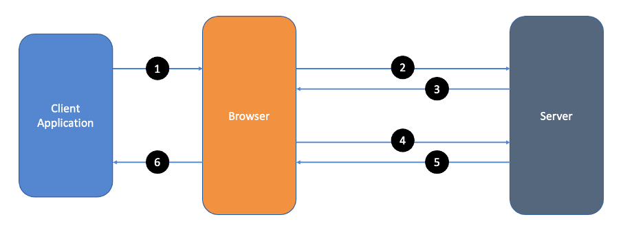

The complete CORS flow for non-simple requests:

1. Client application initiates the request
2. Browser sends the preflight request
3. Server returns the preflight response
4. Browser sends the actual request
5. Server returns the actual response
6. Client receives the actual response

## Introduction to API Gateway

[Amazon API Gateway](https://aws.amazon.com/cn/api-gateway/?nc1=h_ls) is a fully managed service that helps developers easily create, publish, maintain, monitor, and secure APIs at any scale. Without the need to maintain the underlying infrastructure, API Gateway can accept and process thousands of concurrent API calls. API Gateway supports both RESTful and WebSocket API types, as well as multiple backend integration types such as containerized services, serverless workloads, and HTTP endpoints. Other key features of API Gateway include traffic management, CORS support, authorization and access control, throttling, monitoring, and API version management.

### REST API vs HTTP API

REST API and HTTP API are both RESTful API products of Amazon API Gateway. Their differences are as follows.

#### Features

REST API's unique features include:

- API key support
- Per-client throttling
- Request validation
- AWS WAF integration
- Private API endpoints

HTTP API is designed with a minimalist feature set. Its characteristics include:

- Automatic deployment
- Default stage support

#### Performance and Pricing

Because HTTP API has a more streamlined feature set, it offers faster speeds and lower prices.

## Configuring CORS in API Gateway

To resolve cross-origin issues in Amazon API Gateway, you need to perform CORS configuration. API Gateway will automatically use the OPTIONS method and attempt to add CORS headers to existing method integration responses, which helps you handle preflight requests and actual responses. In Amazon API Gateway, REST API and HTTP API have different CORS configuration methods.

### REST API CORS Configuration

- As shown in the following figure, the REST API has a default / resource, under which we created a POST method integrated with a Lambda function as the backend service.

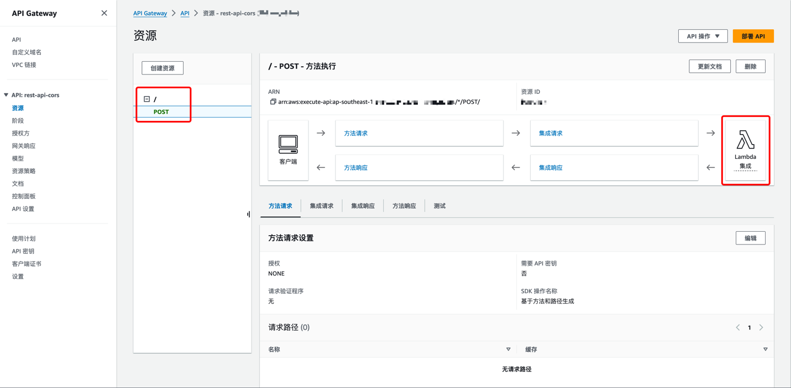

- To configure CORS for the POST method under the / resource, we need to go back to the resource overview page and click Enable CORS.

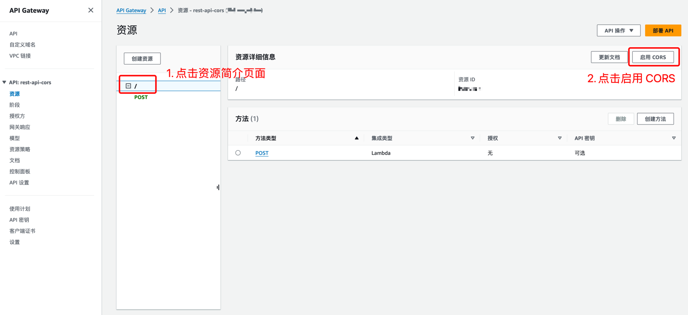

- On the Enable CORS page, first configure the allowed methods for access control. To correctly respond to preflight requests, the OPTIONS method is enabled by default. We select the POST method that needs CORS configuration. Then, we configure the allowed headers and origins for access control — the specific allowed values depend on your backend application. Click Save after configuration.

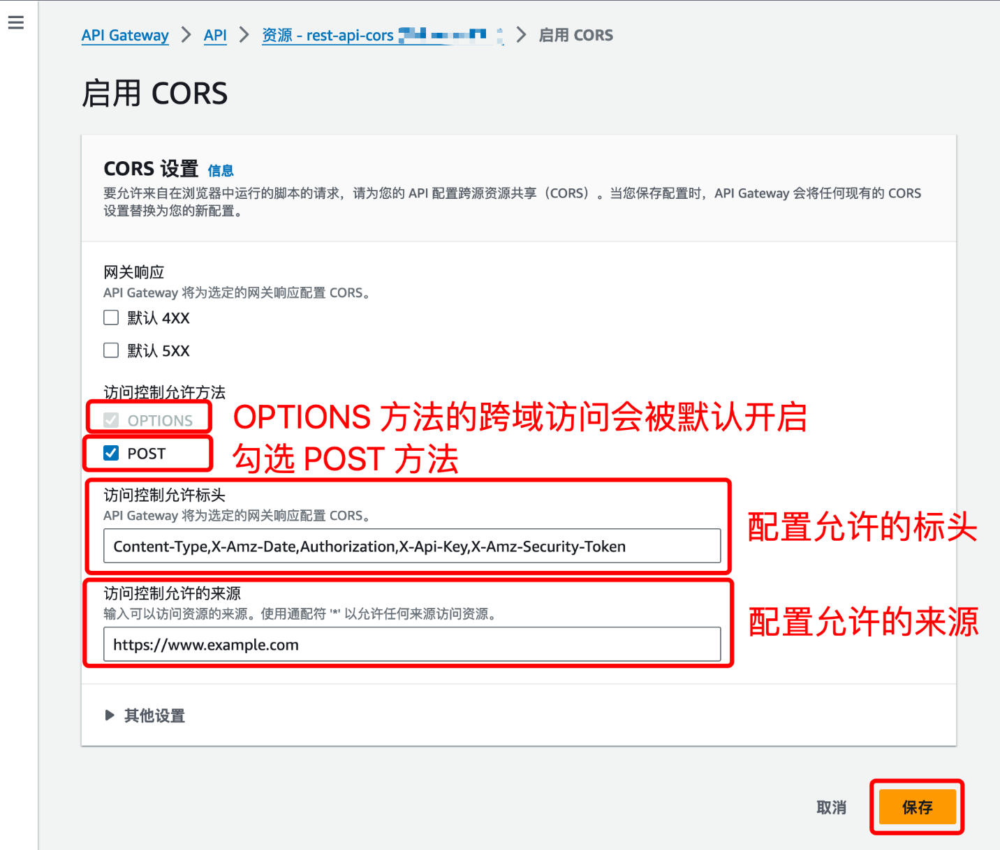

- After saving, on the POST method's integration response page, you can see that in the header mapping, the Access-Control-Allow-Origin mapping value is the allowed origin configured in the previous step.

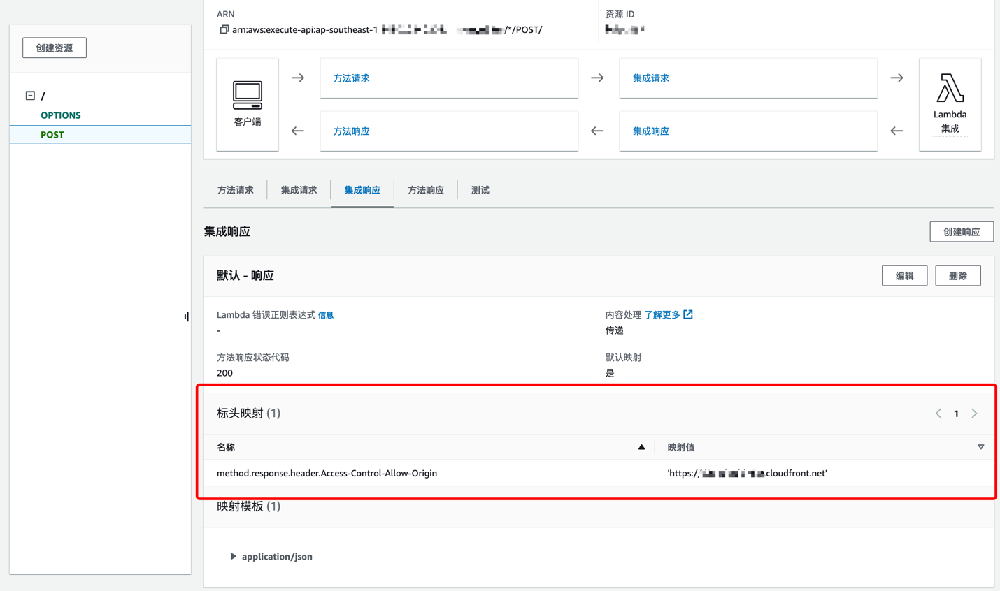

- In the resource list, we can also see that after enabling CORS, API Gateway automatically created an OPTIONS method for us. This method is used to correctly respond to preflight requests. The OPTIONS method's integration type is mock integration, which returns a 200 status code for requests and returns all relevant preflight response headers. The header mapping values are determined by the settings in step 3.

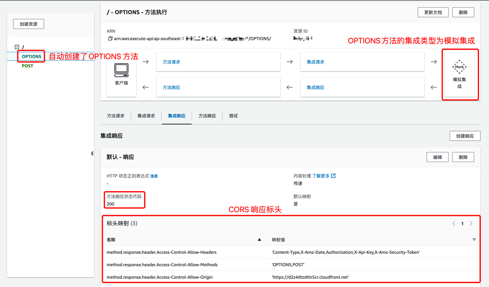

- Testing a cross-origin POST request from the allowed origin endpoint configured in step 3, we can see that for both the preflight request and the actual request, the REST API returns the corresponding headers.

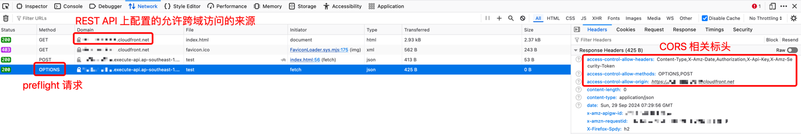

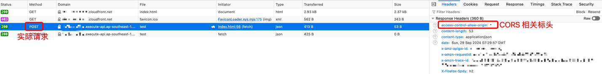

- For non-root paths, you can also check CORS (Cross-Origin Resource Sharing) when creating the resource, so that API Gateway automatically creates an OPTIONS method under this resource to handle preflight requests.

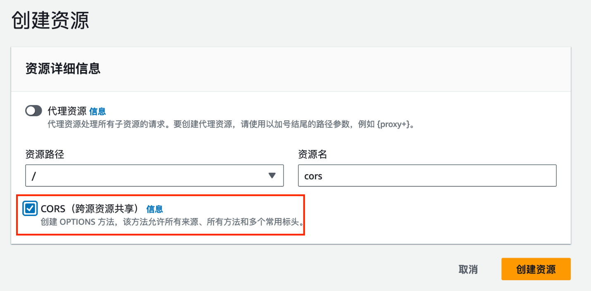

Note that the OPTIONS method created using this approach will accept cross-origin requests from all origins and all methods by default. If you need to tighten the permissions, you can click Edit in the upper right corner to modify it.

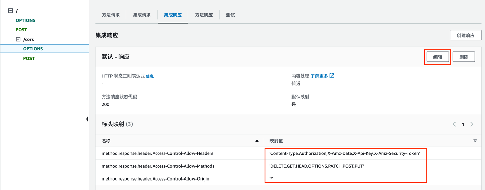

After checking CORS (Cross-Origin Resource Sharing) when creating the resource, you still need to click Enable CORS in the upper right corner of the resource overview page (following the same method as step 3) to configure the CORS-related headers for the specific request method (such as POST).

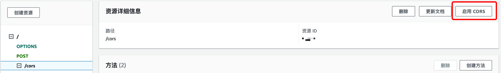

#### CORS Configuration with Authorization

You can integrate [Lambda authorizers](https://docs.aws.amazon.com/apigateway/latest/developerguide/apigateway-use-lambda-authorizer.html) or [Cognito authorizers](https://docs.aws.amazon.com/apigateway/latest/developerguide/apigateway-integrate-with-cognito.html) with your REST API. When enabling authorization, be sure to only enable it for the methods that need it — do not enable authorization for the OPTIONS method, otherwise preflight requests (which are unauthorized) will result in 401 errors.

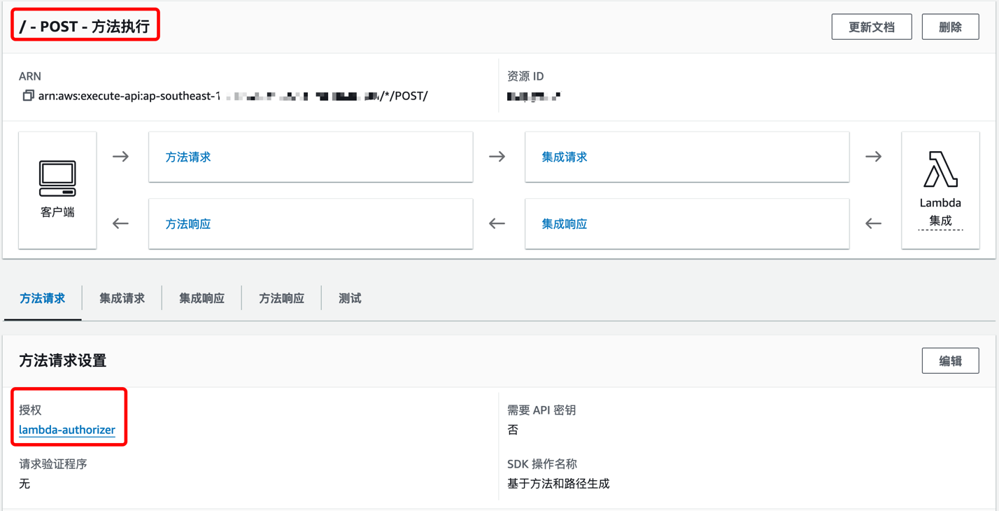

Enable authorization for the POST method.

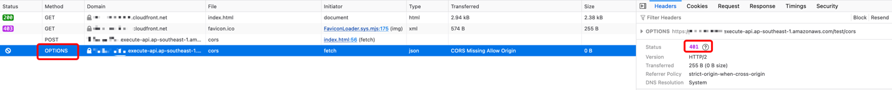

If authorization is enabled for the OPTIONS method, preflight requests will fail with errors.

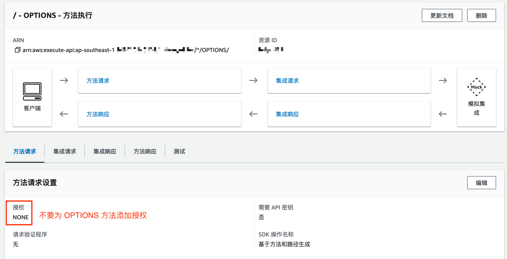

Do not enable authorization for the OPTIONS method.

### HTTP API CORS Configuration

In this section, we continue to use configuring CORS for the POST method under the / resource as an example to demonstrate how to configure CORS for HTTP API.

HTTP API CORS configuration is relatively simple because once you enable CORS for your HTTP API, API Gateway will automatically respond to preflight requests from browsers and automatically add CORS-related headers to your backend responses. You will not see the configuration of the OPTIONS method that API Gateway uses to automatically respond to preflight requests in your API resources, nor will you see the response header configuration for the POST method.

The following are the detailed steps to enable HTTP API CORS:

- Go to the HTTP API page, click CORS in the left navigation bar, then click Configure in the upper right corner.

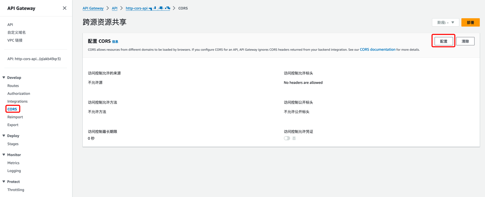

- On the CORS configuration page, enter the allowed origins, headers, and methods for access control. In our example, we need to allow POST method access. Depending on your needs, you can also optionally configure exposed headers, max age, and credentials. After configuration, click Save in the lower right corner.

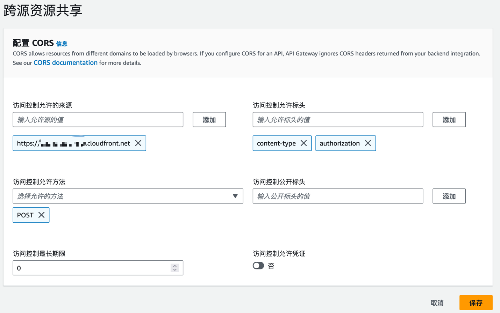

- After configuration, we cannot see the OPTIONS method configuration on the HTTP API routes page.

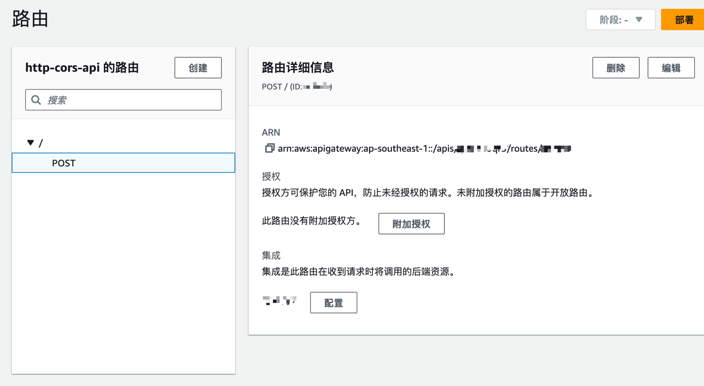

- Testing a cross-origin POST request from the allowed origin endpoint of the HTTP API, we can see that both the preflight OPTIONS request and the actual POST request receive correct responses. This is because API Gateway handles the HTTP API's response to preflight requests and adds the CORS-related headers for us.

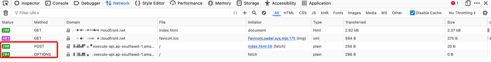

#### CORS Configuration with Authorization

Similar to REST API, HTTP API supports authorization for specific methods through [Lambda](https://docs.aws.amazon.com/apigateway/latest/developerguide/http-api-lambda-authorizer.html), [JWT](https://docs.aws.amazon.com/apigateway/latest/developerguide/http-api-jwt-authorizer.html), and [IAM](https://docs.aws.amazon.com/apigateway/latest/developerguide/http-api-access-control-iam.html) authorizers. If you want to enable CORS for an HTTP API with integrated authorizers, in most cases, HTTP API will automatically handle preflight requests for you. Therefore, no special configuration is needed — simply follow the steps above to enable CORS for an HTTP API with integrated authorizers. The only exception is when you create an authorized ANY method (as shown below). In this case, note that preflight requests will be handled by the ANY method rather than by HTTP API. Since preflight requests do not contain authorization information, the authorized ANY method will not return the correct status code and CORS headers, and the preflight request will fail with a 401 error.

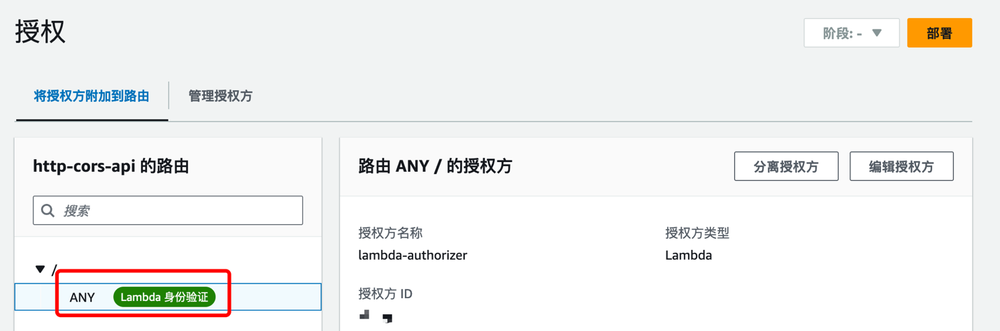

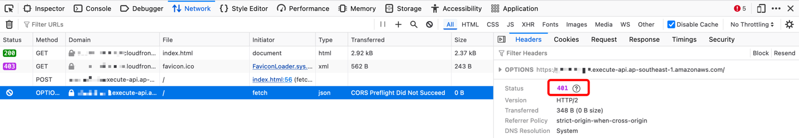

In this case, there are two solutions:

1. **(Recommended)** Create a specific route for each method and resource as needed, and avoid using the ANY method. For example, in our case, we only need to create a route for the POST method.

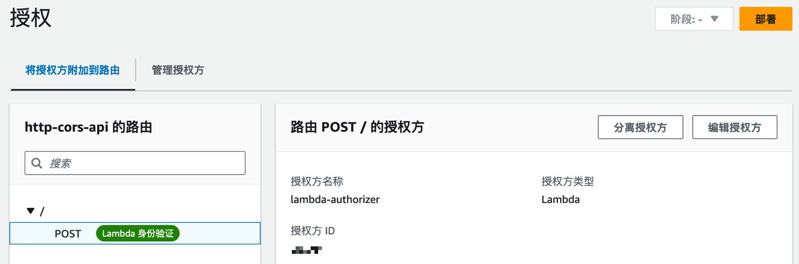

2. Create an unauthorized OPTIONS method route under the same resource path, and add any backend integration to the OPTIONS method (as shown below). This way, the unauthorized OPTIONS route will capture preflight requests.

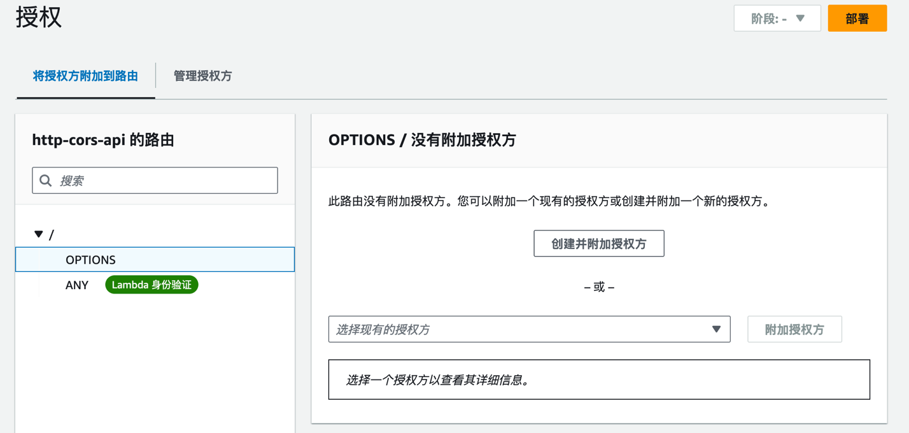

## Summary

This article introduced the CORS configuration methods for REST API and HTTP API in Amazon API Gateway, with special attention to how to configure both API types to ensure preflight requests are correctly responded to when authorization is enabled. The differences in CORS configuration between the two API types are as follows:

| API Type | CORS Configuration Method | Configuration Features | Authorization Notes |
|---|---|---|---|
| REST API | Configure CORS for specific routes in the REST API by clicking Enable CORS in the upper right corner of the route. | You can see the OPTIONS method used to respond to preflight requests and its response header settings under the configured route. You can also see the CORS header settings in the response of the methods that allow cross-origin access. | Do not enable authorization for the OPTIONS method. |
| HTTP API | Configure CORS for the entire HTTP API by clicking CORS in the left navigation bar to enter the CORS configuration page. | Preflight requests are automatically handled by API Gateway, and the automatically responding OPTIONS method configuration is not visible in the console. CORS headers are automatically added by API Gateway, and the CORS header settings are also not visible in the response of the methods that allow cross-origin access. | Avoid using the ANY method. If you must use it, create an additional unauthorized OPTIONS method for handling preflight requests. |

## Related Resources

To enable CORS for other AWS resources, refer to:

- [Enable CORS for CloudFront](https://aws.amazon.com/cn/blogs/china/several-solutions-to-cloudfront-cross-domain-problem-cors/)
- [Enable CORS for Lambda Function URLs](https://aws.amazon.com/cn/blogs/china/several-solutions-to-cloudfront-cross-domain-problem-cors/)
- [Enable CORS for S3 Static Website Hosting](https://docs.aws.amazon.com/zh_cn/AmazonS3/latest/userguide/cors.html)

---

> Original article: [Amazon API Gateway CORS Configuration - AWS Blog](https://aws.amazon.com/cn/blogs/china/amazon-api-gateway-cross-origin-resource-sharing-configuration/)
