In the previous article [*Building Resilient Azure AI Architecture with API Management Gateway*](../azure-apim-ai-resilience/), we built a resilient gateway architecture for multiple Microsoft Foundry resources using Azure API Management — Backend Load Balancing Pool for load distribution, and a `retry` policy that automatically switches to healthy instances when backends return 4xx/5xx errors. This mechanism makes backend failures nearly invisible to clients.

But "invisible" is precisely the challenge for operations teams: **The Retry mechanism, while protecting clients, also hides the details of intermediate failures.** When a request goes through 3 retries and ultimately returns 200, operations staff have no way of knowing why the first two attempts failed — was it a 429 rate limit? A 404 deployment not found? Or a 500 server error? Which backend had the issue? What did the error body say?

This article builds on the previous architecture to achieve complete Retry observability through **Application Insights Diagnostic Logs**, **without modifying any Policy code**, helping developers and operations teams:

- 📋 **Record detailed information for each Retry failure** — including the failed backend address, HTTP status code, error response body, and APIM request ID
- 🔍 **Reconstruct complete Retry chains via KQL queries** — using operation_Id to correlate all retry records for the same request
- 🔔 **Configure automated alerts** — notify the operations team via email when Retry failure counts exceed thresholds

### 1. Architecture Overview

This article adds an Application Insights observability layer on top of the APIM + Foundry resilient architecture from the previous article. No changes to existing APIM Policies or Backend configurations are needed — Retry monitoring and alerting are achieved entirely through Diagnostic Logs configuration.

**Components from the previous article (unchanged):**

| Component | Role |
|-----------|------|
| **Azure API Management** | Unified gateway, executing routing, Retry, and load balancing policies |
| **Backend Load Balancing Pool** | Pool of multiple Foundry resources, distributing requests via Round-Robin |

**New components in this article:**

| Component | Role |
|-----------|------|
| **Application Insights** | Receives APIM native telemetry (`requests` / `dependencies` / `exceptions`), recording details of each Retry backend call |
| **Log Alert** | Automatically triggers alert notifications based on KQL queries when failure counts exceed thresholds |
| **Action Group** | Defines alert actions (Email/SMS/Webhook) |

Core design principles:

- **Zero code changes** — No Policy modifications needed, fully implemented through APIM Diagnostic Logs configuration
- **Native Telemetry** — APIM's `dependencies` table automatically records each `forward-request` call (including intermediate Retry failures), combined with Backend Response Headers to log and Body bytes configuration to capture error details and Foundry request IDs
- **Full Retry chain visibility** — All Retry attempts for the same request share the same `operation_Id`, making it easy to reconstruct the complete retry chain in KQL
- **Proactive alerting** — Log Alert rules automatically detect failure trends and promptly notify the operations team

The following steps will guide you through building the complete Retry observability solution:

| Section | Action | Goal |
|---------|--------|------|
| 2 | Create Application Insights | Set up log storage and query infrastructure |
| 3 | Bind APIM Logger | Associate APIM with App Insights |
| 4 | Configure API Diagnostic Logs | Enable App Insights logging for the target API, configure Verbosity, Backend Response Headers and Body |
| 5 | Verify Data | Confirm Retry records in the dependencies table in App Insights |
| 6 | Configure Alert Rules | Create Log Alert + Action Group for automated email notifications |

### 2. Create an Application Insights Instance

Create a workspace-based Application Insights instance in the same subscription and region as APIM to receive APIM telemetry data.

##### 2-1) In the Azure Portal search bar, type Application Insights and select the **Application Insights** service

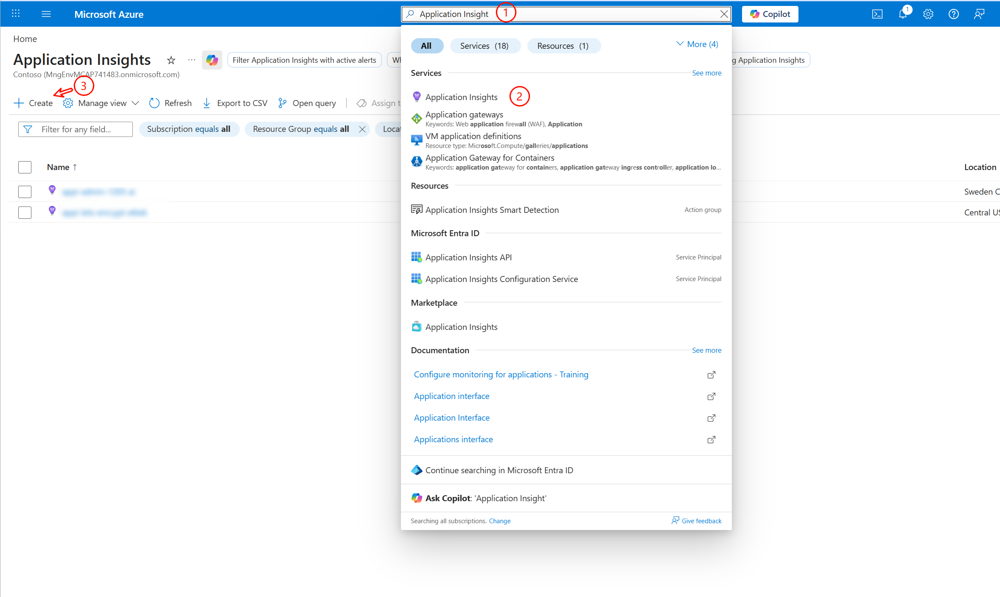

##### 2-2) Click **+ Create**, fill in the following key configurations and complete creation

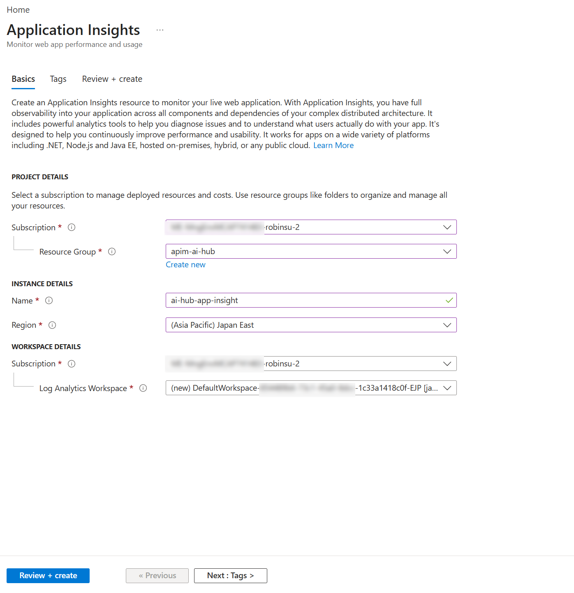

| Configuration | Recommended Value | Description |
|---------------|-------------------|-------------|
| Subscription | Same as APIM | Keep in the same subscription for easier management |
| Resource group | `apim-ai-hub` | Same resource group as APIM |
| Name | `ai-hub-app-insight` | Specify an Application Insights instance name |
| Region | `Japan East` | Same region as APIM to reduce data transmission latency |
| Workspace | Default | System automatically creates a Log Analytics workspace, or select one you've created |

> **📝 Note:**
>
> Application Insights is workspace-based, with underlying data stored in a Log Analytics workspace. A workspace is automatically associated during creation — no manual creation needed.

### 3. Bind APIM Logger

Associate the Application Insights instance created in the previous step with APIM, enabling APIM to send telemetry data to App Insights.

##### 3-1) Navigate to the APIM instance → Left menu **Monitoring** → **Application Insights** → Click **+ Add**

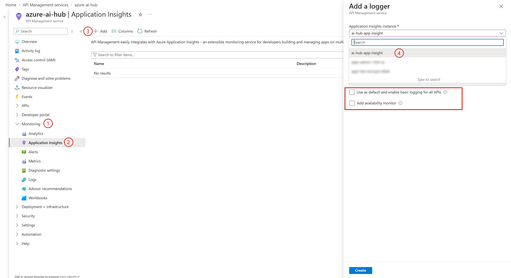

| Configuration | Recommended Value | Description |
|---------------|-------------------|-------------|
| Application Insights instance | `ai-hub-app-insight` | Select the Application Insights instance just created |
| ☐ Use as default and enable basic logging for all APIs | **Unchecked** | When checked, this Logger becomes the global default, enabling basic logging for all APIs. Can reduce throughput by 40-50% under high traffic (>1000 req/s). Recommended to enable per-API in Step 4 |
| ☐ Add availability monitor | **Unchecked** | When checked, App Insights periodically validates whether the APIM gateway endpoint is responding, with results displayed in App Insights' Availability panel. Not needed for this scenario |

### 4. Configure API Diagnostic Logs

Enable Application Insights logging for the target AI API, configuring sampling rate, error recording, Backend Response, and other parameters.

##### 4-1) Navigate to APIM → APIs → Select target API → Switch to **Settings** tab → Scroll down to **Diagnostic Logs** area, click Enable

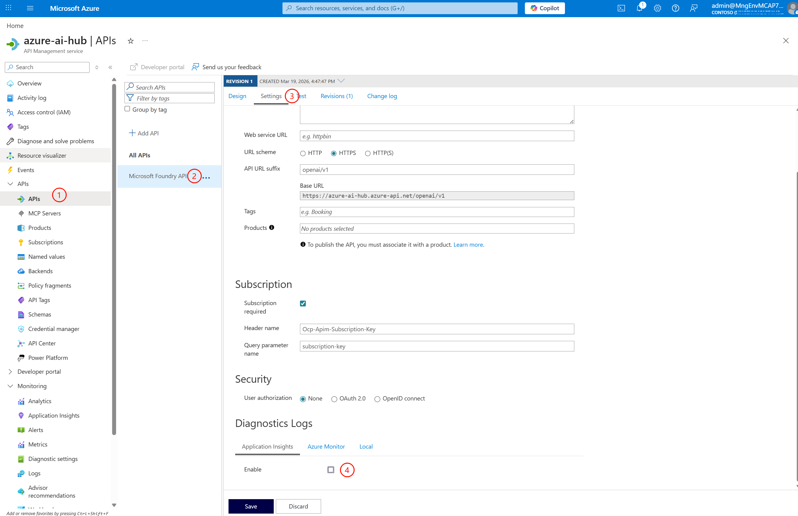

##### 4-2) Select the **Application Insights** tab, check **Enable**, and configure with the following parameters

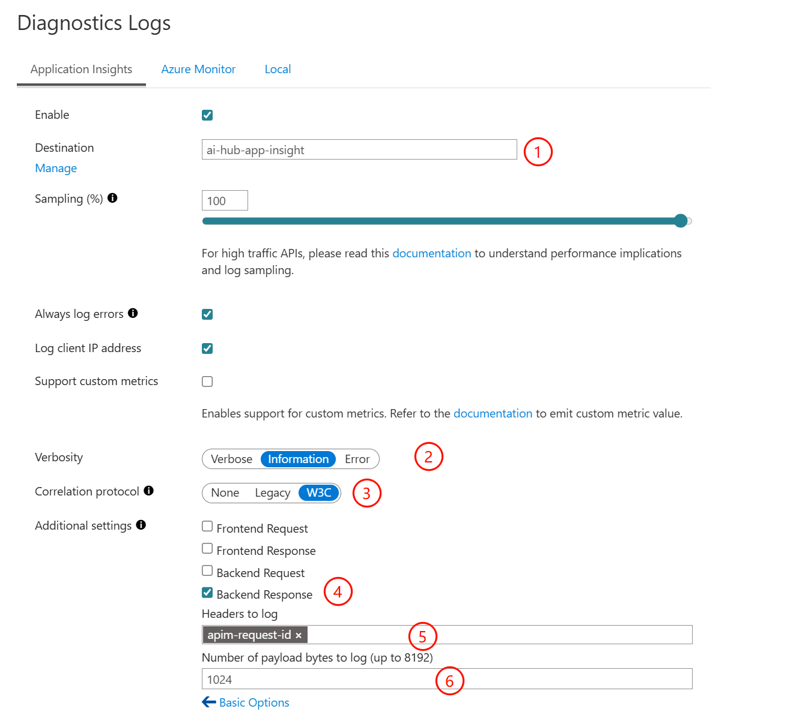

| Configuration | Recommended Value | Description |
|---------------|-------------------|-------------|
| **Destination** | `ai-hub-app-insight` | Select the bound App Insights instance. ⚠️ If it shows "No App Insights were configured", go back to Step 3 to bind the Logger first |
| **Sampling (%)** | `100` | Sampling rate, 100 for full recording (can be adjusted to 25-50 for production) |
| **Always log errors** | ✅ Enable | Ensures error requests are not filtered by sampling — all 4xx/5xx are recorded even when Sampling < 100% |
| **Log client IP address** | ✅ Enable | Records caller IP, useful for troubleshooting |
| **Support custom metrics** | Unchecked | Only needed when using the `emit-metric` policy, not used in this article |
| **Verbosity** | ⚠️ `Information` | Controls the logging level for native telemetry, **recommended to select Information or Verbose** (see explanation below) |
| **Correlation protocol** | `W3C` | Modern standard, supports cross-service distributed tracing using `traceparent` header to correlate frontend and backend requests |

**Verbosity Configuration Notes:**

> **❗ Important:**
>
> **Verbosity should be set to `Information` or `Verbose`, not `Error`.**
>
> **Verbosity controls the logging level for the entire request chain** — successful final requests (200) are treated as information level, failed requests (4xx/5xx) are treated as error level.

| Verbosity | Final Request Successful (200) | Final Request Failed (4xx/5xx) |
|-----------|-------------------------------|-------------------------------|
| **Information** ✅ | ✅ `requests` recorded + ✅ All `dependencies` recorded (including intermediate Retry failures) | ✅ `requests` recorded + ✅ All `dependencies` recorded |
| **Error** ❌ | ❌ **Nothing recorded** (both request and dependencies are lost) | ✅ `requests` recorded + ✅ Associated `dependencies` recorded |

> **⚠️ Warning:**
>
> **When Verbosity=Error:** If 2 out of 3 Retry attempts fail (404) but the 3rd attempt succeeds (200), the entire request chain **will not appear in any table** — including those 2 intermediate failed dependency records. This creates a blind spot for Retry observability.
>
> Selecting `Information` ensures that regardless of whether the final result is success or failure, all Retry processes are fully recorded.

**Additional settings — Backend Response Configuration:**

This is the key configuration for achieving Retry observability. Check **Backend Response**, configure Headers to log and Body bytes — APIM will include this information in the `Properties` field of the `dependencies` table.

| Configuration | Recommended Value | Description |
|---------------|-------------------|-------------|
| **Headers to log** | `apim-request-id` | Records the request tracking ID returned by Foundry, used for locating backend requests when submitting support tickets to Microsoft |
| **Body bytes to log** | `1024` | Records the first 1KB of response body, capturing error JSON details (e.g., `DeploymentNotFound`, `Too Many Requests`, etc.) |

> **📝 Note:**
>
> Headers to log and Body bytes apply to **all sampled requests** (including successful ones), without distinguishing between success and failure. This data appears in two App Insights tables:
> - **`requests` table** — Records the final request returned to the client (frontend perspective)
> - **`dependencies` table** — Records each `forward-request` call (backend perspective, **including each intermediate Retry attempt**)
>
> The `dependencies` table is the core data source for Retry observability.

Click **Save** to complete the configuration.

> **⚠️ Warning:**
>
> Configuration changes take **several minutes** to propagate to APIM gateway instances. If you test immediately and see no data, please wait 5 minutes before checking.

### 5. Verify Data

After configuration is complete, send a few test requests that will trigger Retry (e.g., call a non-existent model deployment), wait approximately 5 minutes, then verify data in Application Insights.

##### 5-1) Navigate to Application Insights → Monitoring → ① Logs, ② Switch to Tables view, ③ Find the `dependencies` table under the Application Insights category and click Run

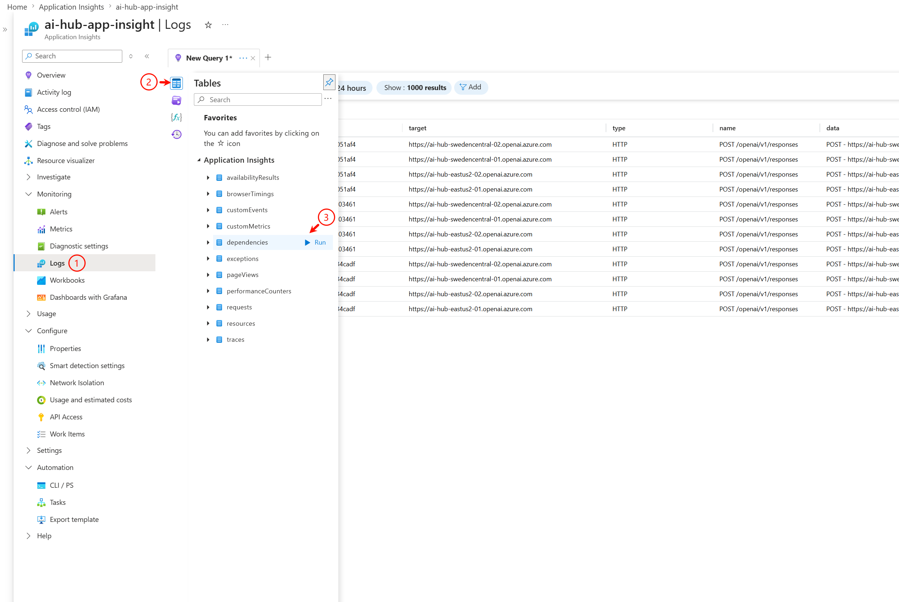

The `dependencies` table generates an independent record for **each `forward-request` call** within the `retry` block — including intermediate failed Retry attempts and the final successful request. In the results on the right, you can see multiple records pointing to different backends (e.g., `ai-hub-swedencentral-02`, `ai-hub-eastus2-01`, etc.), all belonging to the same request's Retry chain.

##### 5-2) Expand a single record to view detailed fields and customDimensions

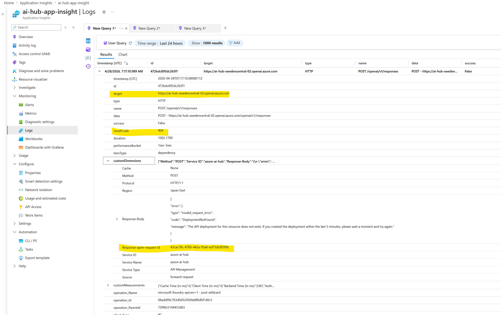

After expanding, you can see the complete information of the dependency record, with key troubleshooting fields highlighted:

| Field | Description |
|-------|-------------|
| **`target`** | Full address of the requested backend |
| **`resultCode`** | HTTP status code |
| `duration` | Call duration |
| `success` | Whether successful |
| **`Response-Body`** | Success/error response JSON details |
| **`Response-apim-request-id`** | Foundry-side request ID (different for each Retry), useful for submitting troubleshooting tickets |

> **💡 Tip:**
>
> Use `operation_Id` to link all Retry records for the same request together, reconstructing the complete retry chain. `Response-apim-request-id` can be used to locate specific backend requests when submitting support tickets to Microsoft.

### 6. Configure Alert Rules

Automatically notify the operations team via email when Retry failure counts exceed thresholds. Alert rules are created on **Application Insights** (not APIM).

##### 6-1) Write and verify KQL query on the Logs page

Navigate to Application Insights → Monitoring → **Logs**, ① create a new query tab, ② switch to **KQL mode**, ③ enter the following query and ④ click **Run** to verify results:

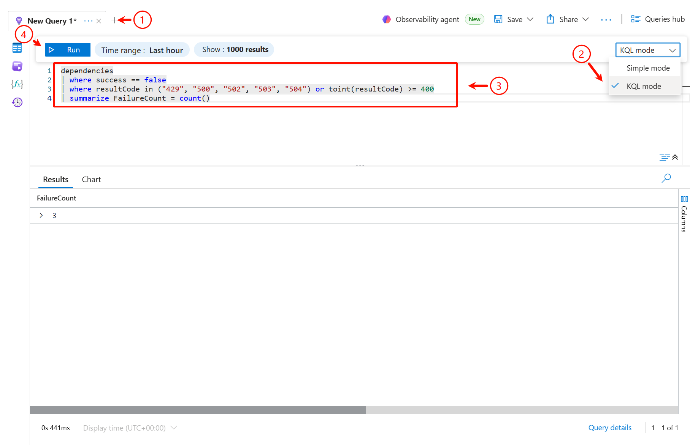

```KQL
dependencies
| where success == false
| where resultCode in ("429", "500", "502", "503", "504") or toint(resultCode) >= 400
| summarize FailureCount = count()
```

Adjust the status code filter as needed:

| Scenario | Filter Condition |
|----------|-----------------|
| All failures | `where success == false` |
| Rate limiting only (429) | `where resultCode == "429"` |
| 5xx server errors only | `where toint(resultCode) >= 500` |
| 429 + 5xx | `where resultCode == "429" or toint(resultCode) >= 500` |
| Exclude 404 | `where success == false and resultCode != "404"` |

Confirm the query returns the expected FailureCount value.

##### 6-2) Click the **`...`** menu in the top right → **+ New alert rule**

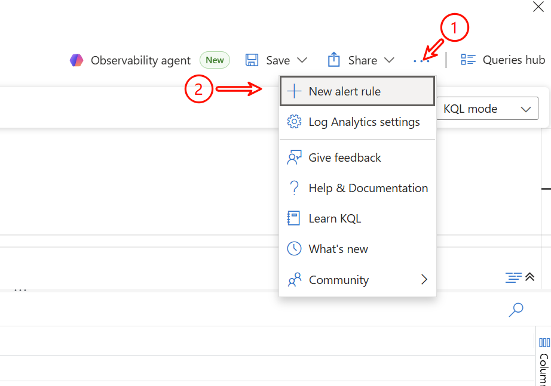

The system will automatically carry over the current KQL query into the Alert rule's Condition configuration.

##### 6-3) Confirm query and Measurement configuration on the Condition tab

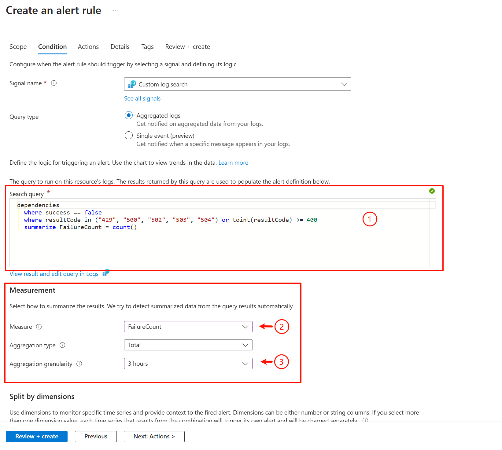

Three key configurations highlighted in the screenshot:

| Annotation | Configuration | Value | Description |
|------------|--------------|-------|-------------|
| ① | **Search query** | KQL from previous step (auto-populated) | Contains `success == false` + status code filter + `summarize FailureCount = count()` |
| ② | **Measure** | `FailureCount` | ⚠️ Must select `FailureCount` (auto-detected from KQL's summarize). If it defaults to `Table rows`, switch manually |
| ③ | **Aggregation granularity** | `3 hours` | Aggregation granularity — aggregates FailureCount within this time range into a single data point for evaluation |

Other settings keep defaults:
- **Query type**: Aggregated logs
- **Aggregation type**: Total (sum of FailureCount)

##### 6-4) Scroll down to configure Alert logic

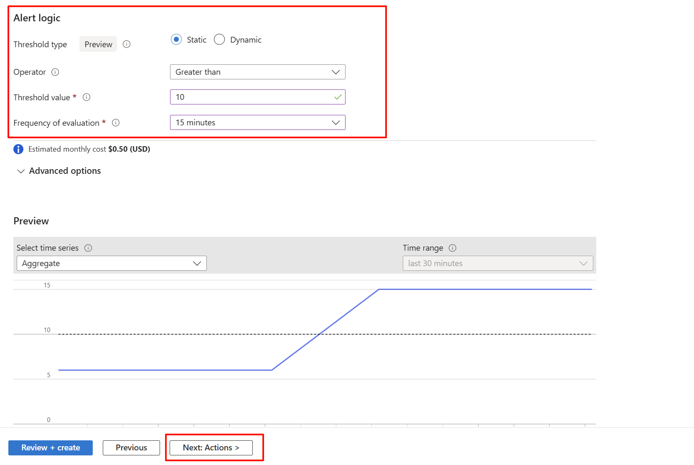

| Configuration | Value | Description |
|---------------|-------|-------------|
| Threshold type | **Static** | Use fixed threshold |
| Operator | **Greater than** | Trigger when FailureCount exceeds threshold |
| Threshold value | `10` | Adjust based on business tolerance |
| Frequency of evaluation | `15 minutes` | Evaluate every 15 minutes |

> **📝 Note:**
>
> 📊 The **Preview** chart below displays the FailureCount trend and threshold line (dashed), helping you assess whether the threshold setting is reasonable. Areas where the blue solid line exceeds the dashed threshold line indicate periods that would trigger alerts.
>
> 💰 Estimated monthly cost is approximately **$0.50 USD** (depends on evaluation frequency).

Click **Next: Actions >** to proceed.

##### 6-5) Configure alert actions on the Actions tab

If the Portal displays the **Use quick actions (preview)** option (new UI), you can complete Action Group creation directly on this page without creating one separately:

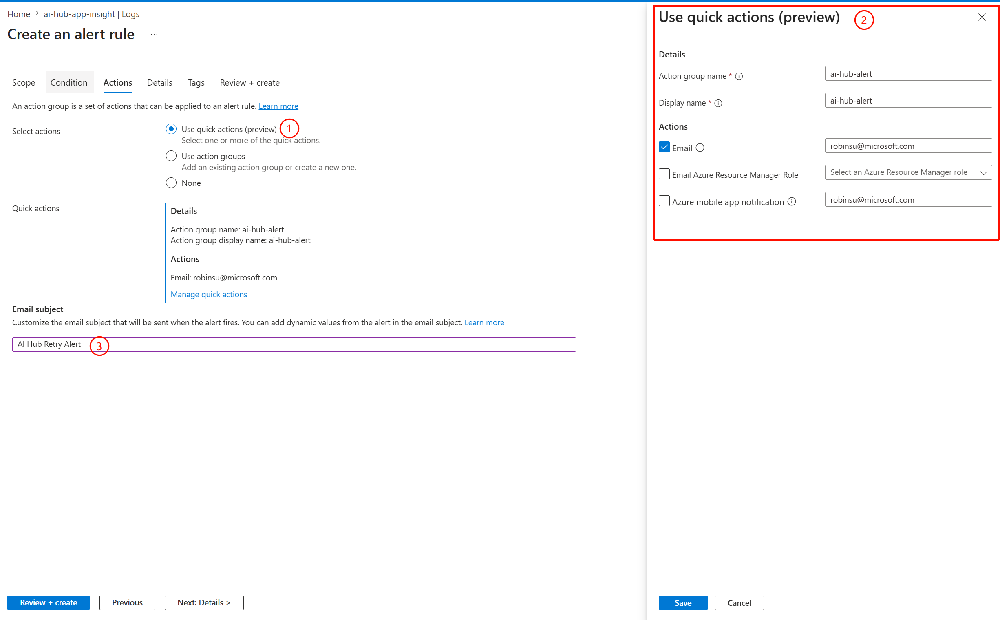

| Annotation | Configuration | Description |
|------------|--------------|-------------|
| ① | **Use quick actions (preview)** | Select this option, and the Portal will automatically create an Action Group |
| ② | **Quick actions panel** | Fill in Action group name, Display name, check Email and enter email address → **Save** |
| ③ | **Email subject** | Custom alert email subject, e.g., `AI Hub Retry Alert` |

> **📝 Note:**
>
> If the Portal doesn't show the quick actions option (legacy UI), select **Use action groups** → **+ Create action group**, and follow steps 6-6 ~ 6-8 below to create one manually.

##### 6-6) Fill in Action Group basic information

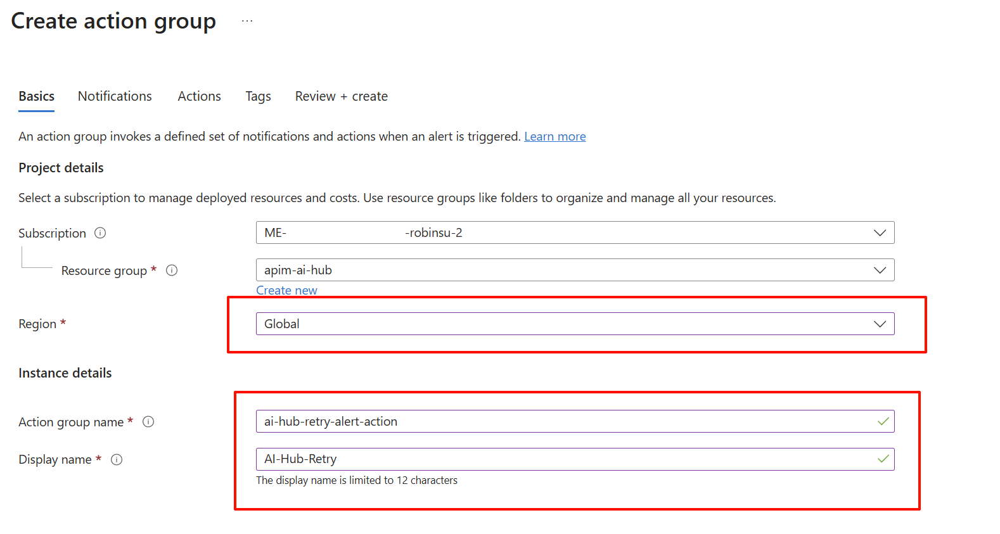

| Configuration | Value | Description |
|---------------|-------|-------------|
| Region | **Global** | Recommended to select Global for Action Groups |
| Action group name | `ai-hub-retry-alert-action` | Unique identifier |
| Display name | `AI-Hub-Retry` | Limited to 12 characters, displayed in notifications |

##### 6-7) Switch to the Notifications tab and configure email notifications

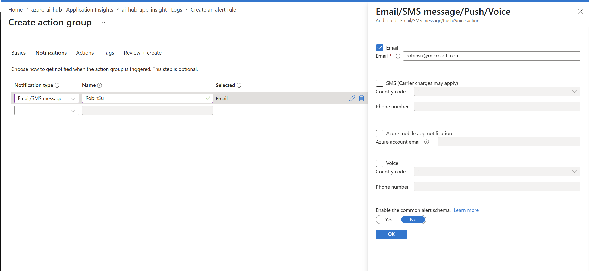

| Configuration | Value | Description |
|---------------|-------|-------------|
| Notification type | **Email/SMS message/Push/Voice** | Select notification method |
| Name | Recipient name | Notification recipient identifier |
| Email | ✅ Check and enter email | Alert email recipient address |

> **📝 Note:**
>
> The Actions tab allows configuration of richer automated actions (Automation Runbook, Azure Function, Logic App, Webhook, etc.). These are not used in this article — simply skip.
>
> 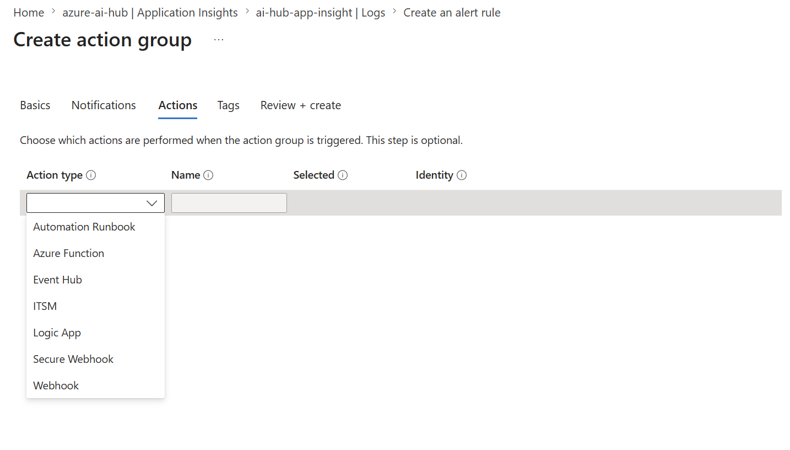

##### 6-8) Switch to the Review + create tab, confirm configuration and click **Create**

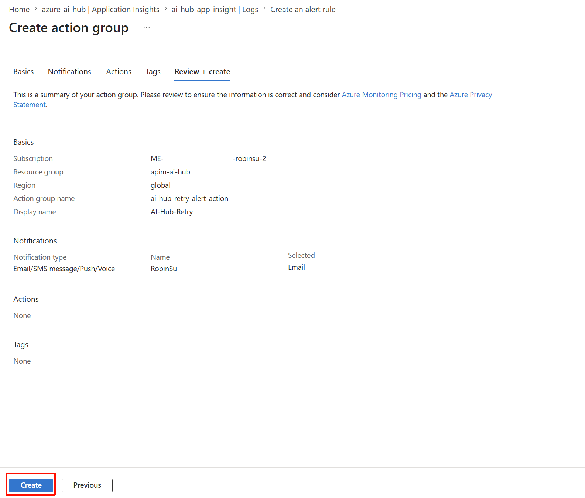

After creation, you'll receive an Azure confirmation email indicating you've been added to the Action Group:

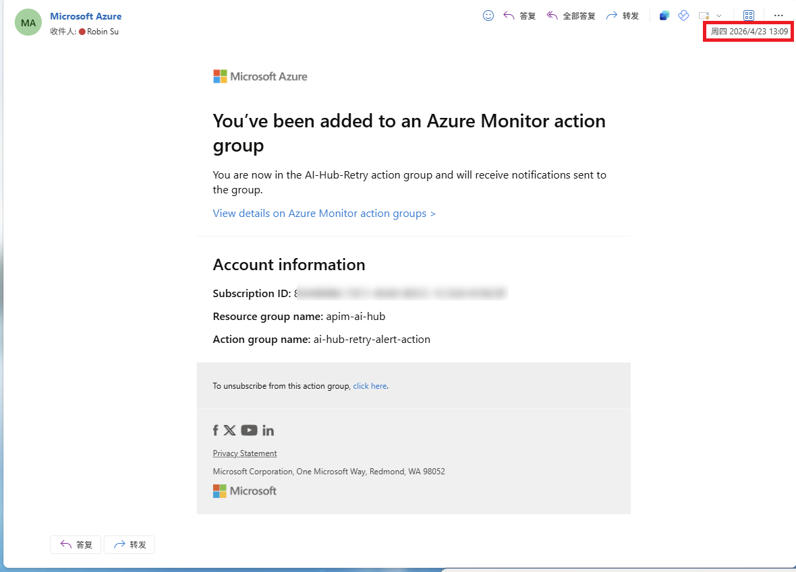

##### 6-9) Return to the Alert rule's Actions page, confirm the Action Group is associated, and fill in the email subject

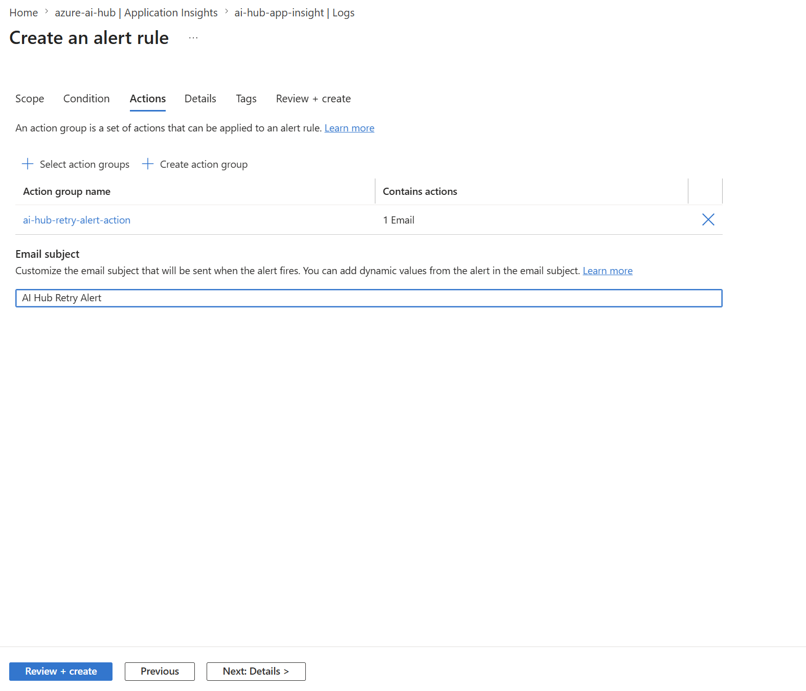

Enter a custom alert email subject in the **Email subject** field, e.g., `AI Hub Retry Alert`.

##### 6-10) Switch to the Details tab and fill in Alert rule basic information

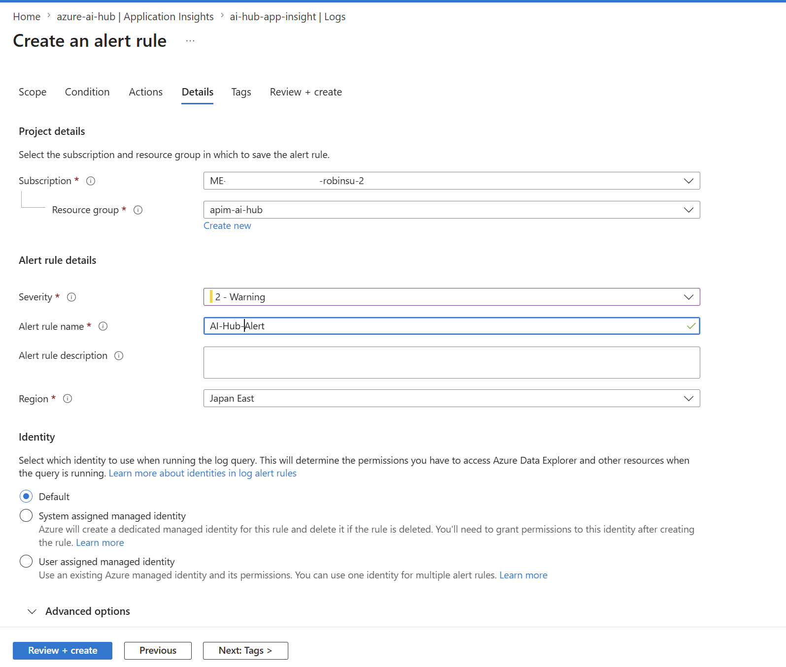

| Configuration | Value | Description |
|---------------|-------|-------------|
| Severity | **2 - Warning** | Alert severity level |
| Alert rule name | `AI-Hub-Alert` | Alert rule name |
| Region | `Japan East` | Same region as App Insights |
| Identity | **Default** | Use default identity |

##### 6-11) Switch to Review + create to confirm all configurations, click **Create** to complete

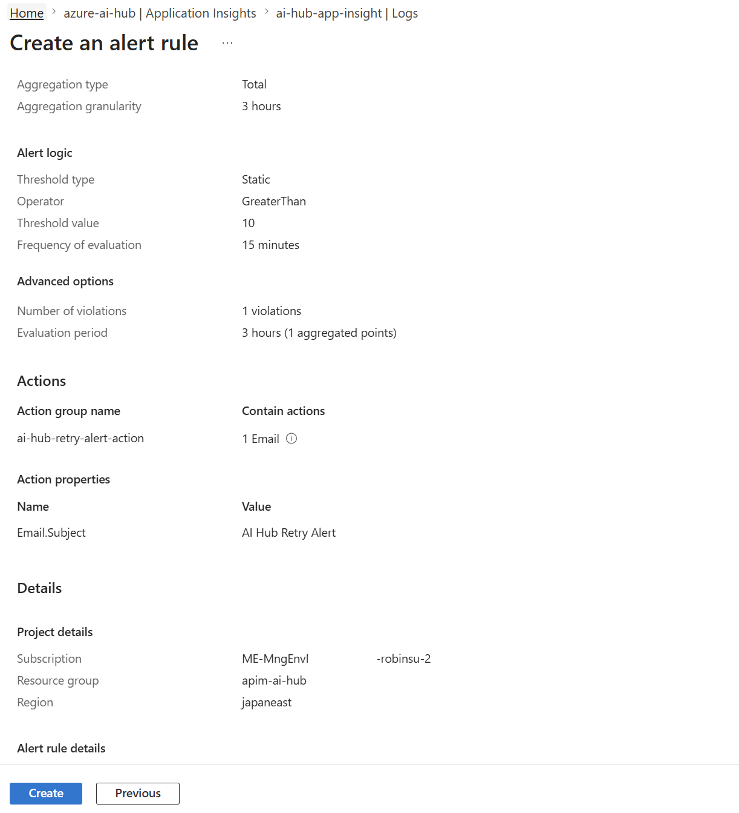

##### 6-12) Verify alert email

Approximately 15 minutes after creation, when FailureCount exceeds the threshold (10), you'll receive an alert email:

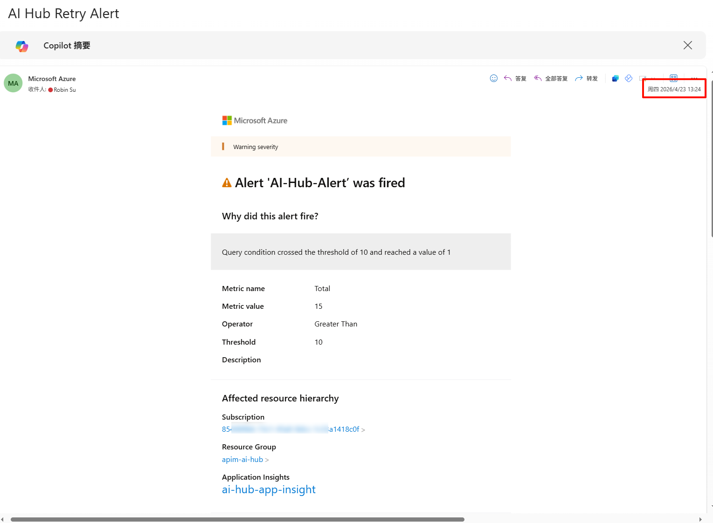

The email contains key information:

| Field | Value | Description |
|-------|-------|-------------|
| Alert name | `AI-Hub-Alert` | Name of the triggered alert rule |
| Severity | Warning | Alert level |
| Metric value | 15 | Actual FailureCount |
| Threshold | 10 | Configured threshold |
| Fired time | Specific time (UTC) | When the alert was triggered |

Click **View alert details** in the email to jump directly to Azure Portal for details; **View search results** to view the KQL query results that triggered the alert.

##### 6-13) (Optional) Fine-tune alert parameters

After the alert rule is created, navigate to Application Insights → Monitoring → **Alerts** → **Alert rules** → Select the corresponding rule → Click the **Edit** button:

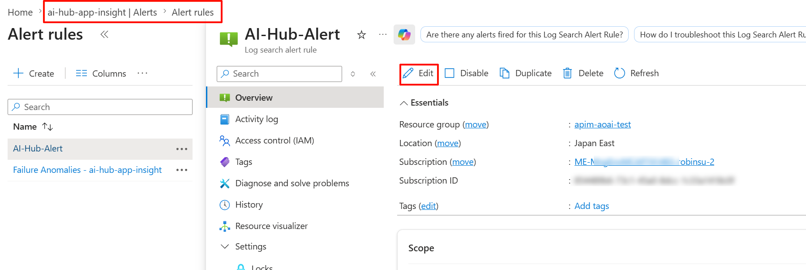

In the editing page's **Details tab → Advanced options**, fine-tune further:

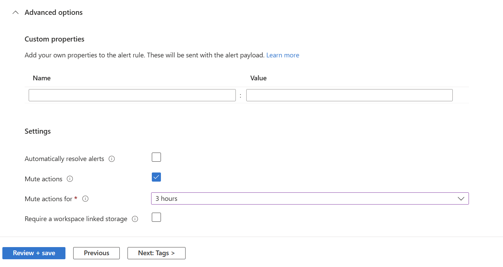

| Configuration | Description | Recommended Value |
|---------------|-------------|-------------------|
| **Mute actions** | Enter a silent period after triggering, during which no repeat notifications are sent | ✅ Check |
| **Mute actions for** | Silent duration — no notifications during this period even if conditions persist | `3 hours` (adjust as needed) |
| **Automatically resolve alerts** | Automatically change alert status from Fired to Resolved when conditions are no longer met | Check as needed |

> **💡 Tip:**
>
> If the evaluation frequency is 15 minutes and Mute is not configured, **an email notification will be sent every 15 minutes** while alert conditions persist. Configuring Mute prevents repeated notifications after the first alert trigger, avoiding email flooding.
>
> Additionally, you can adjust **Aggregation granularity**, **Threshold value**, **Frequency of evaluation**, and other parameters on the editing page to optimize alert sensitivity.

### 7. Appendix: Advanced KQL Queries and Client IP Configuration (Optional)

#### 7-1) Enable Real Client IP Recording

Application Insights **does not store client IP addresses by default** (privacy protection), and the `client_IP` field displays as `0.0.0.0`. Disable IP masking via CLI to record real IPs:

```bash
az resource update \
  --resource-group <resource-group> \
  --name <app-insights-name> \
  --resource-type "Microsoft.Insights/components" \
  --set properties.DisableIpMasking=true
```

> **⚠️ Warning:**
>
> Disabling IP masking will record real client IP addresses. Please ensure this complies with your organization's privacy requirements.
>
> 📖 Reference: Geolocation and IP address handling: https://learn.microsoft.com/azure/azure-monitor/app/ip-collection

#### 7-2) Correlate Client IP with Retry Failure Records

The `dependencies` table itself does not contain client IP (it records APIM → backend outbound calls). You need to JOIN with the `requests` table via `operation_Id`:

```kusto
dependencies
| where timestamp > ago(1h)
| where success == false
| join kind=leftouter (
    requests 
    | project operation_Id, req_client_IP = client_IP
  ) on operation_Id
| project timestamp, target, resultCode, 
         ClientIP = req_client_IP,
         ErrorBody = tostring(customDimensions["Response-Body"]),
         APIMRequestId = tostring(customDimensions["Response-apim-request-id"]),
         operation_Id
| order by timestamp desc
```

> **📝 Note:**
>
> Both `requests` and `dependencies` tables have a `client_IP` field, but with different meanings:
> - **`requests.client_IP`** — IP of the client calling APIM (real client)
> - **`dependencies.client_IP`** — APIM gateway's outbound IP (not the client)
>
> When JOINing, use renaming (e.g., `req_client_IP`) to avoid field conflicts.

#### 7-3) More Useful KQL Queries

**Reconstruct complete Retry chain by operation_Id (including the successful attempt):**

```kusto
dependencies
| where timestamp > ago(1h)
| summarize CallCount = count(),
            Backends = make_list(target),
            StatusCodes = make_list(resultCode),
            Durations = make_list(duration)
  by operation_Id
| where CallCount > 1
| order by CallCount desc
```

**Failure trend chart:**
```kusto
dependencies
| where timestamp > ago(24h)
| where success == false
| summarize FailureCount = count() by bin(timestamp, 5m), target
| render timechart
```

**For alerting (grouped by backend + status code):**
```kusto
dependencies
| where timestamp > ago(2h)
| where success == false
| summarize FailureCount = count() by target, resultCode
| where FailureCount > 0
```

### Summary

Through this article's implementation, we've built a complete Retry observability solution on top of the resilient gateway architecture from the previous article:

| Capability | Implementation |
|------------|---------------|
| **Each Retry failure recorded** | APIM native `dependencies` table automatically records each `forward-request` call |
| **Error Body recording** | Backend Response Body bytes=1024, error JSON details appear in Properties |
| **Request tracking IDs** | `operation_Id` (unchanged across Retries) + `Response-apim-request-id` (Foundry-side ID) |
| **Call duration** | Native `DurationMs` field, precise to milliseconds |
| **KQL queries** | Support aggregation analysis by backend, status code, and time dimensions |
| **Automated alerting** | Log Alert rules + Action Group email notifications |

For users who have already deployed the resilient architecture from the previous article, this article **requires no Policy code changes** — complete Retry observability is achieved solely through APIM Diagnostic Logs configuration (binding App Insights + **setting Verbosity to Information** + enabling Backend Response Headers/Body).

Those errors hidden by the Retry mechanism are now clearly recorded in Application Insights' `dependencies` table, ready for operations staff to review and address.

### References

| Document | Link |
|----------|------|
| How to integrate Azure API Management with Azure Application Insights | https://learn.microsoft.com/azure/api-management/api-management-howto-app-insights |
| Diagnostic - Create Or Update REST API | https://learn.microsoft.com/rest/api/apimanagement/diagnostic/create-or-update |
| Application Insights telemetry data model | https://learn.microsoft.com/azure/azure-monitor/app/data-model-complete |
| Geolocation and IP address handling (IP masking) | https://learn.microsoft.com/azure/azure-monitor/app/ip-collection |
| Subscriptions in Azure API Management | https://learn.microsoft.com/azure/api-management/api-management-subscriptions |
| Tutorial: Create a log search alert for an Azure resource | https://learn.microsoft.com/azure/azure-monitor/alerts/tutorial-log-alert |
| Create and manage action groups | https://learn.microsoft.com/azure/azure-monitor/alerts/action-groups |
| Kusto Query Language (KQL) overview | https://learn.microsoft.com/azure/data-explorer/kusto/query/ |
| Performance implications and log sampling | https://learn.microsoft.com/azure/api-management/api-management-howto-app-insights#performance-implications-and-log-sampling |
| Azure Monitor pricing | https://azure.microsoft.com/pricing/details/monitor/ |
