随着企业对 AI 能力的需求日益增长，越来越多的组织开始将 Microsoft Foundry 中的模型服务深度集成到核心业务系统中。当 AI 服务从实验阶段迈向生产环境时，架构设计的关注点也随之发生转变——**高可用性、弹性伸缩、统一治理与安全管控**成为企业级 AI 架构不可回避的关键主题。

*As enterprise demand for AI capabilities grows, organizations are deeply integrating Microsoft Foundry model services into core business systems. As AI moves from experimentation to production, **high availability, elastic scaling, unified governance, and security controls** become unavoidable themes.*

在生产级 AI 架构中，依赖单一订阅下的单一服务实例往往难以满足企业对**服务连续性、稳定性以及大规模吞吐容量**的要求——**配额有限**难以支撑大规模并发、**单点故障**影响服务可用性、**单区域部署**缺乏容灾能力。一个成熟的架构应当具备跨订阅的资源整合能力，通过**聚合多个订阅下的 AI 资源配额**来最大化可用吞吐量，同时结合流量分发、故障自动转移以及统一的身份认证与访问控制，确保 AI 服务在面对各种运行时挑战时依然能够稳定响应。

*In production, a single subscription instance fails to meet requirements for **continuity, stability, and throughput**. A mature architecture consolidates resources across subscriptions, **aggregating AI quotas** to maximize throughput, with traffic distribution, automatic failover, and unified access control.*

**Azure API Management（APIM）** 作为 Azure 原生的 API 网关服务，天然适合承担这一角色。通过将 APIM 部署为 AI 服务的统一入口，并结合以下核心能力，我们可以构建一套**企业级、高韧性的 AI 服务架构**：

*Azure API Management (APIM), as Azure's native API gateway, is naturally suited for this role. By deploying APIM as the unified entry point, combined with the following capabilities, we can build an **enterprise-grade, highly resilient AI architecture**:*

- 🔀 **Backend Load Balancing Pool** — 跨多个订阅、多个 Microsoft Foundry 资源实例实现负载均衡与故障转移，聚合分散在不同订阅下的配额容量
- 🔐 **Managed Identity** — 以零密钥的方式实现 APIM 与后端 AI 服务之间的安全认证，消除凭据管理负担
- 🛡️ **统一 API 治理** — 在网关层实现请求路由、流量控制、日志审计与策略管理，为所有 AI 调用提供一致的管控能力

*🔀 **Backend Load Balancing Pool** — Load balancing and failover across subscriptions and Foundry instances, aggregating distributed quotas*

*🔐 **Managed Identity** — Zero-key secure authentication between APIM and backend AI services*

*🛡️ **Unified API Governance** — Request routing, traffic control, log auditing, and policy management at the gateway layer*

本文将通过一个完整的实践案例，详细介绍如何使用 APIM 构建面向多个 Microsoft Foundry 资源的韧性网关架构——从资源部署、身份配置到负载均衡策略，逐步搭建一套可直接用于生产环境的解决方案。

*This article walks through a complete hands-on example: from resource deployment and identity configuration to load balancing policies, building a production-ready resilient gateway architecture targeting multiple Microsoft Foundry resources.*

## 架构概览 / Architecture Overview

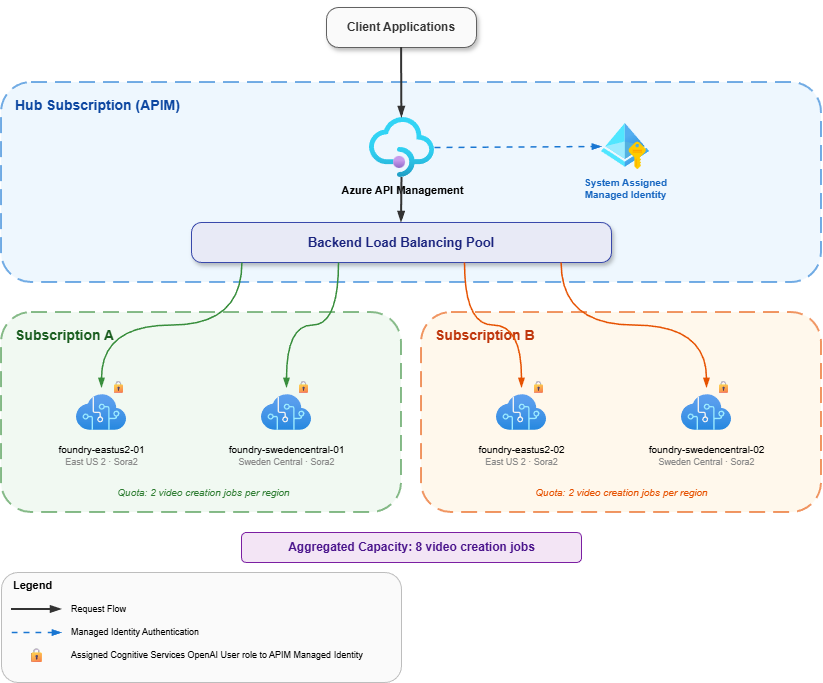

本架构采用**集中式 API 网关 + 多订阅后端模式**，以 Azure API Management 为统一网关入口，通过 APIM 的后端负载均衡池（Backend Load Balancing Pool）将请求轮询分发到分布在多个订阅、多个区域中的 Microsoft Foundry 资源实例。

*This architecture uses a **centralized API gateway + multi-subscription backend pattern**, with APIM as the unified entry point, distributing requests round-robin to Foundry instances across multiple subscriptions and regions.*

核心设计理念包括：

*Core design principles:*

- **统一入口** — 客户端只需访问 APIM 端点，无需感知后端资源的位置和数量；后端负载均衡池默认采用 Round-Robin 轮询策略，将请求均匀分发到所有健康实例 / *Clients only need the APIM endpoint; the pool uses Round-Robin by default*
- **安全认证简化** — APIM 与后端 Foundry 资源之间通过托管标识（Managed Identity）实现零密钥安全通信；对外仅由 APIM 统一提供 API Key / *Zero-key communication via Managed Identity; clients only need a single API Key*
- **跨订阅配额聚合** — 将分散在不同订阅下的 Foundry 资源配额汇聚为统一容量池，突破单一订阅的配额上限 / *Aggregate quotas across subscriptions into a unified capacity pool*
- **跨区域容灾** — 资源分布在不同区域，当某个区域不可用时，APIM 自动将流量路由到健康实例 / *Cross-region disaster recovery; APIM automatically routes to healthy instances*

APIM 的 Policy 策略引擎还为本架构提供了灵活的流量控制能力：

*APIM's Policy engine also provides flexible traffic control:*

- **定向路由** — 通过 `X-AI-Foundry-Target` 请求头精确路由到指定后端实例 / *Pinned routing via `X-AI-Foundry-Target` header*
- **自动故障转移** — `retry` 策略自动重试并切换到健康后端，指数退避 / *Auto-retry with exponential backoff on 4xx/5xx*
- **请求溯源** — `X-AI-Foundry-Backend` 响应头返回实际处理后端 / *`X-AI-Foundry-Backend` response header for tracing*

接下来按以下步骤完成架构搭建：

*Architecture setup steps:*

| 章节 | 操作 | 目标 | 平台 |
|------|------|------|------|
| 1 | 创建 APIM 实例 | 搭建统一网关入口，启用 Managed Identity | Azure Portal |
| 2 | 创建 Foundry 资源 | 在多个订阅和区域中构建后端资源池 | Azure Portal |
| 3 | 部署 AI 模型 | 使后端资源具备 AI 服务能力（以 Sora2 为例） | Foundry Portal |
| 4 | 配置 RBAC | 授予 APIM 托管标识访问后端的权限 | Azure Portal |
| 5 | 配置 Backend + LB Pool | 注册后端并组建负载均衡池 | Azure Portal (APIM) |
| 6 | 创建 API + Policy | 定义 API 入口，配置路由与故障转移 | Azure Portal (APIM) |
| 7 | 测试与验证 | 验证负载均衡、指定后端路由 | curl / Postman |


---

## 1. 创建 APIM 实例 / Create APIM Instance

在 Azure Portal 中创建 API Management 实例，选择 v2 Tier（Basicv2 / Standardv2 / Premiumv2），并在创建时启用 **System Assigned Managed Identity**。

*Create an API Management instance in Azure Portal, selecting v2 Tier, and enable **System Assigned Managed Identity** during creation.*

**Portal 操作 / Portal Steps：** 搜索 `API Management Service` → + Create → 填写配置 → Managed identity 页签启用 → Review + install

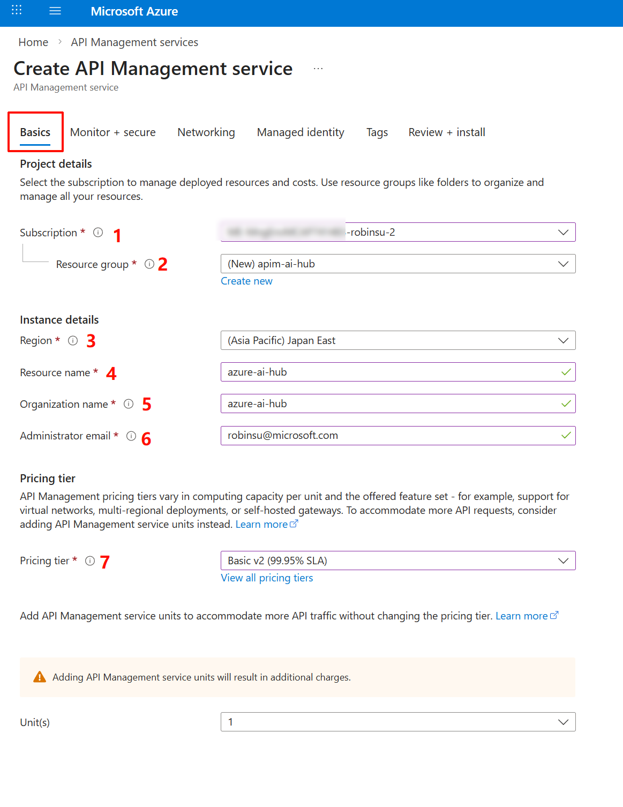

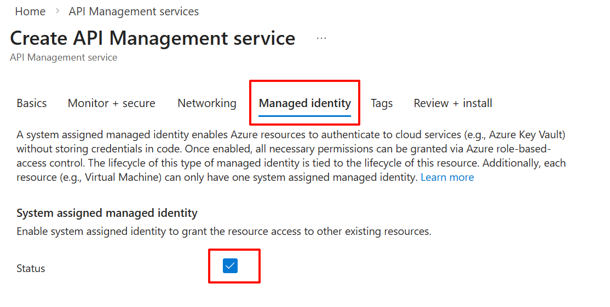

**CLI 替代方式 / CLI Alternative：**

```bash
az rest --method PUT \
  --url "https://management.azure.com/subscriptions/<subscription-id>/resourceGroups/<resource-group>/providers/Microsoft.ApiManagement/service/<apim-name>?api-version=2024-05-01" \
  --body '{
    "location": "<region>",
    "sku": { "name": "<BasicV2|StandardV2|PremiumV2>", "capacity": 1 },
    "identity": { "type": "SystemAssigned" },
    "properties": {
      "publisherName": "<organization-name>",
      "publisherEmail": "<admin-email>"
    }
  }'
```

**创建完成后确认 / After Creation：**

*After deployment, confirm:*

- Status: **Online**
- 记录 **Gateway URL**（如 `https://<apim-name>.azure-api.net`）/ *Record **Gateway URL***
- 记录 Managed Identity 的 **Object (principal) ID**（后续 RBAC 需要）/ *Record Managed Identity **Object (principal) ID** for RBAC*

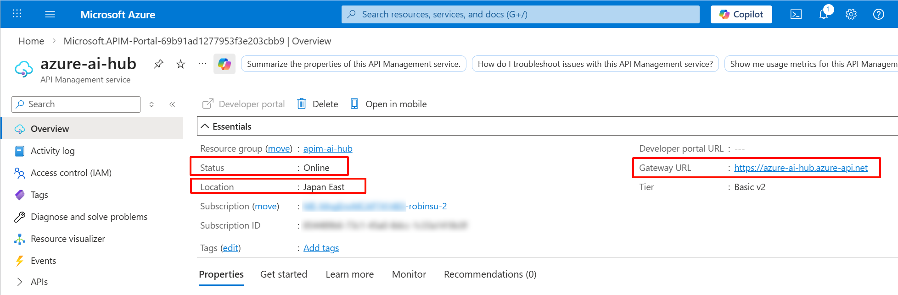

---

## 2. 创建 Foundry 资源 / Create Foundry Resources

在多个订阅和区域中创建 Foundry 资源，每个资源需创建对应的项目。

*Create Foundry resources across multiple subscriptions and regions, each with a corresponding project.*

**Portal 操作 / Portal Steps：** 搜索 `Microsoft Foundry` → Create a resource → 填写 Subscription / Region / Name / Project name → Create

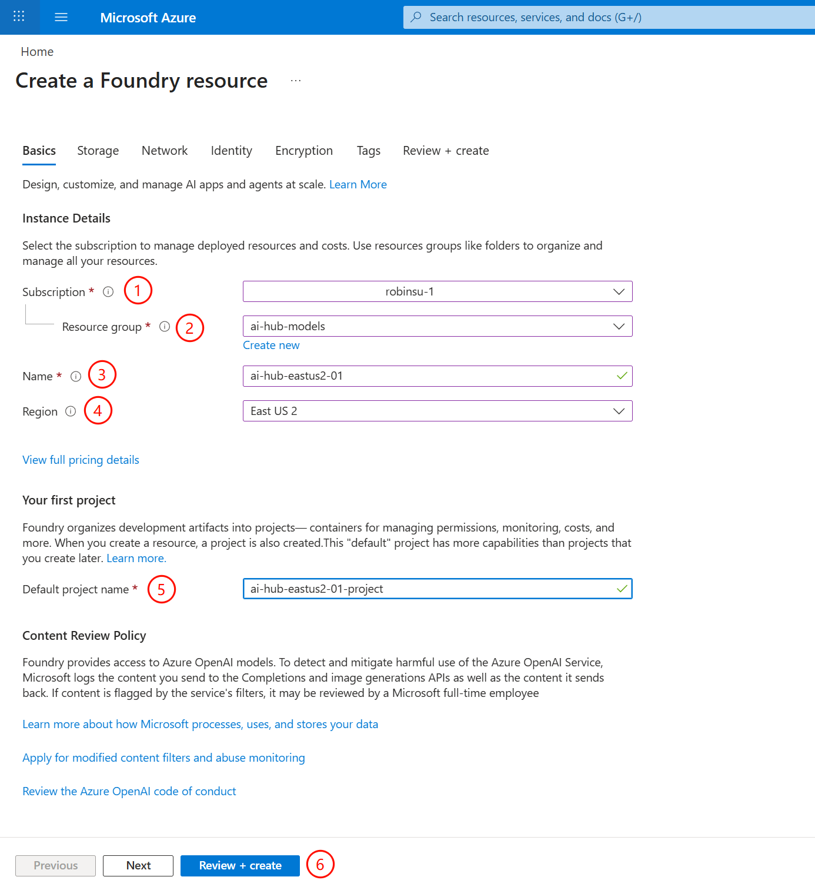

**CLI 替代方式 / CLI Alternative：**

```bash
az cognitiveservices account create \
  --subscription <subscription-id> \
  --resource-group <resource-group> \
  --name <foundry-resource-name> \
  --location <region-code> \
  --kind AIServices --sku S0 \
  --custom-domain <foundry-resource-name> \
  --allow-project-management && \
az cognitiveservices account project create \
  --subscription <subscription-id> \
  --name <foundry-resource-name> \
  --resource-group <resource-group> \
  --project-name <project-name> \
  --location <region-code>
```

**示例资源分布 / Example Resource Distribution：**

| 订阅 | 区域 | 资源名称 |
|------|------|---------|
| Subscription A | East US 2 | foundry-eastus2-01 |
| Subscription A | Sweden Central | foundry-swedencentral-01 |
| Subscription B | East US 2 | foundry-eastus2-02 |
| Subscription B | Sweden Central | foundry-swedencentral-02 |

---

## 3. 部署模型 / Deploy Models

在 Foundry Portal 中为每个资源部署 AI 模型。

*Deploy AI models in each Foundry resource via the Foundry Portal.*

**Portal 操作 / Portal Steps：** 在 [Foundry Portal](https://ai.azure.com/nextgen/) 中选择目标项目 → Build → Models → Deploy a base model → 搜索模型（如 `sora-2`）→ Deploy → Default settings

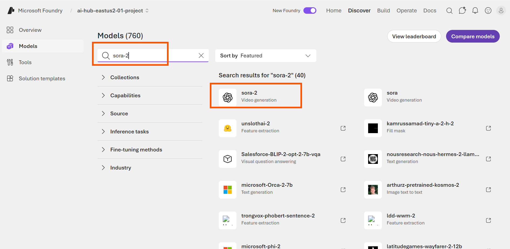

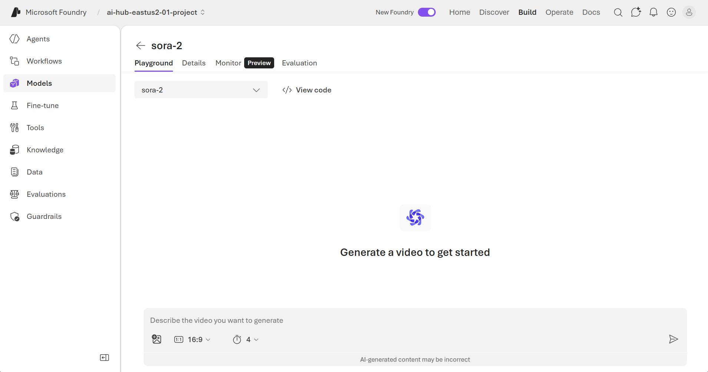

**CLI 替代方式 / CLI Alternative：**

```bash
az cognitiveservices account deployment create \
  --subscription <subscription-id> \
  --resource-group <resource-group> \
  --name <foundry-resource-name> \
  --deployment-name <deployment-name> \
  --model-name <model-name> \
  --model-version <model-version> \
  --model-format <model-format> \
  --sku-name <sku-name> \
  --sku-capacity <capacity>
```

> 模型名称、版本、SKU 等参数因区域而异，详见：[模型与区域可用性](https://learn.microsoft.com/azure/foundry/foundry-models/concepts/models-sold-directly-by-azure)
>
> *Model names, versions, and SKUs vary by region. See: [Models and Region Availability](https://learn.microsoft.com/azure/foundry/foundry-models/concepts/models-sold-directly-by-azure)*


---

## 4. 配置 RBAC / Configure RBAC

在**每个 Foundry 资源**上为 APIM 的 Managed Identity 授予 `Cognitive Services OpenAI User` 角色。

*Grant the `Cognitive Services OpenAI User` role to APIM's Managed Identity on **each Foundry resource**.*

**Portal 操作 / Portal Steps：** 进入 Foundry 资源 → Access control (IAM) → + Add → Add role assignment → 搜索 `Cognitive Services OpenAI User` → Members 选 Managed identity → 选择 API Management service → Review + assign

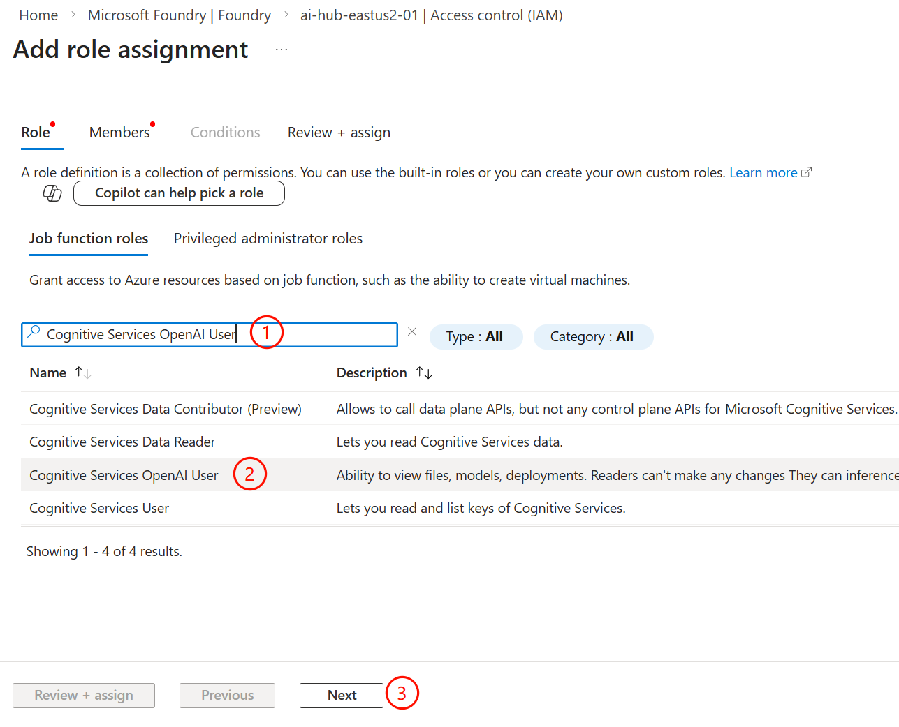

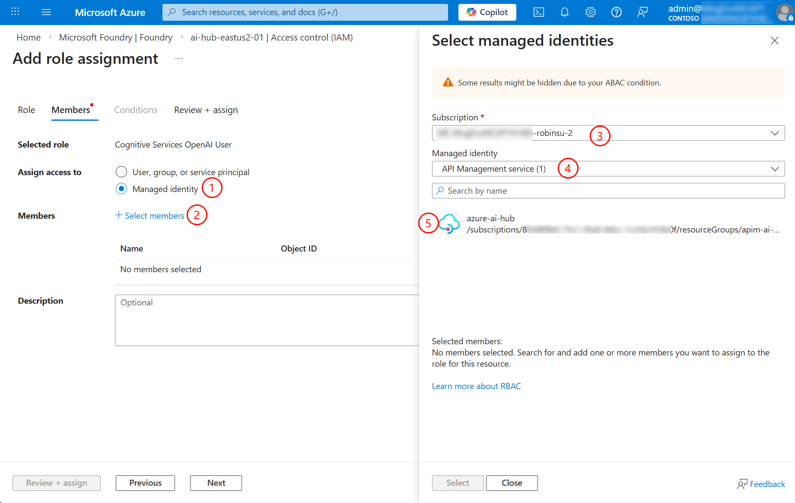

**CLI 替代方式 / CLI Alternative：**

```bash
# 获取 APIM Managed Identity Principal ID / Get APIM Managed Identity Principal ID
az apim show \
  --subscription <subscription-id> \
  --name <apim-name> \
  --resource-group <resource-group> \
  --query "identity.principalId" -o tsv

# 为每个 Foundry 资源分配角色 / Assign role for each Foundry resource
az role assignment create \
  --assignee <principal-id> \
  --role "Cognitive Services OpenAI User" \
  --scope /subscriptions/<subscription-id>/resourceGroups/<resource-group>/providers/Microsoft.CognitiveServices/accounts/<foundry-resource-name>
```

> `Cognitive Services OpenAI User` 是最小权限角色，允许推理调用但不允许修改资源配置。
>
> *`Cognitive Services OpenAI User` is the minimum permission role—allows inference calls but not resource configuration changes.*

---

## 5. 配置 Backend + Load Balancing Pool / Configure Backend + LB Pool

### 5a) 创建 Backend / Create Backend

为每个 Foundry 资源创建一个 Backend，配置 Managed Identity 认证。

*Create a Backend for each Foundry resource with Managed Identity authentication.*

**获取 OpenAI 端点 / Get OpenAI Endpoint：** 在 [Foundry Portal](https://ai.azure.com/nextgen/) 的项目 Home 页面找到 **Azure OpenAI endpoint**，或通过 CLI：

```bash
az cognitiveservices account show \
  --subscription <subscription-id> \
  --resource-group <resource-group> \
  --name <foundry-resource-name> \
  --query "properties.endpoints.\"OpenAI Language Model Instance API\"" -o tsv
```

**Portal 操作 / Portal Steps：** APIM → Backends → + Create new backend → 填写 Name / Runtime URL → Managed Identity 标签页 → Client identity 选 System assigned → Resource ID 填 `https://cognitiveservices.azure.com` → Create

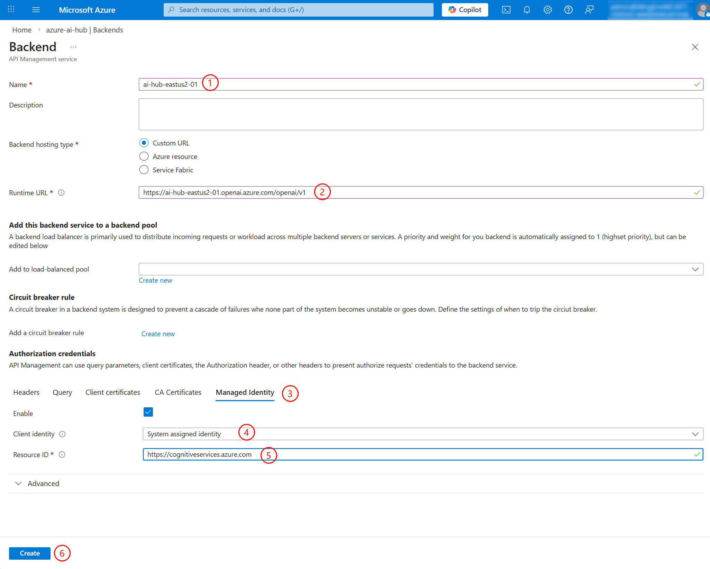

**关键配置说明 / Key Configuration：**

| 配置项 | 示例值 | 说明 |
|--------|--------|------|
| Name | `<foundry-resource-name>` | 建议与 Foundry 资源名一致 |
| Runtime URL | `https://<foundry-resource-name>.openai.azure.com/openai/v1` | Foundry OpenAI 端点（+`openai/v1`） |
| Client identity | System assigned identity | 使用 APIM 系统托管标识 |
| Resource ID | `https://cognitiveservices.azure.com` | Token audience，**固定值** |

**CLI 替代方式 / CLI Alternative：**

```bash
az rest --method PUT \
  --url "https://management.azure.com/subscriptions/<subscription-id>/resourceGroups/<resource-group>/providers/Microsoft.ApiManagement/service/<apim-name>/backends/<backend-name>?api-version=2024-05-01" \
  --body '{
    "properties": {
      "url": "https://<foundry-resource-name>.openai.azure.com/openai/v1",
      "protocol": "http",
      "credentials": {
        "managedIdentity": {
          "clientId": null,
          "resource": "https://cognitiveservices.azure.com"
        }
      }
    }
  }'
```

### 5b) 创建 Load Balancing Pool / Create LB Pool

**Portal 操作 / Portal Steps：** APIM → Backends → Load balancer 标签页 → + Create new pool → 填写 Pool Name → 勾选所有 Backend → Send requests evenly (Round-robin) → Create

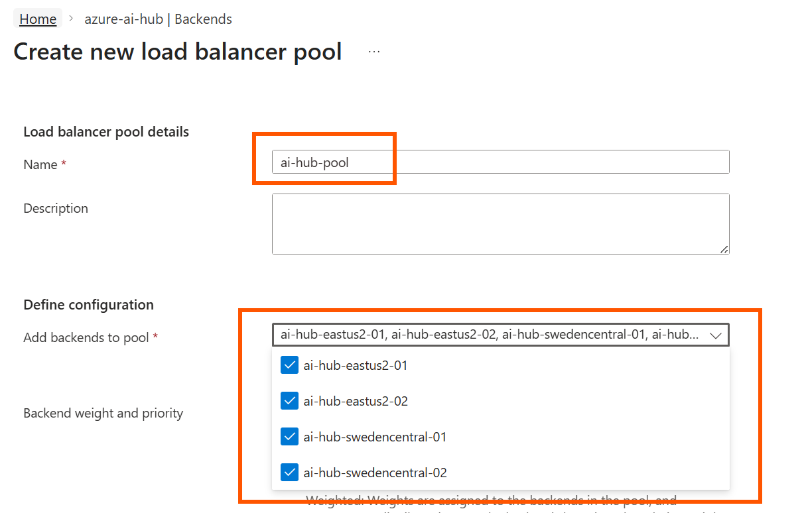

> Portal 提供两种选项：**Send requests evenly**（Round-robin 均匀分发）和 **Customize weight and priority**（自定义权重与优先级）。
>
> *Two options: **Send requests evenly** (Round-robin) or **Customize weight and priority**.*

---

## 6. 创建 API + Policy / Create API + Policy

### 6a) 创建 API / Create API

**Portal 操作 / Portal Steps：** APIM → APIs → + Add API → HTTP → 填写 Display name / API URL suffix (`openai/v1`) → Web service URL 留空 → Create

然后添加 Operations：+ Add operation → 为 POST / GET / DELETE 各创建 `/*` 通配符路径。

*Add operations: create `/*` wildcard path for POST, GET, DELETE.*

> 本示例使用泛路径 `/*` 统一代理所有请求。如需更细粒度控制，可针对特定场景创建操作，例如仅匹配 Sora2 的 `/videos/*` 路径。
>
> *This example uses wildcard `/*` to proxy all requests. For finer control, create operations for specific paths like `/videos/*` for Sora2.*

### 6b) 配置 Policy / Configure Policy

选择 All operations → 点击 Inbound processing 的 `</>` → 粘贴以下 Policy，修改 Pool 名称 → Save

*Select All operations → click `</>` in Inbound processing → paste the policy below, update pool name → Save*

```xml
<policies>
    <inbound>
        <base />
        <!-- 读取请求头，允许调用方指定特定后端 -->
        <set-variable name="target" value="@(context.Request.Headers.GetValueOrDefault("X-AI-Foundry-Target", ""))" />
        <!-- 后端负载均衡池名称 -->
        <set-variable name="pool_name" value="<your-ai-hub-pool-name>" />
        <choose>
            <when condition="@(context.Variables.GetValueOrDefault<string>("target") != "")">
                <set-backend-service backend-id="@(context.Variables.GetValueOrDefault<string>("target"))" />
            </when>
            <otherwise>
                <set-backend-service backend-id="@((string)context.Variables["pool_name"])" />
            </otherwise>
        </choose>
    </inbound>
    <outbound>
        <base />
        <set-header name="X-AI-Foundry-Backend" exists-action="override">
            <value>@(context.Request.Url.Host.Split('.')[0])</value>
        </set-header>
    </outbound>
    <on-error>
        <base />
    </on-error>
    <backend>
        <choose>
            <when condition="@(context.Variables.GetValueOrDefault<string>("target") != "")">
                <forward-request buffer-request-body="true" />
            </when>
            <otherwise>
                <retry condition="@(context.Response == null || context.Response.StatusCode >= 400)" count="3" interval="1" delta="1" max-interval="5" first-fast-retry="true">
                    <set-backend-service backend-id="@((string)context.Variables["pool_name"])" />
                    <forward-request buffer-request-body="true" />
                </retry>
            </otherwise>
        </choose>
    </backend>
</policies>
```

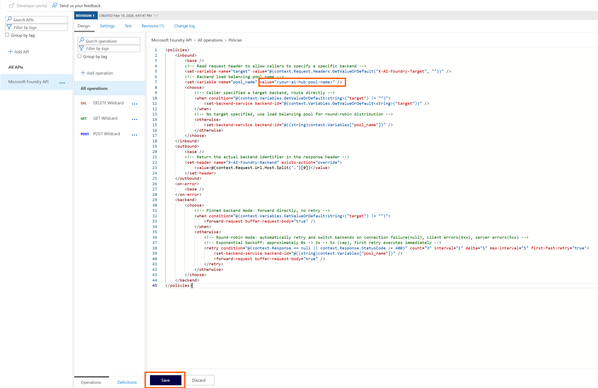

**Policy 核心逻辑 / Policy Logic：**

| 区域 | 功能 |
|------|------|
| **inbound** | 读取 `X-AI-Foundry-Target`，有值则路由到指定后端，否则使用 LB Pool 轮询 / *Route to pinned backend or round-robin pool* |
| **outbound** | `X-AI-Foundry-Backend` 响应头返回实际后端名称 / *Return actual backend in response header* |
| **backend** | 指定后端直接转发；轮询模式遇错误自动重试切换（最多 3 次，指数退避）/ *Direct forward for pinned; auto-retry with exponential backoff for pool* |


---

## 7. 测试与验证 / Test and Validate

**准备工作 / Prerequisites：**

*Gather the following before testing:*

- 获取 Gateway URL：APIM → Overview → Gateway URL / *Get Gateway URL: APIM → Overview → Gateway URL*
- 获取 API Key：APIM → Subscriptions → Built-in all-access → Show keys → Primary key / *Get API Key: APIM → Subscriptions → Built-in all-access → Show keys → Primary key*

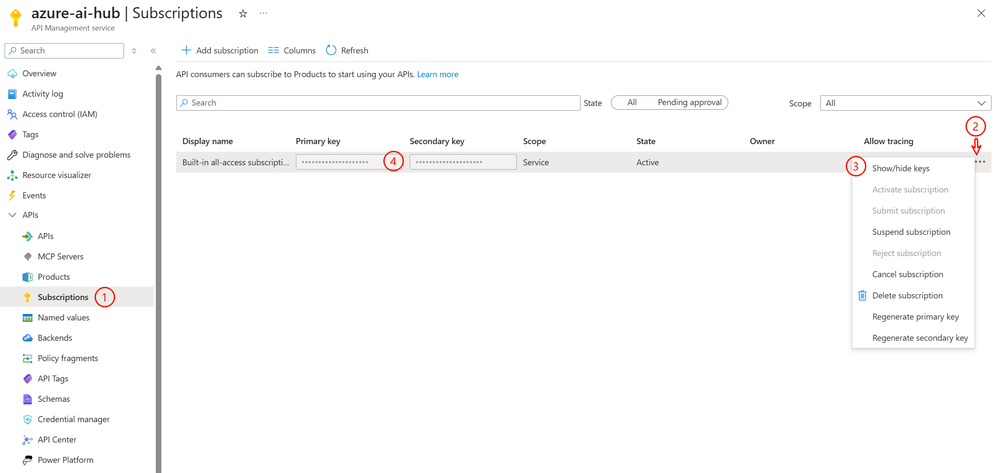

### 测试 1：负载均衡 / Test 1: Load Balancing

连续发送请求，观察 `X-AI-Foundry-Backend` 响应头在多个后端间轮换：

*Send consecutive requests without `X-AI-Foundry-Target`, observe `X-AI-Foundry-Backend` rotating across backends:*

```bash
curl -D - -o /dev/null --location \
  'https://<apim-gateway-url>/openai/v1/videos' \
  --header 'Ocp-Apim-Subscription-Key: <your-subscription-key>'
```

预期：每次请求的 `X-AI-Foundry-Backend` 值不同，证明 Round-robin 轮询生效。

*Expected: `X-AI-Foundry-Backend` changes with each request, confirming Round-robin is working.*

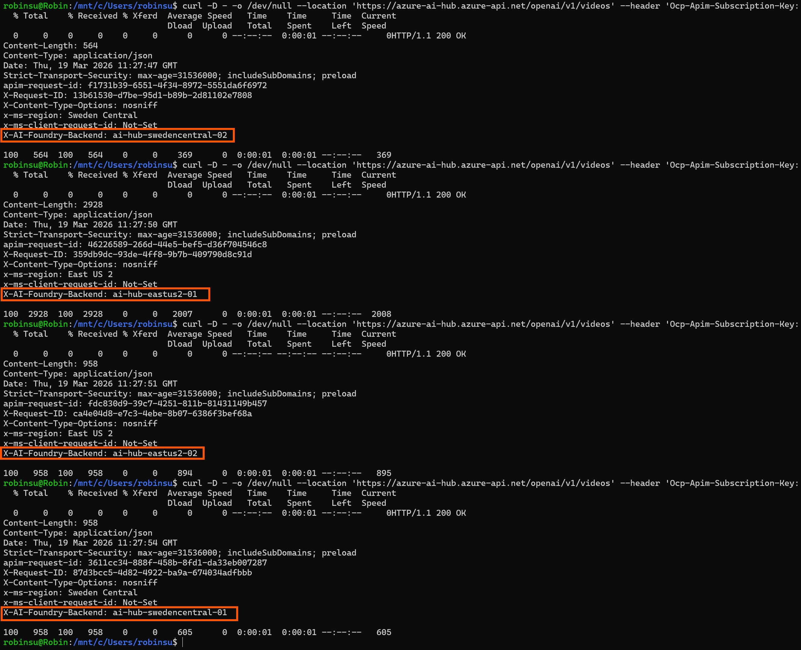

### 测试 2：指定后端路由 / Test 2: Pinned Backend Routing

通过 `X-AI-Foundry-Target` 请求头锁定特定后端：

*Use `X-AI-Foundry-Target` header to pin to a specific backend:*

```bash
curl -s -D - -o /dev/null --location \
  'https://<apim-gateway-url>/openai/v1/responses' \
  --header 'Content-Type: application/json' \
  --header 'Ocp-Apim-Subscription-Key: <your-subscription-key>' \
  --header 'X-AI-Foundry-Target: <backend-name>' \
  --data '{"model": "<model-name>", "input": "Hello"}' \
  | grep -i X-AI-Foundry-Backend
```

预期：多次请求的 `X-AI-Foundry-Backend` 始终返回指定的后端名称。

*Expected: `X-AI-Foundry-Backend` consistently returns the specified backend name.*

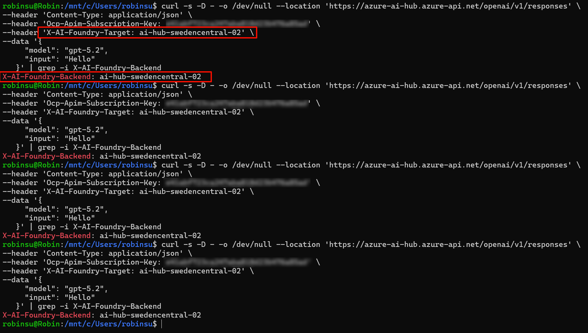

---

## 常见问题 / FAQ

**Q: 为什么不使用 APIM Backend 的 Circuit Breaker？**

***Q: Why not use APIM Backend's Circuit Breaker?***

本架构目标是负载均衡与配额聚合。Circuit Breaker 会在后端故障时"断路"，但在我们的场景中，一个后端的某个模型限流（429）不应阻断对该后端其他模型的访问。通过 `retry` + `set-backend-service` 实现的简单故障转移更适合此场景。

*This architecture targets load balancing and quota aggregation. Circuit Breaker would "break" on backend failure, but a 429 on one model shouldn't block other models on the same backend. Simple failover via `retry` + `set-backend-service` is more appropriate.*

**Q: 这个架构仅适用于 Sora2 吗？**

***Q: Is this architecture only for Sora2?***

不是。适用于任何 Foundry / Azure OpenAI 模型服务（Responses API、Chat Completions、Embeddings、Image Generation 等），只需将 Backend URL 指向对应端点即可。

*No. It applies to any Foundry / Azure OpenAI model service (Responses API, Chat Completions, Embeddings, Image Generation, etc.)—just point the Backend URL to the corresponding endpoint.*

---

## 参考文档 / Reference Documentation

- Microsoft Foundry 概述 / Overview: https://learn.microsoft.com/azure/foundry/what-is-foundry
- Foundry RBAC: https://learn.microsoft.com/azure/foundry-classic/openai/how-to/role-based-access-control
- APIM v2 Tier: https://learn.microsoft.com/azure/api-management/v2-service-tiers-overview
- 后端与负载均衡池 / Backends & LB Pool: https://learn.microsoft.com/azure/api-management/backends
- APIM 托管标识 / Managed Identity: https://learn.microsoft.com/azure/api-management/api-management-howto-use-managed-service-identity
- 重试策略 / Retry Policy: https://learn.microsoft.com/azure/api-management/retry-policy
- Sora2 视频生成 / Video Generation: https://learn.microsoft.com/azure/foundry/openai/concepts/video-generation
- 模型与区域可用性 / Models & Regions: https://learn.microsoft.com/azure/foundry/foundry-models/concepts/models-sold-directly-by-azure
- Azure OpenAI 错误码 / Error Codes: https://learn.microsoft.com/azure/foundry/openai/supported-languages#error-handling

---

