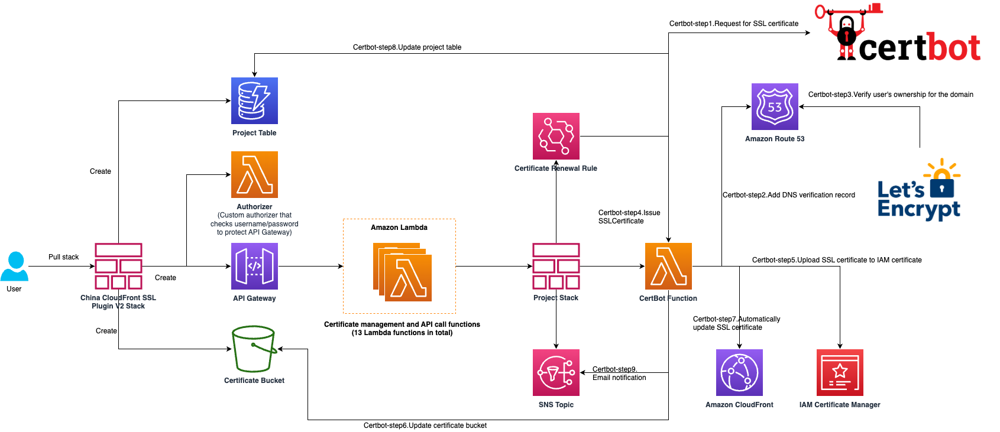

在当今数字时代，网站安全至关重要。SSL 证书作为保护网站数据传输安全的重要工具，其管理和更新一直是开发运维人员关注的焦点。在 2023 年我们发布了 China CloudFront SSL Plugin 方便中国区 CloudFront 与免费 SSL 证书的集成。我们持续迭代我们的方案。现在，我们很高兴地宣布 China CloudFront SSL Plugin 的第二代版本正式发布。

### 全新升级，更强大的功能

China CloudFront SSL Plugin V2 带来了三大核心升级，让证书管理更简单、更安全、更高效。

#### 1. 突破单项目限制，实现多项目统一管理，在新版本中，我们彻底重构了项目管理架构：

- 升级前 V1 版本：每个堆栈仅支持管理单个项目的域名集合，多项目管理需要部署多个堆栈

- 升级后 V2 版本：单一堆栈即可统一管理多个项目的域名集合，大幅简化运维工作

#### 2. 全新交互体验，告别复杂操作，为提升用户体验，我们重新设计了管理界面：

- 升级前 V1 版本：基于 Swagger UI 构建的 API 管理页面，需要手动构造和发起 API 请求

- 升级后 V2 版本：直观的图形用户界面，通过简单的按钮点击即可完成所有操作，降低使用门槛

#### 3. 安全机制升级，保障操作安全，全面增强了安全性：

- 升级前 V1 版本：外部 API 缺乏有效的安全校验机制

- 升级后 V2 版本：引入 Access Key 验证机制，所有 API 操作都需要进行身份验证，确保安全可控

在带来全新功能的同时，我们保留并强化了方案最受欢迎的特性：

✓ 成本优势

- 完全采用无服务器架构，按实际调用次数计费
- 证书更新默认每 30 天触发一次
- 仅产生极少的存储费用和日志费用

✓ 运营自动化

- 支持与 CloudFront 的无缝集成
- 证书更新后自动替换 CloudFront 中已关联的证书
- 通过 EventBridge 实现证书的自动定期更新

✓ 运维透明

- 完整的邮件通知机制，覆盖证书全生命周期
- 直观的图形化控制面板，实时掌握证书状态
- 支持多项目统一管理和监控

✓ 代码开源

- 所有代码以开源方式提供
- 支持在源代码基础上进行定制化开发
- 便于根据企业需求进行二次开发

这些升级不仅提升了用户体验，更为 China CloudFront 证书管理提供了更强大的支持。无论是单个网站还是多个项目的证书管理，V2 版本都能够从容应对。

## 技术架构

作为一个面向中国区 CloudFront 的证书管理方案，我们基于无服务器架构设计了完整的技术架构，通过 Amazon CloudFormation 模版实现自动化部署。

1. 核心组件：

- Let's Encrypt：作为免费、开放、自动化的证书颁发机构，为方案提供免费 SSL 证书支持
- Certbot：作为免费的开源软件工具，实现证书的自动化获取、部署和更新
- Amazon Lambda：作为核心计算组件，负责运行证书颁发程序、前端界面以及证书管理 API
- Amazon API Gateway：提供安全的证书管理 API 接口，所有操作都需要 Access Key 验证

2. 存储与数据库：

- Amazon DynamoDB：作为无服务器数据库，专门存储项目证书颁发状态与报错信息
- Amazon S3：用于存储备份的 SSL 证书，支持证书的下载和备份管理
- IAM SSL 证书存储：专门用于存储与 CloudFront 关联的 SSL 证书，这是中国区域的特殊要求

3. 自动化与通知：

- Amazon SNS：负责发送证书颁发状态的邮件通知，确保运维人员及时获取证书状态
- Amazon EventBridge：通过定时任务触发证书更新，默认每 30 天自动更新一次

## 部署演示

#### 创建管理堆栈

创建管理堆栈是部署 China CloudFront SSL Plugin V2 的第一步。通过 Amazon CloudFormation 模板，您可以一键部署包含 Lambda 函数、API Gateway、DynamoDB 等核心组件的主堆栈。在部署过程中，您需要指定堆栈名称和 Access Key 作为 API Gateway 的安全密钥，确保只有授权用户才能访问证书管理功能。整个部署过程约需 3-5 分钟，完成后您将获得证书管理前端页面的访问链接。

#### 创建证书项目

创建证书项目是使用 China CloudFront SSL Plugin V2 的核心步骤。在图形化管理界面中，您可以轻松创建新的证书项目，为指定的域名集合申请免费的 Let's Encrypt SSL 证书。每个项目支持多个域名（用逗号分隔），您可以设置接收通知的邮箱地址和证书自动更新间隔（推荐 30 天）。项目创建后，系统会自动部署专属的子堆栈，包含证书颁发 Lambda 函数和 EventBridge 定时规则，实现证书的自动化管理。

#### 将自动颁发的证书附加到 CloudFront

将自动颁发的证书附加到 CloudFront 是实现 HTTPS 访问的关键步骤。证书成功颁发后，系统会自动将其上传到 IAM SSL 证书存储中，您可以在 CloudFront 控制台的分配设置中找到并选择对应的证书。在"备用域名与 SSL 证书"设置中，填入您申请证书的域名，并在自定义 SSL 证书下拉菜单中选择对应的证书即可完成绑定。一旦绑定成功，后续的证书自动更新将无缝替换 CloudFront 中的证书，无需手动干预。

#### 更新证书项目（域名/自动更新时间）

更新证书项目功能让您可以灵活调整项目配置以适应业务变化。通过选择项目并点击"修改项目"按钮，您可以更新域名列表和调整 SSL 证书自动更新时间间隔。每次项目修改都会触发新的证书颁发，确保配置变更立即生效。系统会自动处理 CloudFront 证书的更新和旧证书的清理，整个过程对用户透明且安全可靠。

#### 重新颁发证书/强制更新证书

重新颁发证书功能为您提供了手动控制证书更新的能力。当遇到证书颁发失败或需要立即更新证书时，您可以在证书列表中选择相应证书，点击"重新颁发"按钮手动触发证书更新流程。系统会重新执行完整的证书申请、验证、颁发和 CloudFront 更新流程，并通过邮件通知您操作结果。这个功能特别适用于故障恢复、紧急更新或测试场景，确保您的 SSL 证书始终处于最新状态。

如果您需要体验完整功能请参考我们的解决方案页面进行部署体验。

部署链接：[一键部署 China CloudFront SSL Plugin V2](https://console.amazonaws.cn/cloudformation/home?#/stacks/create/template?templateURL=https://aws-cn-getting-started.s3.cn-northwest-1.amazonaws.com.cn/china-cloudfront-ssl-plugin_v2/ChinaCloudFrontSslPluginStackV2.template.json)

完整教程：[China CloudFront SSL Plugin V2 完整教程](https://www.amazonaws.cn/getting-started/tutorials/create-ssl-with-cloudfront/)

## 总结

China CloudFront SSL Plugin V2 通过全新的多项目管理架构、直观的图形化界面和增强的安全机制，为中国区域的 CloudFront 用户提供了更加便捷和完善的证书解决方案。

## 相关资源与文档

### 教程及部署方式

- [China CloudFront SSL Plugin V2 完整教程](https://www.amazonaws.cn/getting-started/tutorials/create-ssl-with-cloudfront/)

  详细的部署和使用指南，包含完整的操作步骤和故障排查

- [一键部署 V2 版本](https://console.amazonaws.cn/cloudformation/home?#/stacks/create/template?templateURL=https://aws-cn-getting-started.s3.cn-northwest-1.amazonaws.com.cn/china-cloudfront-ssl-plugin_v2/ChinaCloudFrontSslPluginStackV2.template.json)

  直接通过 CloudFormation 模板部署最新版本

### 开源代码仓库

- [China CloudFront SSL Plugin V2](https://github.com/aws-samples/sample-China-CloudFront-SSL-Plugin-V2)

  V2 版本的完整源代码，支持自定义开发和贡献

- [China CloudFront SSL Plugin V1](https://github.com/aws-samples/China-CloudFront-SSL-Plugin)

  第一代版本的源代码，用于对比和参考

### 相关亚马逊云科技服务文档

- [Amazon CloudFront 中国区功能差异](https://docs.amazonaws.cn/aws/latest/userguide/cloudfront.html#feature-diff)

  了解中国区 CloudFront 的特殊要求和限制

- [IAM SSL 证书管理](https://docs.amazonaws.cn/IAM/latest/UserGuide/id_credentials_server-certs.html)

  中国区 CloudFront SSL 证书存储的官方文档

- [Amazon Route 53 域名迁移](https://www.amazonaws.cn/getting-started/tutorials/migrate-domain-to-amazon-route53/)

  将域名解析迁移到 Route 53 的详细步骤

- [ICP 备案指南](https://www.amazonaws.cn/support/icp/)

  中国区域网站部署必需的 ICP 备案流程

- [Amazon CloudFront 部署指南](https://aws.amazon.com/cn/blogs/china/divert-website-access-traffic-from-ec2-to-amazon-cloudfront/)

  CloudFront 部署小指南（八）- 使用中国区 CloudFront 及 SSL 插件部署免费证书

### 其他技术参考

- [Let's Encrypt 官方文档](https://letsencrypt.org/zh-cn/docs/)

  了解 Let's Encrypt 证书颁发机构的工作原理和限制

- [Certbot 官方文档](https://certbot.eff.org/pages/about)

  Certbot 工具的详细使用说明

- [Amazon Route 53 DNS 验证](https://certbot-dns-route53.readthedocs.io/en/stable/)

  Route 53 DNS 验证插件的技术文档

### 联系我们

- [联系亚马逊云科技的技术支持](https://webchat-aws.clink.cn/chat.html?accessId=35d2504b-57b6-4093-97fd-81a6198bbbfa&language=zh_CN)

  获取官方专业的技术支持和问题解答

- [邮件联系解决方案团队](mailto:china-cloudfront-ssl-plugin@amazon.com)

  直接联系 China CloudFront SSL Plugin 解决方案团队获取专业支持

---

> 原文链接：[AWS 博客](https://aws.amazon.com/cn/blogs/china/china-cloudfront-ssl-plugin-v2-a-one-stop-certificate-solution-for-cloudfront-in-china-region/) | [GitHub](https://github.com/aws-samples/sample-China-CloudFront-SSL-Plugin-V2)
