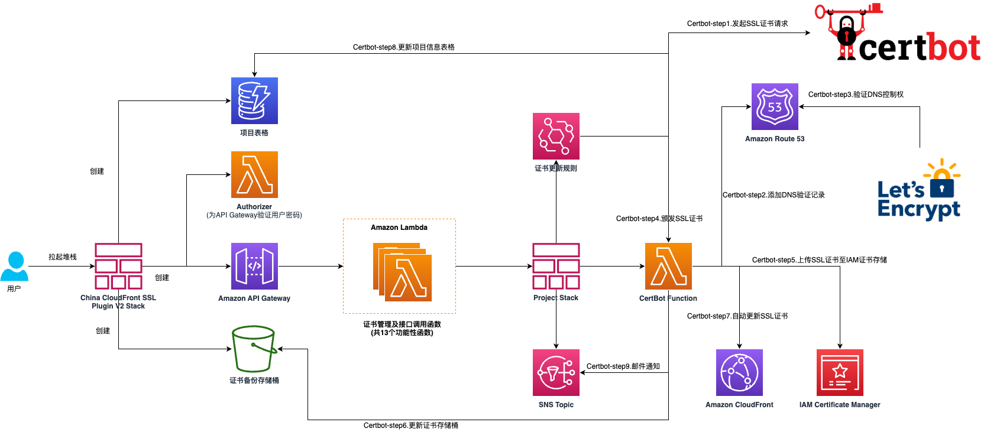
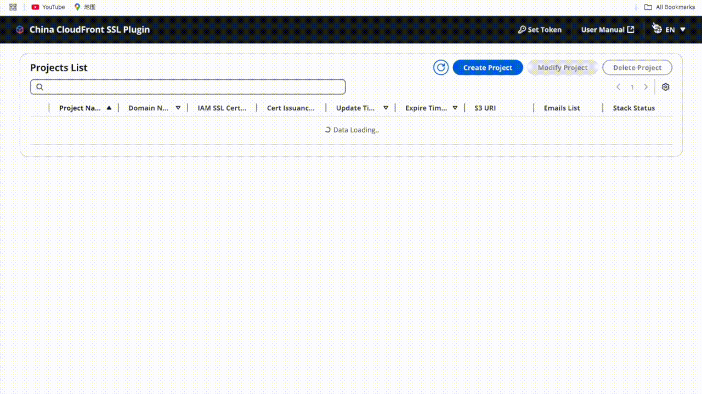
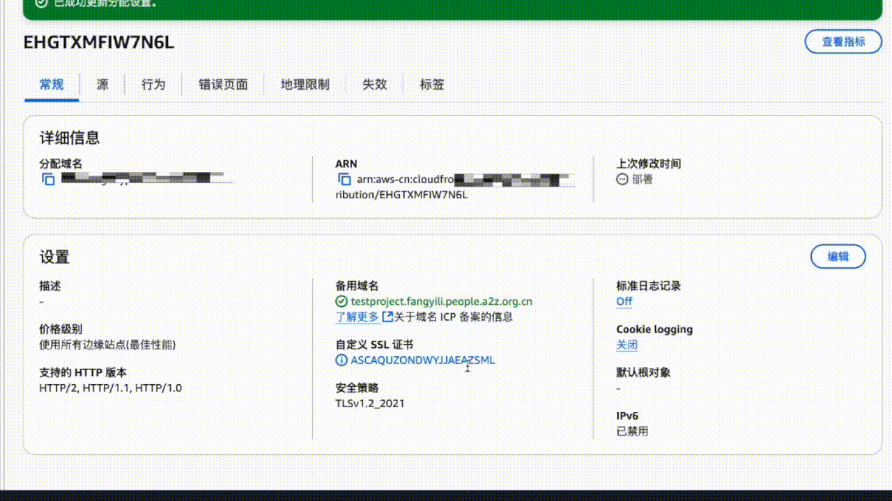
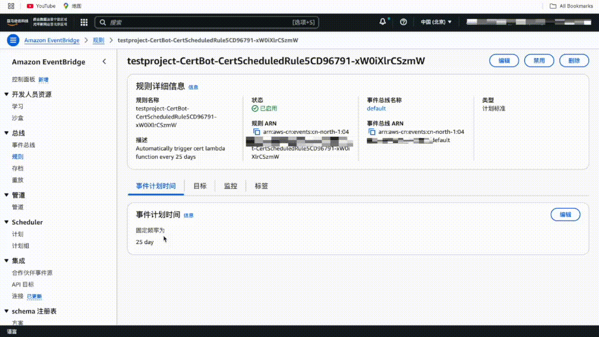

在当今数字时代，网站安全至关重要。SSL 证书作为保护网站数据传输安全的重要工具，其管理和更新一直是开发运维人员关注的焦点。在 2023 年我们发布了 China CloudFront SSL Plugin 方便中国区 CloudFront 与免费 SSL 证书的集成。现在，我们很高兴地宣布第二代版本正式发布。

## 全新升级，更强大的功能

V2 带来了三大核心升级，让证书管理更简单、更安全、更高效。

### 1. 多项目统一管理

- **V1**：每个堆栈仅支持单个项目，多项目需部署多个堆栈
- **V2**：单一堆栈统一管理多个项目

### 2. 图形化界面

- **V1**：Swagger UI，需手动构造 API 请求
- **V2**：直观 GUI，按钮点击完成操作

### 3. 安全认证

- **V1**：外部 API 缺乏安全校验
- **V2**：Access Key 验证机制

### 保留的核心特性

在带来新功能的同时，我们保留了最受欢迎的核心特性：

✓ **成本优势** — 无服务器架构，按调用计费，证书每30天自动更新，极少存储费用

✓ **运营自动化** — CloudFront 无缝集成，证书自动替换，EventBridge 定时更新

✓ **运维透明** — 邮件通知全生命周期，图形化控制面板，多项目监控

✓ **代码开源** — 所有代码开源，支持定制开发

## 技术架构

基于无服务器架构，通过 CloudFormation 一键部署。

**核心组件**：Let's Encrypt + Certbot + Lambda + API Gateway

**存储**：DynamoDB（状态）+ S3（备份）+ IAM SSL（CloudFront 关联）

**自动化**：SNS（邮件通知）+ EventBridge（定时更新，默认30天）

## 部署演示

### 创建管理堆栈

通过 CloudFormation 模板一键部署主堆栈（Lambda、API Gateway、DynamoDB），指定堆栈名称和 Access Key，3-5 分钟完成。

### 创建证书项目

在 GUI 中创建证书项目，为域名集合申请 Let's Encrypt 证书。支持多域名（逗号分隔），可设邮箱通知和更新间隔（推荐30天）。系统自动部署子堆栈。

### 附加证书到 CloudFront

证书颁发后自动上传到 IAM SSL 存储，在 CloudFront 控制台选择即可。后续自动更新无缝替换，无需手动干预。

### 更新证书项目

可随时更新域名列表和更新间隔，每次修改触发新证书颁发。系统自动处理 CloudFront 证书更新和旧证书清理。

### 重新颁发证书

手动控制证书更新，适用于故障恢复、紧急更新或测试。系统重新执行完整的证书申请、验证、颁发和 CloudFront 更新流程。

- 部署链接：[一键部署 V2](https://console.amazonaws.cn/cloudformation/home?#/stacks/create/template?templateURL=https://aws-cn-getting-started.s3.cn-northwest-1.amazonaws.com.cn/china-cloudfront-ssl-plugin_v2/ChinaCloudFrontSslPluginStackV2.template.json)
- 完整教程：[V2 教程](https://www.amazonaws.cn/getting-started/tutorials/create-ssl-with-cloudfront/)

## 总结

V2 通过多项目管理架构、图形化界面和增强安全机制，为中国区 CloudFront 用户提供更便捷的证书解决方案。

## 资源

- [V2 教程](https://www.amazonaws.cn/getting-started/tutorials/create-ssl-with-cloudfront/)
- [GitHub V2](https://github.com/aws-samples/sample-China-CloudFront-SSL-Plugin-V2)
- [GitHub V1](https://github.com/aws-samples/China-CloudFront-SSL-Plugin)
- [CloudFront 中国区差异](https://docs.amazonaws.cn/aws/latest/userguide/cloudfront.html#feature-diff)
- [IAM SSL 证书管理](https://docs.amazonaws.cn/IAM/latest/UserGuide/id_credentials_server-certs.html)
- [Let's Encrypt 文档](https://letsencrypt.org/zh-cn/docs/)
- [Certbot 文档](https://certbot.eff.org/pages/about)
- [联系我们](mailto:china-cloudfront-ssl-plugin@amazon.com)

---

原文链接：[AWS 博客](https://aws.amazon.com/cn/blogs/china/china-cloudfront-ssl-plugin-v2-a-one-stop-certificate-solution-for-cloudfront-in-china-region/) | [GitHub](https://github.com/aws-samples/sample-China-CloudFront-SSL-Plugin-V2)

