> **原文链接 / Original Post:** [Amazon CloudFront 部署小指南（八）- 使用中国区 CloudFront 及 CloudFront SSL 插件部署免费证书](https://aws.amazon.com/cn/blogs/china/divert-website-access-traffic-from-ec2-to-amazon-cloudfront/)
>
> **GitHub:** [aws-samples/China-CloudFront-SSL-Plugin](https://github.com/aws-samples/China-CloudFront-SSL-Plugin)

本文适用于亚马逊云科技中国区服务，阅读本文您将了解到如何使用中国区 Amazon CloudFront 将部署在 EC2 网站上的流量进行加速与分发，并使用 [China CloudFront SSL 插件](https://www.amazonaws.cn/getting-started/tutorials/create-ssl-with-cloudfront/)提供的免费证书保护您的站点。该插件可以帮助您在亚马逊云科技中国区域生成、更新和下载免费的 SSL 证书，并支持与 Amazon CloudFront 的集成及关联 SSL 证书的自动更新。您亦可参考本文的将 EC2 与 CloudFront 集成部分，用于亚马逊云科技全球区域使用 CloudFront 分发 EC2 网站流量的配置操作。

*This article applies to AWS China Region services. You will learn how to use Amazon CloudFront in the China Region to accelerate and distribute traffic from websites deployed on EC2, and use the [China CloudFront SSL Plugin](https://www.amazonaws.cn/getting-started/tutorials/create-ssl-with-cloudfront/) to deploy free SSL certificates to protect your site. The plugin helps you generate, renew, and download free SSL certificates in the AWS China Regions, with Amazon CloudFront integration and automatic certificate renewal. You can also refer to the EC2-CloudFront integration section for configuring CloudFront to distribute EC2 website traffic in AWS Global Regions.*

## 为什么选用 Amazon CloudFront? / Why Choose Amazon CloudFront?

Amazon CloudFront 是亚马逊云科技提供的一项内容分发网络（CDN）服务。使用 CDN 可以减少网站的加载时间，降低跳出率，增加流量和收益；同时还可以减轻源服务器的负载，提高网站的稳定性和安全性，并保证网站的可用性和可靠性。Amazon CloudFront 可以在开发人员友好环境中以低延迟和高传输速度向全球客户安全分发数据、视频、应用程序和 API，同时可以与 Amazon S3、Elastic Load Balancer 或 Amazon EC2 等服务无缝协作。

*Amazon CloudFront is a Content Delivery Network (CDN) service provided by AWS. Using a CDN reduces website load times, lowers bounce rates, and increases traffic and revenue, while also reducing the load on origin servers, improving website stability and security. Amazon CloudFront securely delivers data, videos, applications, and APIs to customers globally with low latency and high transfer speeds in a developer-friendly environment, and integrates seamlessly with Amazon S3, Elastic Load Balancer, Amazon EC2, and more.*

Amazon CloudFront 不仅可以加速您的网站，减轻源服务器的负载，还可以降低您部署在亚马逊云中的网站传出至互联网的数据传输费用。以 EC2 为例，相比较 EC2 的传出至互联网的数据传输费用，在亚马逊云科技中国区域使用 Amazon CloudFront 可以帮助您降低至少 67% 的传出至互联网的数据传输费用。具体费用可参考亚马逊云科技中国区官方网站 [EC2 数据传输费用](https://www.amazonaws.cn/ec2/pricing/#Amazon_EC2_.E6.95.B0.E6.8D.AE.E4.BC.A0.E8.BE.93)与 [CloudFront 数据传输费用](https://www.amazonaws.cn/cloudfront/pricing/#On-demand_Pricing)。

*Amazon CloudFront not only accelerates your website and reduces origin server load, but also lowers the data transfer costs for traffic leaving your AWS-hosted website to the internet. For example, compared to EC2's outbound data transfer costs, using Amazon CloudFront in the AWS China Regions can help you reduce outbound data transfer costs by at least 67%. For specific pricing, refer to [EC2 Data Transfer Pricing](https://www.amazonaws.cn/ec2/pricing/#Amazon_EC2_.E6.95.B0.E6.8D.AE.E4.BC.A0.E8.BE.93) and [CloudFront Data Transfer Pricing](https://www.amazonaws.cn/cloudfront/pricing/#On-demand_Pricing).*

## 使用中国区 CloudFront 的注意事项 / Considerations for Using CloudFront in China Regions

- **ICP 备案及备案域名 / ICP Filing and Domain Registration：** 根据相关法律法规，如果您需要在中国境内托管网站，首先需要进行 ICP 备案，未备案的域名无法提供网页服务，请准备一个已备案的域名。请查阅亚马逊云科技中国区 [ICP 备案支持文档](https://www.amazonaws.cn/support/icp/)，了解有关获取域名所需 ICP 备案的更多详细信息。
  *According to relevant regulations, websites hosted in mainland China require ICP filing. Domains without ICP filing cannot serve web content. Please refer to the AWS China [ICP Filing Support Documentation](https://www.amazonaws.cn/support/icp/).*

- **CloudFront 提供的域名 / CloudFront Provided Domain：** CloudFront 会为您自动分配一个 CloudFront 域 `*.cloudfront.cn`。但基于 ICP 备案需求，在中国区您无法直接使用该域名用于网站服务。您必须向 CloudFront 分配添加 ICP 备案后的域名作为备用域名（也称为 CNAME），然后使用备用域名访问您的网站。
  *CloudFront automatically assigns a `*.cloudfront.cn` domain. However, due to ICP requirements, you cannot directly use this domain for website services in China. You must add an ICP-filed domain as an alternate domain name (CNAME).*

- **CloudFront 集成 SSL/TLS 证书 / SSL/TLS Certificate Integration：** 中国区域的 Amazon CloudFront 目前不支持 [Amazon Certificate Manager](https://www.amazonaws.cn/certificate-manager/features/)。如果您需要在 CloudFront 使用 SSL/TLS 证书，您可以通过第三方证书机构获取 SSL/TLS 证书，并[导入 SSL/TLS 证书](https://docs.amazonaws.cn/AmazonCloudFront/latest/DeveloperGuide/cnames-and-https-procedures.html#cnames-and-https-uploading-certificates)。您也可以通过 [China CloudFront SSL 插件](https://www.amazonaws.cn/getting-started/tutorials/create-ssl-with-cloudfront/)来获取免费的 SSL/TLS 证书，本篇文章"使用 China CloudFront SSL 插件部署免费证书"将进行重点介绍。
  *Amazon CloudFront in the China Regions does not currently support [Amazon Certificate Manager](https://www.amazonaws.cn/certificate-manager/features/). You can obtain SSL/TLS certificates from third-party CAs or use the [China CloudFront SSL Plugin](https://www.amazonaws.cn/getting-started/tutorials/create-ssl-with-cloudfront/) for free certificates.*

- **CloudFront 中国区域和全球区域的功能差异 / Feature Differences Between China and Global Regions：** 在中国区域 Amazon CloudFront 目前不支持 Lambda@Edge、Amazon WAF 等功能，更多详情请[查看文档](https://docs.amazonaws.cn/aws/latest/userguide/cloudfront.html#feature-diff)。
  *Amazon CloudFront in China Regions does not currently support Lambda@Edge, Amazon WAF, etc. See the [documentation](https://docs.amazonaws.cn/aws/latest/userguide/cloudfront.html#feature-diff) for details.*

## 前提条件 / Prerequisites

为了确保您完成本篇的全部内容，获得亚马逊云科技的各种服务带来的一致性体验，请确保您已经满足前提条件。

*To complete all sections of this article and get a consistent experience with AWS services, please ensure you meet the following prerequisites.*

- 您的亚马逊云科技中国区账号已经完成了 ICP 备案的相关事项，确保 80/443 端口已经开放 / Your AWS China Region account has completed ICP filing, with ports 80/443 open
- 您拥有经过 ICP 备案过域名 / You have an ICP-filed domain
- 使用 [Amazon Route 53](https://www.amazonaws.cn/route53/) 作为您的域名解析服务。如果您尚未将域名解析迁移至亚马逊云科技 Amazon Route 53，请点击[参考文档](https://www.amazonaws.cn/getting-started/tutorials/migrate-domain-to-amazon-route53/) / Use [Amazon Route 53](https://www.amazonaws.cn/route53/) as your DNS service. If you haven't migrated yet, see the [reference documentation](https://www.amazonaws.cn/getting-started/tutorials/migrate-domain-to-amazon-route53/)

## 将 EC2 与 CloudFront 集成 / Integrating EC2 with CloudFront

在本篇文章的后续内容您将跟随文档操作，开启一个 EC2 并搭建一个 Web 服务器，随后将 EC2 与 CloudFront 进行集成，并利用 China CloudFront SSL 插件部署免费证书。

*In the following sections, you will launch an EC2 instance, set up a web server, integrate EC2 with CloudFront, and deploy a free SSL certificate using the China CloudFront SSL Plugin.*

您还会了解到一些使用 EC2 及 CloudFront 的小技巧，例如使用弹性 IP 来固定您的 EC2 公有 DNS 主机名用于 CloudFront 的源，或者使用 Amazon 托管式前缀列表来加强 EC2 的安全性。

*You will also learn some tips, such as using Elastic IP to fix your EC2 public DNS hostname for CloudFront origins, or using AWS-managed prefix lists to enhance EC2 security.*

本篇文章的部署架构图如下所示：

*The deployment architecture is shown below:*

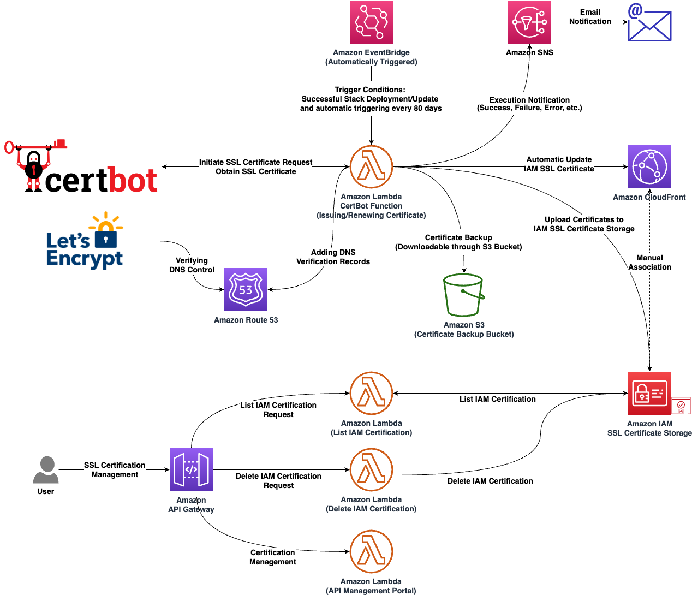

### 创建 EC2 并安装 Web 服务器 / Create EC2 and Install Web Server

在本节中您将创建一个 EC2 并安装一个 Web 服务器用于网站服务，随后将一个弹性 IP 绑定至 EC2 上用于固定 EC2 的公有 DNS 主机名。

*In this section, you will create an EC2 instance with a web server, then bind an Elastic IP to fix the public DNS hostname.*

#### 一、启动 EC2 实例 / Step 1: Launch EC2 Instance

您可以通过 EC2 控制台启动一个 EC2 实例。

*Launch an EC2 instance from the EC2 console.*


请为您的实例命名，例如"web-server"。

*Name your instance, e.g., "web-server".*


系统映像（AMI）与实例类型，您可以保持默认。

*You can keep the default AMI and instance type.*

- AMI: Amazon Linux 2023
- 实例类型 / Instance type: micro


在"密钥对"处选择已有或者创建新的密钥对，用于您后续操作系统的运维。

*Select an existing key pair or create a new one for SSH access.*


关于网络配置，请确保您的 EC2 实例部署在公有子网，同时请勾选"允许来自互联网的 HTTP 流量"，以确保 EC2 的 80 端口互联网可达。

*For network settings, ensure the EC2 instance is in a public subnet and check "Allow HTTP traffic from the internet" to make port 80 accessible.*


请在底部展开"高级详细信息"部分：

*Expand the "Advanced details" section at the bottom:*

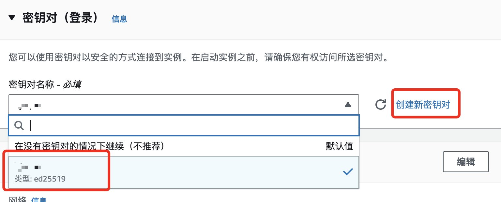

在页面底部"用户数据"处，粘贴以下代码，用于在实例首次启动时安装 Web 服务器。随后点击"启动实例"按钮，执行实例启动。

*Paste the following user data script to install a web server on first boot, then click "Launch instance".*

```bash
#!/bin/bash
yum install -y httpd
systemctl enable httpd
systemctl start httpd
```


#### 二、创建弹性 IP 并关联 EC2 实例 / Step 2: Create Elastic IP and Associate with EC2

[弹性 IP](https://docs.amazonaws.cn/AWSEC2/latest/UserGuide/elastic-ip-addresses-eip.html) 地址是专为云计算设计的静态 IPv4 地址，利用弹性 IP 可保证您的 EC2 实例的公有 IP 地址和公有 DNS 主机名不会发生变化。在本节中您将了解到如何使用弹性 IP 关联 EC2 实例，并利用 EC2 实例的公有 DNS 主机名访问您的站点。

*[Elastic IP](https://docs.amazonaws.cn/AWSEC2/latest/UserGuide/elastic-ip-addresses-eip.html) is a static IPv4 address designed for cloud computing. It ensures your EC2 instance's public IP address and DNS hostname remain unchanged. In this section, you'll learn how to associate an Elastic IP with your EC2 instance and access your site using the public DNS hostname.*

您可以在 EC2 控制台中，左侧"网络与安全"菜单中找到弹性 IP。

*Find Elastic IP under "Network & Security" in the EC2 console left menu.*


点击右上角"分配弹性 IP 地址"，随后点击"分配"来获得弹性 IP。

*Click "Allocate Elastic IP address" then "Allocate" to obtain an Elastic IP.*


随后选中您的弹性 IP，点击右上角"操作"按钮，选择"关联弹性 IP 地址"。

*Select your Elastic IP, click "Actions", and choose "Associate Elastic IP address".*


然后请选择您先前创建的 EC2 实例，并点击关联按钮，以保证 EC2 实例的公有 IP 地址不会变化。

*Select your previously created EC2 instance and click "Associate" to ensure the public IP address remains stable.*

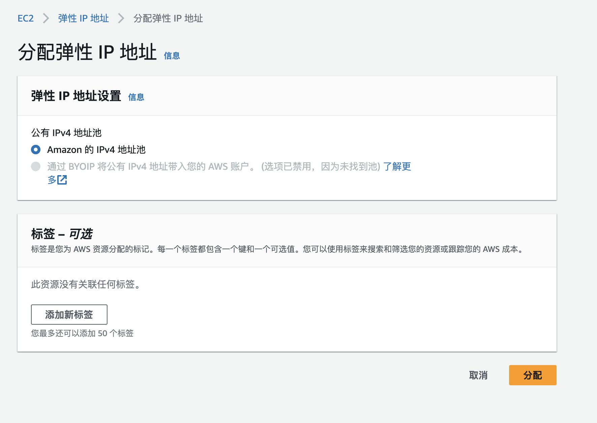

随后您可以点击左侧"实例"菜单，返回到实例列表中，选中您的实例，并复制公有 IPv4 DNS。

*Return to the instance list, select your instance, and copy the public IPv4 DNS.*

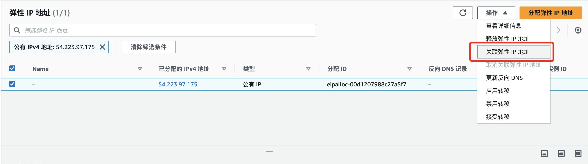

最后您可以使用公有 DNS 主机名，在浏览器中进行访问，以确保 Web 服务器安装完成。在这里您可以看到，当前的站点使用的是 80 端口，同时没有关联 SSL/TLS 证书。

*Access the public DNS hostname in your browser to verify the web server is installed. You'll see the site is using port 80 without SSL/TLS.*


在后面的部分，您将利用该域名作为 CloudFront 的源，将网站访问流量由 EC2 转移至 Amazon CloudFront。

*In the following sections, you'll use this hostname as the CloudFront origin to divert website traffic from EC2 to Amazon CloudFront.*

### 创建 CloudFront 并使用 CloudFront 访问您的站点 / Create CloudFront Distribution

在本节中您将创建 CloudFront 分配并关联至上述完成部署的 EC2 中，将流量通过请求 CloudFront 来实现内容分发的加速。

*In this section, you will create a CloudFront distribution and associate it with your EC2 instance to accelerate content delivery.*

#### 一、创建 CloudFront 分配并关联 EC2 实例 / Step 1: Create CloudFront Distribution

接下来，您将快速构建一个 CloudFront 分配（Distribution）配置，进入到 CloudFront 首页并创建配置：

*Next, you'll quickly set up a CloudFront distribution. Go to the CloudFront console and create a distribution:*

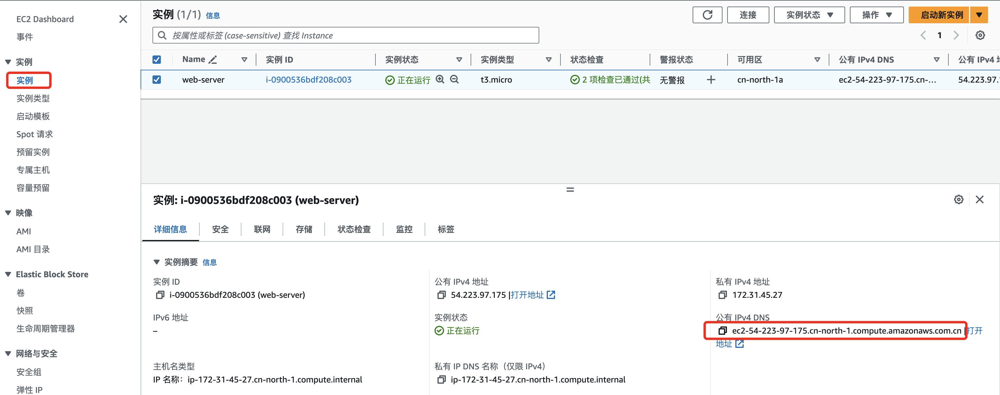

在 CloudFront 的配置初始化页面，您将看到一个 CloudFront 配置需要具备的所有基本配置元素，分别为：

*On the CloudFront configuration page, you'll see the basic configuration elements:*

- **源 / Origin** – 源服务器，可支持多种类型的亚马逊云科技服务，包括并不仅限于 S3 / EC2 / ELB / API Gateway 等，并可支持第三方源站 / The origin server, supporting S3, EC2, ELB, API Gateway, and third-party origins
- **缓存行为 / Cache Behavior** – 通过路径匹配制定缓存行为、启用传输压缩、允许请求方法、访问控制等 / Define caching behavior through path matching, enable compression, allowed methods, access control, etc.
- **设置 / Settings** – 别名（CNAME）/ SSL 证书 / 默认根对象 / 日志记录等 / Alternate domain names (CNAME), SSL certificate, default root object, logging, etc.

在源服务器设置中，使用绑定弹性 IP 地址的 EC2 的公有 DNS 来作为源域，同时确保源协议为 HTTP。

*For the origin, use the EC2 public DNS (with Elastic IP) as the origin domain. Ensure the origin protocol is HTTP.*

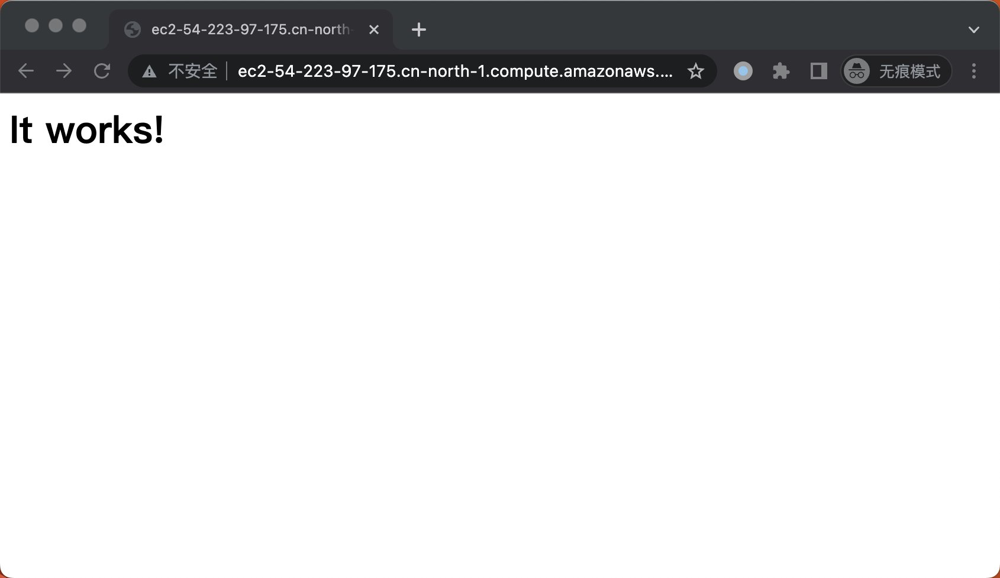

在默认缓存行为中，您可保持默认设置：

*Keep the default cache behavior settings:*


> **注：** 由于合规性要求，中国北京/中国宁夏区域的 CloudFront 提供的分配默认域名无法直接访问，需完成域名的 ICP 备案并通过 CNAME 域名解析后才可进行访问。
>
> **Note:** Due to compliance requirements, the default CloudFront domain in Beijing/Ningxia regions cannot be accessed directly. You must complete ICP filing and set up CNAME DNS resolution.

在设置部分，您需要在备用域名（CNAME）中填写 ICP 备案过的域名：

*In the settings section, enter your ICP-filed domain as the alternate domain name (CNAME):*

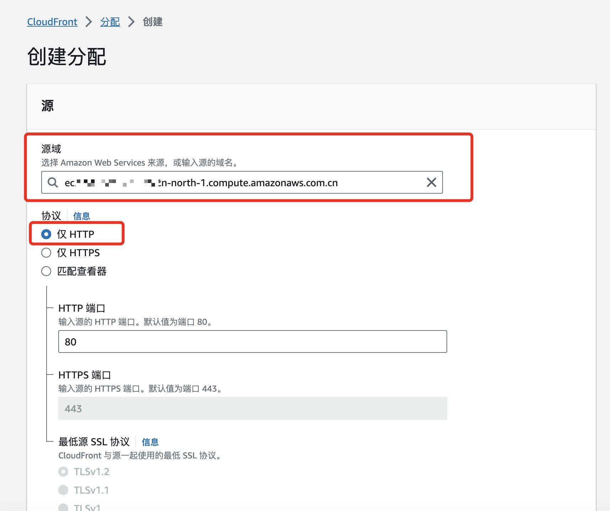

创建完毕后，等待部署完成。部署完成之后，检查您的备用域名，若域名已通过 ICP 备案，您应能看到"绿色标记"。

*After creation, wait for deployment. Once complete, check your alternate domain name — if ICP-filed, you should see a "green checkmark".*


等待部署完成之后进入 Route 53 或您的域名解析提供商，更新解析配置。以 Route 53 为例，进入对应域名的托管区域并创建一个新记录。

*After deployment, go to Route 53 (or your DNS provider) to update DNS records. Create a new record in the hosted zone.*

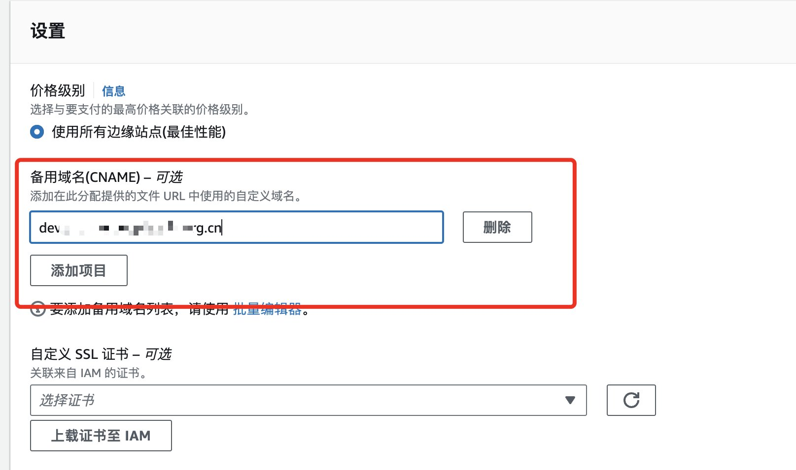

填写对应的解析记录：

*Fill in the DNS record:*


完成域名解析更新后，打开浏览器访问 ICP 备案的域名：

*After DNS update, access your ICP-filed domain in the browser:*

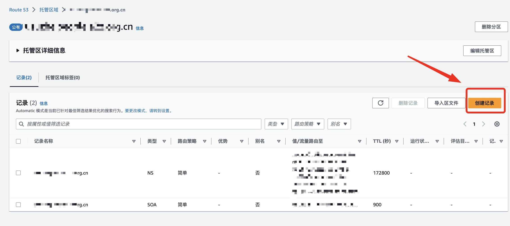

> **注：** 如果出现 502 报错，请检查 EC2 是否安装 SSL 证书或者源端口是否正确，请参考[文档](https://docs.amazonaws.cn/AmazonCloudFront/latest/DeveloperGuide/http-502-bad-gateway.html)。如果出现 403 报错，请确保您使用 ICP 备案的域名访问。
>
> **Note:** If you get a 502 error, check whether EC2 has an SSL certificate installed or if the origin port is correct. See [documentation](https://docs.amazonaws.cn/AmazonCloudFront/latest/DeveloperGuide/http-502-bad-gateway.html). For 403 errors, ensure you're using the ICP-filed domain.

#### 二、提升 EC2 与网站的安全 / Step 2: Enhance EC2 and Website Security

在本章节您将使用 [Amazon 托管式前缀列表](https://docs.amazonaws.cn/vpc/latest/userguide/working-with-aws-managed-prefix-lists.html#available-aws-managed-prefix-lists)来加强 EC2 的安全性。您可以借助 Amazon CloudFront 的 AWS 托管式前缀列表，从而将源的入站 HTTP/HTTPS 流量限定为属于 CloudFront 面向源的服务器的 IP 地址。

*In this section, you'll use [AWS-managed prefix lists](https://docs.amazonaws.cn/vpc/latest/userguide/working-with-aws-managed-prefix-lists.html#available-aws-managed-prefix-lists) to enhance EC2 security. You can use the CloudFront managed prefix list to restrict inbound HTTP/HTTPS traffic to CloudFront origin-facing IP addresses only.*

请选中实例，进入 EC2 的安全组，编辑入站规则：新建一条 HTTP 规则，源中输入"cloudfront"，选中 `com.amazonaws.global.cloudfront.origin-facing` 的前缀列表，同时删除原有面向 `0.0.0.0/0` 的规则。

*Edit the security group inbound rules: add an HTTP rule with `com.amazonaws.global.cloudfront.origin-facing` prefix list as the source, and remove the existing `0.0.0.0/0` rule.*


此外您也可以在 CloudFront 上关联 SSL/TLS 证书，来加强网站的安全。在后面的部分，您将利用 China CloudFront SSL 插件部署免费的 SSL 证书。

*You can also associate SSL/TLS certificates with CloudFront to enhance website security. In the following section, you'll deploy free SSL certificates using the China CloudFront SSL Plugin.*

## 使用 China CloudFront SSL 插件部署免费证书 / Deploy Free SSL Certificates with China CloudFront SSL Plugin

在开始操作前，请再次确认您使用 Amazon Route 53 解析您的域名。本篇仅介绍部署部分，有关更多详情请查看 [China CloudFront SSL 插件](https://www.amazonaws.cn/getting-started/tutorials/create-ssl-with-cloudfront/?nc1=h_ls)。

*Before starting, confirm you're using Amazon Route 53 for DNS. This section covers deployment only. For more details, see the [China CloudFront SSL Plugin](https://www.amazonaws.cn/getting-started/tutorials/create-ssl-with-cloudfront/?nc1=h_ls).*

### 1. 初始化部署 / Initial Deployment

通过 CloudFormation 服务部署模板，点击[链接](https://console.amazonaws.cn/cloudformation/home?#/stacks/create/template?templateURL=https://aws-cn-getting-started.s3.cn-northwest-1.amazonaws.com.cn/china-cloudfront-ssl-plugin/ChinaCloudFrontSslPluginStack.json)，将跳转至 CloudFormation 控制台创建堆栈。

*Deploy via CloudFormation. Click the [link](https://console.amazonaws.cn/cloudformation/home?#/stacks/create/template?templateURL=https://aws-cn-getting-started.s3.cn-northwest-1.amazonaws.com.cn/china-cloudfront-ssl-plugin/ChinaCloudFrontSslPluginStack.json) to launch the stack in the CloudFormation console.*

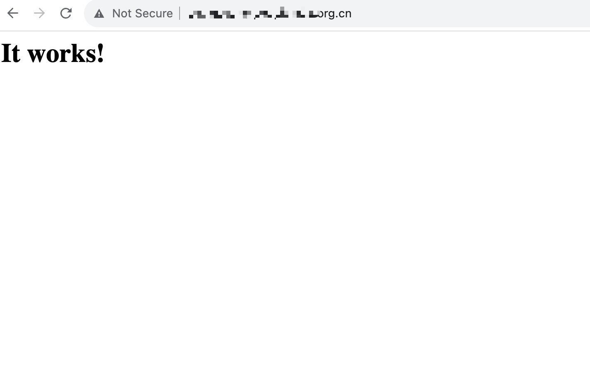

### 2. 输入部署参数信息 / Enter Deployment Parameters

为堆栈指定详细信息，请注意以下参数：

*Specify stack details with the following parameters:*

- **堆栈名称 / Stack Name：** 请为堆栈命名 / Name your stack
- **Email：** 输入您的邮箱用于订阅 SNS 邮件提醒，仅支持一个邮箱 / Enter your email for SNS notifications (one email only)
- **Domain Name：** 输入域名用于获取 SSL 证书，支持通配符域名和多个域名（英文逗号分隔） / Enter domain names for the SSL certificate. Supports wildcard and multiple domains (comma-separated)
- **SSL Renew Interval Days：** 输入更新证书的周期。Let's Encrypt 证书有效期为 90 天，请确保输入 1-89 内的数字。推荐默认 80 天 / Enter the renewal interval. Let's Encrypt certificates are valid for 90 days; enter 1-89. Default: 80 days.

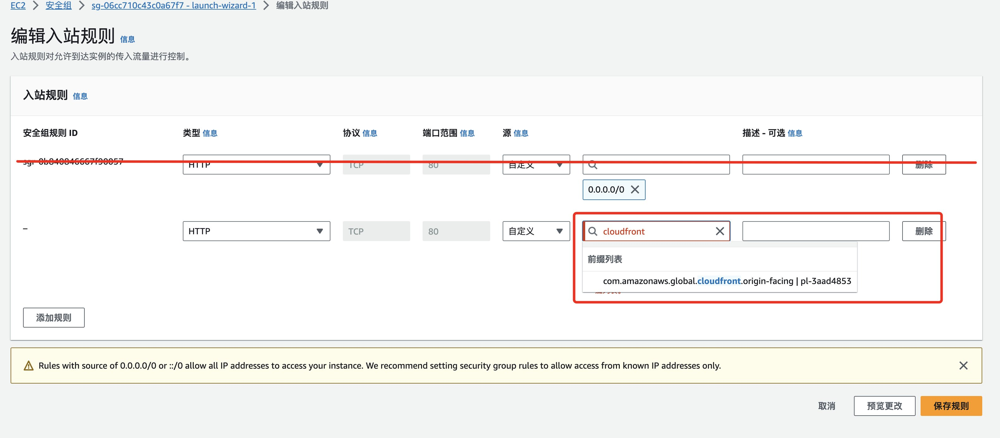

### 3. 确认部署信息 / Confirm Deployment

请在当前页面确认部署信息，在底部勾选"我确认"，并点击【提交】。

*Confirm deployment details, check the acknowledgment box at the bottom, and click **Submit**.*


提交完毕后，将在该堆栈事件栏内看到资源正在陆续创建。等待约 3 分钟。

*After submission, you'll see resources being created in the stack events tab. Wait about 3 minutes.*

### 4. 及时订阅消息通知服务 / Subscribe to SNS Notifications

等待堆栈部署过程中请及时查看您的邮箱，您将收到由 no-reply@sns.amazonaws.com 发送的 SNS 订阅确认请求。请尽快点击确认链接。

*During deployment, check your email for an SNS subscription confirmation from no-reply@sns.amazonaws.com. Click the confirmation link promptly.*


订阅成功后的提示：

*Successful subscription confirmation:*


### 5. 查看堆栈部署进度 / Check Stack Deployment Progress

当堆栈状态转变为绿色的 `CREATE_COMPLETE` 即为创建完毕。

*When the stack status turns to green `CREATE_COMPLETE`, the deployment is finished.*

您可以在堆栈"输出"标签页中查看快速链接：

*Check the "Outputs" tab for quick links:*

- **CloudfrontConsole：** 访问 CloudFront 控制台，快速绑定已颁发的证书 / Access the CloudFront console to bind the issued certificate
- **ManagementWebURL：** 访问 SwaggerUI，查看或删除 IAM 中已有的 SSL 证书 / Access SwaggerUI to view or delete existing SSL certificates in IAM
- **S3BucketURL：** 访问 S3 控制台，下载颁发的 SSL 证书 / Access the S3 console to download issued SSL certificates

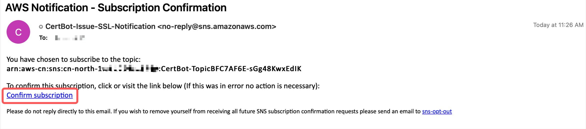

### 6. 在 Amazon CloudFront 控制台中绑定 SSL 证书 / Bind SSL Certificate in CloudFront Console

堆栈部署完毕后，将自动为您的域名申请 SSL 证书。如果已订阅 SNS 主题，您会收到邮件提醒证书颁发成功。证书名称由堆栈名称与过期时间组成，例如：`Certbot-2023-11-14-1540`。

*After stack deployment, an SSL certificate is automatically requested for your domain. If subscribed to SNS, you'll receive an email confirming certificate issuance. The certificate name consists of the stack name and expiry time, e.g., `Certbot-2023-11-14-1540`.*


打开 CloudFront 控制台，选择您的分配，找到编辑备用域名与 SSL 证书的选项。

*Open the CloudFront console, select your distribution, and find the option to edit alternate domain names and SSL certificate.*


在自定义 SSL 证书的下拉菜单中选择对应的 SSL 证书，随后保存更改。

*Select the corresponding SSL certificate from the custom SSL certificate dropdown, then save changes.*

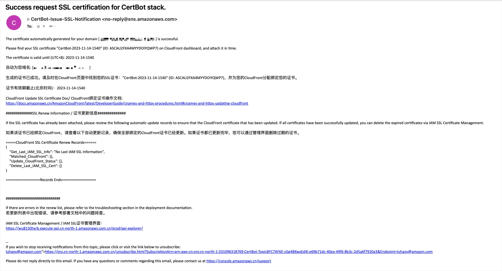

部署完毕后，您可以使用浏览器通过 HTTPS 协议访问由 CloudFront 加速的站点，查看由 Let's Encrypt 颁发的 SSL 证书信息，有效时长为 90 天。

*After deployment, you can access your CloudFront-accelerated site via HTTPS and verify the Let's Encrypt SSL certificate, valid for 90 days.*


有关更多 China CloudFront SSL 插件的使用方式，请查看 [China CloudFront SSL 插件文档](https://www.amazonaws.cn/getting-started/tutorials/create-ssl-with-cloudfront/?nc1=h_ls)。

*For more information on using the China CloudFront SSL Plugin, see the [plugin documentation](https://www.amazonaws.cn/getting-started/tutorials/create-ssl-with-cloudfront/?nc1=h_ls).*

## 总结 / Summary

通过本篇文章相信您已经了解了 Amazon CloudFront 的基本操作，并了解到如何将您部署在 EC2 上的网站访问流量转移到 CloudFront，从而实现访问加速和成本节省。此外您也了解到了通过 EC2 安全组中的 Amazon 托管式前缀列表来确保您的 EC2 仅接受来源于 CloudFront 流量，并通过 China CloudFront SSL 插件来申请免费 SSL 证书，利用 HTTPS 协议来保护您的站点。

*Through this article, you've learned the basics of Amazon CloudFront and how to divert EC2 website traffic to CloudFront for acceleration and cost savings. You've also learned to use AWS-managed prefix lists to restrict EC2 traffic to CloudFront only, and to deploy free SSL certificates using the China CloudFront SSL Plugin to protect your site with HTTPS.*

## 参考文档 / References

- [China CloudFront SSL 插件](https://www.amazonaws.cn/getting-started/tutorials/create-ssl-with-cloudfront/?nc1=h_ls)
- [Amazon CloudFront 介绍 / Introduction](https://docs.amazonaws.cn/AmazonCloudFront/latest/DeveloperGuide/Introduction.html)
- [Amazon CloudFront 中国区差异 / China Region Differences](https://docs.amazonaws.cn/aws/latest/userguide/cloudfront.html#feature-diff)
- [使用中国区 Amazon CloudFront 进行网络加速 / Network Acceleration with CloudFront in China](https://www.amazonaws.cn/getting-started/use-cases/cloudfront-network-acceleration/?nc1=h_ls)

## 本篇作者 / Authors

### 苏喆 / Su Zhe

亚马逊云科技解决方案架构师，负责亚马逊云科技的云计算方案架构咨询和设计，致力于亚马逊云科技服务在电商、教育以及开发者群体中的推广。曾就职于 IBM，担任 IT 解决方案架构师，负责云原生与容器架构的设计及开发。

*AWS Solutions Architect, responsible for cloud architecture consulting and design. Focused on promoting AWS services in e-commerce, education, and developer communities. Previously worked at IBM as an IT Solutions Architect on cloud-native and container architecture.*

### 金泽萱 / Jin Zexuan

亚马逊云科技解决方案架构师，拥有多年企业上云项目管理和交付经验。负责基于亚马逊云科技的云计算方案架构设计，咨询，实施等相关工作。对 DevOps、微服务、容器等领域有着丰富的实践经验。

*AWS Solutions Architect with years of experience in enterprise cloud migration project management and delivery. Specializes in cloud architecture design, consulting, and implementation. Extensive practical experience in DevOps, microservices, and containers.*

### 卢皓宇 / Lu Haoyu

亚马逊云科技解决方案架构师，负责基于亚马逊云科技的云计算方案架构的设计和技术咨询，同时致力于亚马逊云科技在开发者和学生群体中的应用与推广，在无服务器领域有丰富经验。

*AWS Solutions Architect, responsible for cloud architecture design and technical consulting. Dedicated to promoting AWS adoption among developers and students, with extensive experience in serverless technologies.*

### 李方怡 / Li Fangyi

AWS 解决方案架构师，负责基于 AWS 的云计算方案架构咨询和设计，致力于 AWS 云服务在创新增长客户群体中的推广，具有丰富的解决客户实际问题的经验。

*AWS Solutions Architect, focused on cloud architecture consulting and design, dedicated to promoting AWS services among innovative growth customers, with extensive experience solving real customer challenges.*

### 赵运喜 / Zhao Yunxi

亚马逊云科技解决方案顾问，负责云计算市场探索与挖掘，为客户提供数字化转型咨询，帮助加速业务发展和创新。

*AWS Solutions Consultant, responsible for cloud market exploration, providing digital transformation consulting to help accelerate business growth and innovation.*
