本文适用于亚马逊云科技中国区服务，阅读本文您将了解到如何使用中国区 Amazon CloudFront 将部署在 EC2 网站上的流量进行加速与分发，并使用 [China CloudFront SSL 插件](https://www.amazonaws.cn/getting-started/tutorials/create-ssl-with-cloudfront/)提供的免费证书保护您的站点。该插件可以帮助您在亚马逊云科技中国区域生成、更新和下载免费的 SSL 证书，并支持与 Amazon CloudFront 的集成及关联 SSL 证书的自动更新。您亦可参考本文的将 EC2 与 CloudFront 集成部分，用于亚马逊云科技全球区域使用 CloudFront 分发 EC2 网站流量的配置操作。

## 为什么选用 Amazon CloudFront?

Amazon CloudFront 是亚马逊云科技提供的一项内容分发网络（CDN）服务。使用 CDN 可以减少网站的加载时间，降低跳出率，增加流量和收益；同时还可以减轻源服务器的负载，提高网站的稳定性和安全性，并保证网站的可用性和可靠性。Amazon CloudFront 可以在开发人员友好环境中以低延迟和高传输速度向全球客户安全分发数据、视频、应用程序和 API，同时可以与 Amazon S3、Elastic Load Balancer 或 Amazon EC2 等服务无缝协作。

Amazon CloudFront 不仅可以加速您的网站，减轻源服务器的负载，还可以降低您部署在亚马逊云中的网站传出至互联网的数据传输费用。以 EC2 为例，相比较 EC2 的传出至互联网的数据传输费用，在亚马逊云科技中国区域使用 Amazon CloudFront 可以帮助您降低至少 67% 的传出至互联网的数据传输费用。具体费用可参考亚马逊云科技中国区官方网站 [EC2 数据传输费用](https://www.amazonaws.cn/ec2/pricing/#Amazon_EC2_.E6.95.B0.E6.8D.AE.E4.BC.A0.E8.BE.93)与 [CloudFront 数据传输费用](https://www.amazonaws.cn/cloudfront/pricing/#On-demand_Pricing)。

## 使用中国区 CloudFront 的注意事项

- **ICP 备案及备案域名：** 根据相关法律法规，如果您需要在中国境内托管网站，首先需要进行 ICP 备案，未备案的域名无法提供网页服务，请准备一个已备案的域名。请查阅亚马逊云科技中国区 [ICP 备案支持文档](https://www.amazonaws.cn/support/icp/)，了解有关获取域名所需 ICP 备案的更多详细信息。

- **CloudFront 提供的域名：** CloudFront 会为您自动分配一个 CloudFront 域 `*.cloudfront.cn`。但基于 ICP 备案需求，在中国区您无法直接使用该域名用于网站服务。您必须向 CloudFront 分配添加 ICP 备案后的域名作为备用域名（也称为 CNAME），然后使用备用域名访问您的网站。

- **CloudFront 集成 SSL/TLS 证书：** 中国区域的 Amazon CloudFront 目前不支持 [Amazon Certificate Manager](https://www.amazonaws.cn/certificate-manager/features/)。如果您需要在 CloudFront 使用 SSL/TLS 证书，您可以通过第三方证书机构获取 SSL/TLS 证书，并[导入 SSL/TLS 证书](https://docs.amazonaws.cn/AmazonCloudFront/latest/DeveloperGuide/cnames-and-https-procedures.html#cnames-and-https-uploading-certificates)。您也可以通过 [China CloudFront SSL 插件](https://www.amazonaws.cn/getting-started/tutorials/create-ssl-with-cloudfront/)来获取免费的 SSL/TLS 证书，本篇文章"使用 China CloudFront SSL 插件部署免费证书"将进行重点介绍。

- **CloudFront 中国区域和全球区域的功能差异：** 在中国区域 Amazon CloudFront 目前不支持 Lambda@Edge、Amazon WAF 等功能，更多详情请[查看文档](https://docs.amazonaws.cn/aws/latest/userguide/cloudfront.html#feature-diff)。

## 前提条件

为了确保您完成本篇的全部内容，获得亚马逊云科技的各种服务带来的一致性体验，请确保您已经满足前提条件。

- 您的亚马逊云科技中国区账号已经完成了 ICP 备案的相关事项，确保 80/443 端口已经开放；
- 您拥有经过 ICP 备案过域名；
- 使用 [Amazon Route 53](https://www.amazonaws.cn/route53/) 作为您的域名解析服务。如果您尚未将域名解析迁移至亚马逊云科技 Amazon Route 53，请点击[参考文档](https://www.amazonaws.cn/getting-started/tutorials/migrate-domain-to-amazon-route53/)。

## 将 EC2 与 CloudFront 集成

在本篇文章的后续内容您将跟随文档操作，开启一个 EC2 并搭建一个 Web 服务器，随后将 EC2 与 CloudFront 进行集成，并利用 China CloudFront SSL 插件部署免费证书。

您还会了解到一些使用 EC2 及 CloudFront 的小技巧，例如使用弹性 IP 来固定您的 EC2 公有 DNS 主机名用于 CloudFront 的源，或者使用 Amazon 托管式前缀列表来加强 EC2 的安全性。

本篇文章的部署架构图如下所示：


### 创建 EC2 并安装 Web 服务器

在本节中您将创建一个 EC2 并安装一个 Web 服务器用于网站服务，随后将一个弹性 IP 绑定至 EC2 上用于固定 EC2 的公有 DNS 主机名。

#### 一、启动 EC2 实例

您可以通过 EC2 控制台启动一个 EC2 实例。


请为您的实例命名，例如"web-server"。

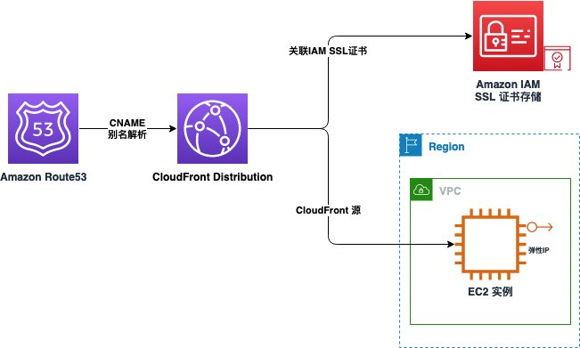

系统映像（AMI）与实例类型，您可以保持默认。

- AMI: Amazon Linux 2023
- 实例类型：micro

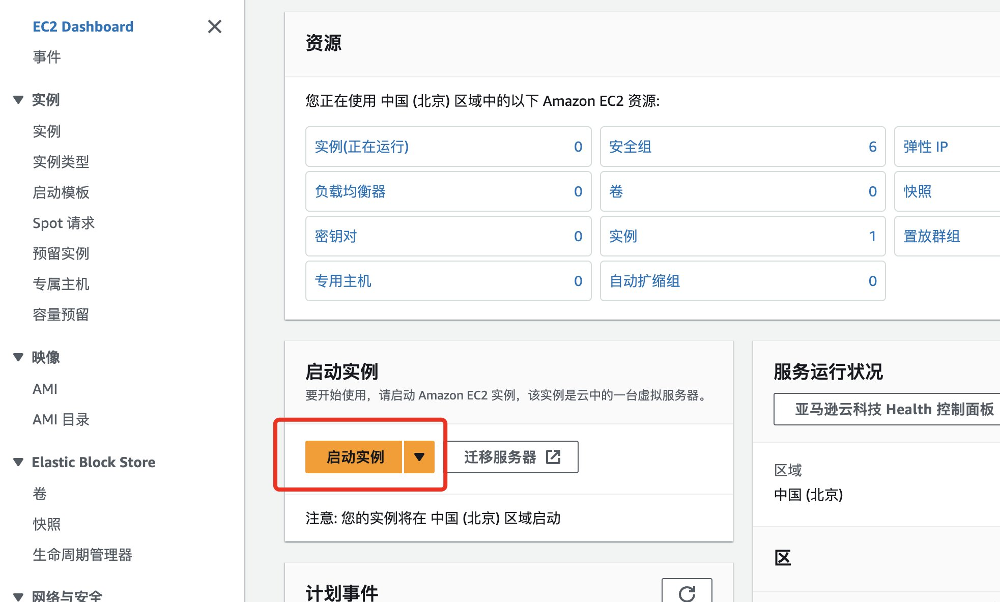

在"密钥对"处选择已有或者创建新的密钥对，用于您后续操作系统的运维。

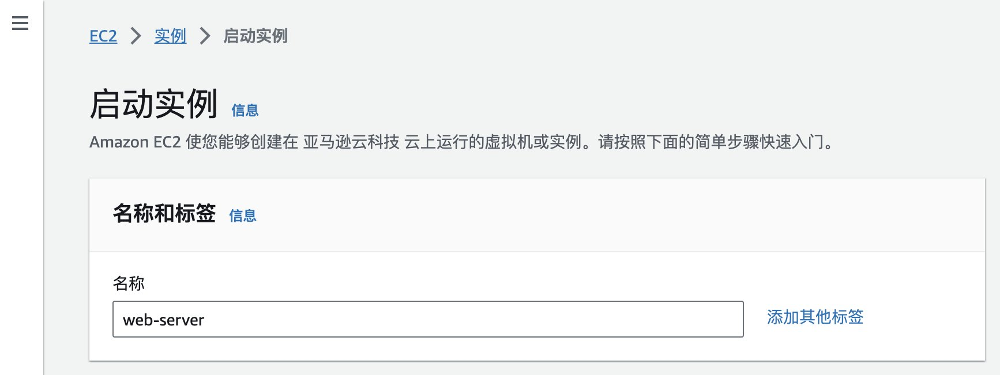

关于网络配置，请确保您的 EC2 实例部署在公有子网，同时请勾选"允许来自互联网的 HTTP 流量"，以确保 EC2 的 80 端口互联网可达。

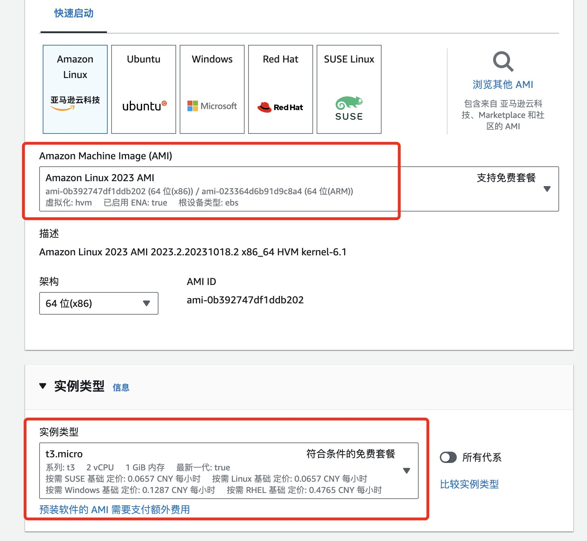

请在底部展开"高级详细信息"部分：


在页面底部"用户数据"处，粘贴以下代码，用于在实例首次启动时安装 Web 服务器。随后点击"启动实例"按钮，执行实例启动。

```bash
#!/bin/bash
yum install -y httpd
systemctl enable httpd
systemctl start httpd
```

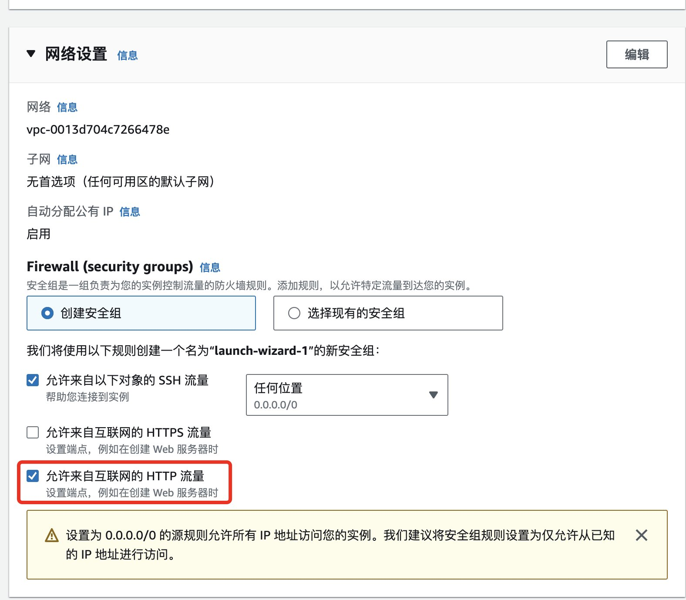

#### 二、创建弹性 IP 并关联 EC2 实例

[弹性 IP](https://docs.amazonaws.cn/AWSEC2/latest/UserGuide/elastic-ip-addresses-eip.html) 地址是专为云计算设计的静态 IPv4 地址，利用弹性 IP 可保证您的 EC2 实例的公有 IP 地址和公有 DNS 主机名不会发生变化。在本节中您将了解到如何使用弹性 IP 关联 EC2 实例，并利用 EC2 实例的公有 DNS 主机名访问您的站点。

您可以在 EC2 控制台中，左侧"网络与安全"菜单中找到弹性 IP。

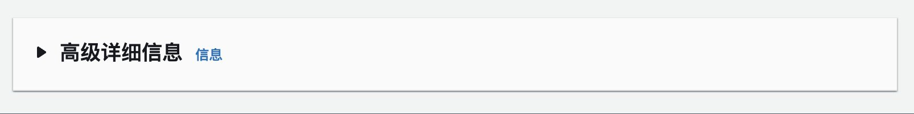

点击右上角"分配弹性 IP 地址"，随后点击"分配"来获得弹性 IP。

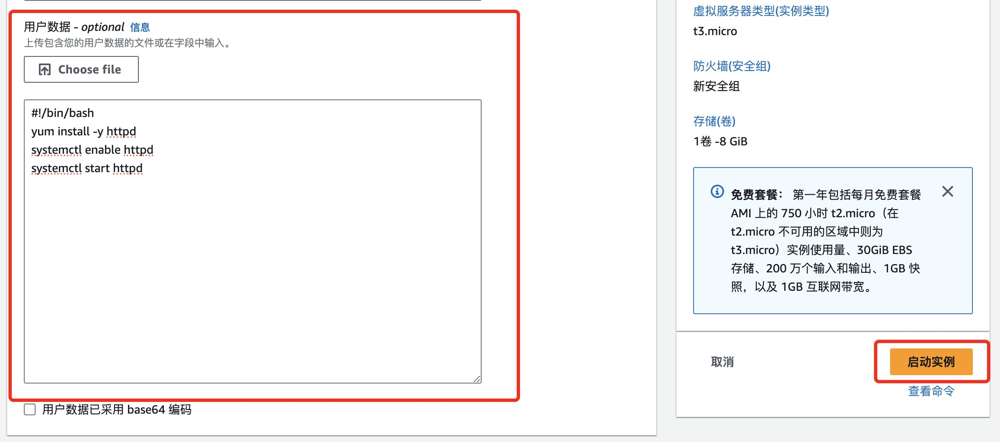

随后选中您的弹性 IP，点击右上角"操作"按钮，选择"关联弹性 IP 地址"。

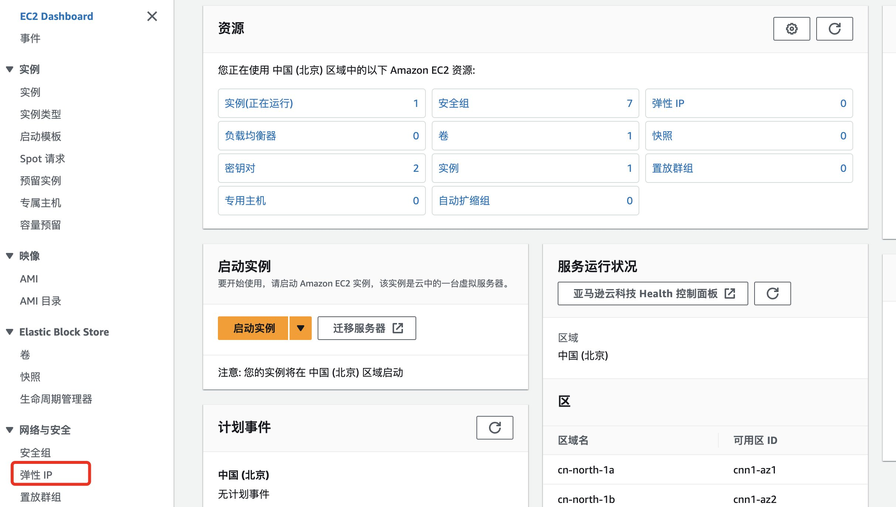

然后请选择您先前创建的 EC2 实例，并点击关联按钮，以保证 EC2 实例的公有 IP 地址不会变化。


随后您可以点击左侧"实例"菜单，返回到实例列表中，选中您的实例，并复制公有 IPv4 DNS。


最后您可以使用公有 DNS 主机名，在浏览器中进行访问，以确保 Web 服务器安装完成。在这里您可以看到，当前的站点使用的是 80 端口，同时没有关联 SSL/TLS 证书。

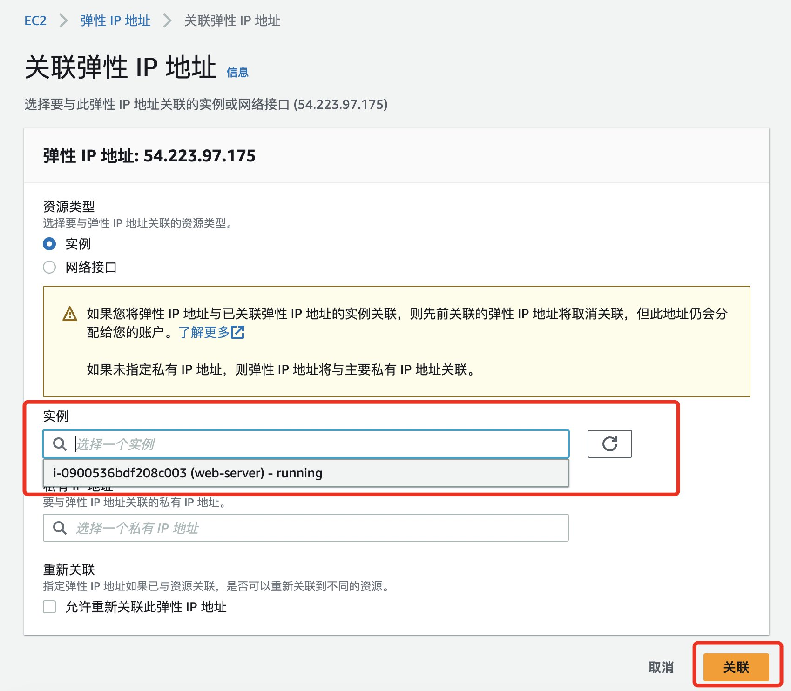

在后面的部分，您将利用该域名作为 CloudFront 的源，将网站访问流量由 EC2 转移至 Amazon CloudFront。

### 创建 CloudFront 并使用 CloudFront 访问您的站点

在本节中您将创建 CloudFront 分配并关联至上述完成部署的 EC2 中，将流量通过请求 CloudFront 来实现内容分发的加速。

#### 一、创建 CloudFront 分配并关联 EC2 实例

接下来，您将快速构建一个 CloudFront 分配（Distribution）配置，进入到 CloudFront 首页并创建配置：


在 CloudFront 的配置初始化页面，您将看到一个 CloudFront 配置需要具备的所有基本配置元素，分别为：

- **源** – 源服务器，可支持多种类型的亚马逊云科技服务，包括并不仅限于 S3 / EC2 / ELB / API Gateway 等，并可支持第三方源站。
- **缓存行为** – 在此设置中，您可以快速通过路径匹配的方式，灵活的制定缓存行为 / 启用传输压缩 / 允许请求方法 / 访问控制等功能。
- **设置** – 其他配置，例如别名（CNAME）/ SSL 证书 / 默认根对象 / 日志记录等。

您可先参考以下配置进行初始化配置，在源服务器设置的部分，您将使用上一步创建的绑定弹性 IP 地址的 EC2 的公有 DNS 来作为源域，同时确保您选择的源协议为 HTTP。


在默认缓存行为中，您可参考如下截图保持默认设置即可：

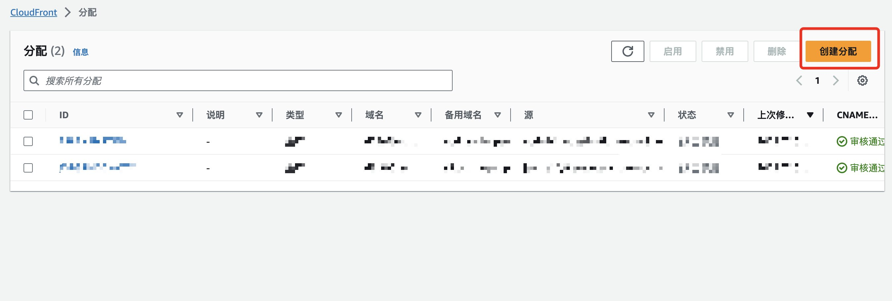

> **注：** 由于合规性要求，中国北京/中国宁夏区域的 CloudFront 提供的分配默认域名无法直接访问，需完成域名的 ICP 备案并通过 CNAME 域名解析后才可进行访问。请通过下述操作配置 CloudFront 备用域名以通过"CNAME 审核"。

在设置部分，您需要在备用域名（CNAME）中填写 ICP 备案过的域名，关于证书部分，您可以参见本文"使用 China CloudFront SSL 插件部署免费证书"部分查看。


创建完毕后，您将返回到 Distribution 的设置页面，等待部署完成。

部署完成之后，您可在您的 CloudFront 分配的设置界面中中检查您的填写的备用域名，若您的域名已经通过 ICP 备案，您应能看到如图所示"绿色标记"。

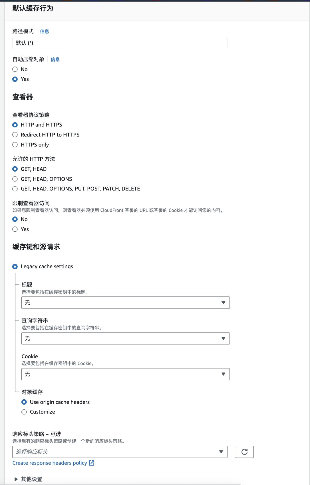

等待部署完成之后进入 Route53 或您的域名解析提供商，更新解析配置。以下本文以 Route53 为例。您可以进入 Route53 对应域名的托管区域并创建一个新记录。


您可以通过如图所示填写对应的解析记录。

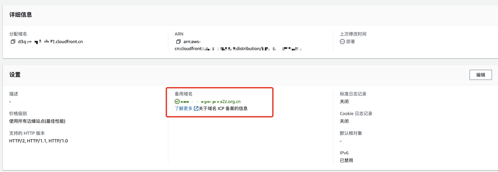

完成域名解析更新后，打开浏览器访问 ICP 备案的域名，您应当能看到如下界面。


> **注：** 如果出现 502 报错，请检查 EC2 是否安装 SSL 证书或者源端口是否正确，请参考[文档](https://docs.amazonaws.cn/AmazonCloudFront/latest/DeveloperGuide/http-502-bad-gateway.html)。如果出现 403 报错，请确保您使用 ICP 备案的域名访问。

#### 二、提升 EC2 与网站的安全

在本章节您将使用 [Amazon 托管式前缀列表](https://docs.amazonaws.cn/vpc/latest/userguide/working-with-aws-managed-prefix-lists.html#available-aws-managed-prefix-lists)来加强 EC2 的安全性。托管式前缀列表是包含一个或多个 CIDR 块的集合。您可以使用前缀列表更轻松地配置和维护安全组和路由表，而 Amazon 托管前缀列表为 Amazon 服务的 IP 地址范围集。例如您可以借助 Amazon CloudFront 的 AWS 托管式前缀列表，从而将源的入站 HTTP/HTTPS 流量限定为属于 CloudFront 面向源的服务器的 IP 地址。

请选中您需要修改的实例，进入 EC2 的安全组，点击入站规则-编辑，新建一条 HTTP 的规则，源中输入"cloudfront"，并选中 `com.amazonaws.global.cloudfront.origin-facing` 的前缀列表，同时删除原有 HTTP 80 端口面向互联网 `0.0.0.0/0` 的规则，以确保您的 EC2 仅仅接受来源于 CloudFront 流量，从而加强您 EC2 的安全性。

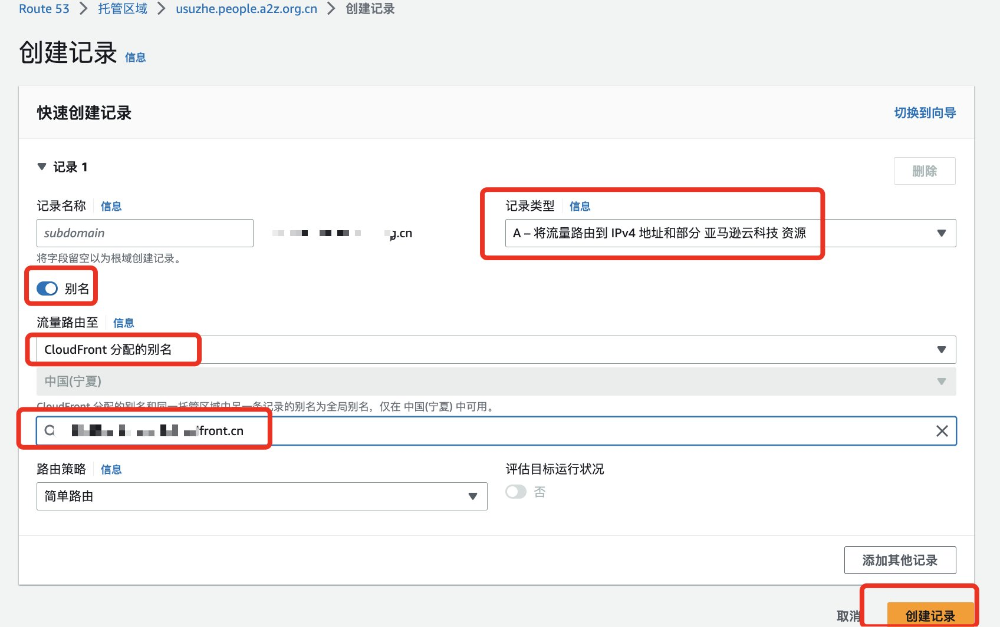

此外您也可以在 CloudFront 上关联 SSL/TLS 证书，来加强网站的安全。在后面的部分，您将利用 China CloudFront SSL 插件部署免费的 SSL 证书，为您的网站安全性增加保障。

## 使用 China CloudFront SSL 插件部署免费证书

在开始操作前，请再次确认您使用 Amazon Route 53 解析您的域名。如果您尚未将域名解析迁移至亚马逊云科技 Amazon Route 53，请点击[参考文档](https://www.amazonaws.cn/getting-started/tutorials/migrate-domain-to-amazon-route53/)。本篇仅介绍部署部分，有关更多详情请查看 [China CloudFront SSL 插件](https://www.amazonaws.cn/getting-started/tutorials/create-ssl-with-cloudfront/?nc1=h_ls)查找有关信息。

### 1. 初始化部署

通过 CloudFormation 服务部署模板，点击[链接](https://console.amazonaws.cn/cloudformation/home?#/stacks/create/template?templateURL=https://aws-cn-getting-started.s3.cn-northwest-1.amazonaws.com.cn/china-cloudfront-ssl-plugin/ChinaCloudFrontSslPluginStack.json)，随后将跳转至中国区 CloudFormation 控制台创建堆栈。


### 2. 输入部署参数信息

为堆栈指定详细信息，请注意以下参数信息。

- **堆栈名称：** 请为堆栈命名，例如您的网站项目名称
- **Email：** 输入您的邮箱用于订阅 SNS 邮件提醒以了解证书颁发和更新的状态，仅支持一个邮箱
- **Domain Name：** 输入域名用于获取 SSL 证书，域名支持通配符域名和多个域名。请使用英文逗号分隔。例如：example.com, *.example.com
- **SSL Renew Interval Days：** 输入更新证书的周期。Let's encrypt 颁发的证书有效期为 90 天，请确保输入的数字在 1-89 内，从而可以及时更新证书。推荐的默认情况为每 80 天更新一次

信息确认完毕后点击，请点击下一步，直接进入第 4 步"堆栈审核"。


### 3. 确认部署信息

请在当前页面确认您的部署信息，确认完毕后在页面底部勾选最下方蓝色窗口内的"我确认"，并点击右下角【提交】按钮进行提交。

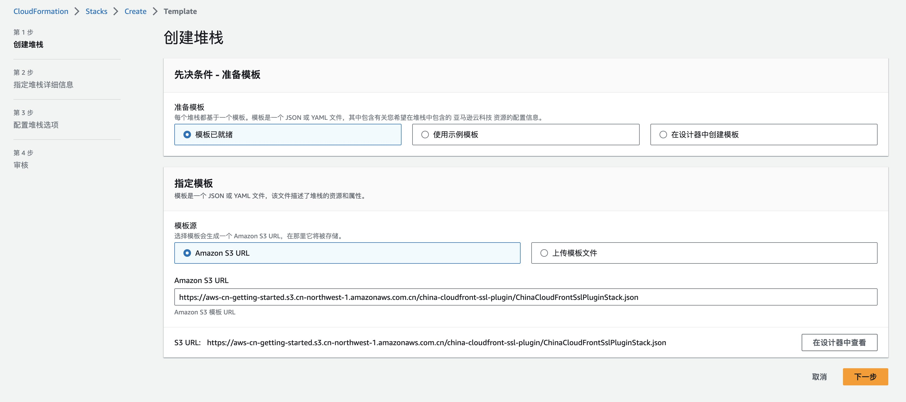

提交完毕后，将在该堆栈事件栏内看到堆栈内资源正在陆续创建。等待约 3 分钟。

### 4. 及时订阅消息通知服务

等待堆栈部署过程请及时查看您的邮箱，您将收到由 no-reply@sns.amazonaws.com 发送的 SNS 邮件提醒订阅的确认请求。请尽快点击订阅确认链接以便及时接收 SNS 消息通知，否则您可能会错过首次证书颁发的信息。

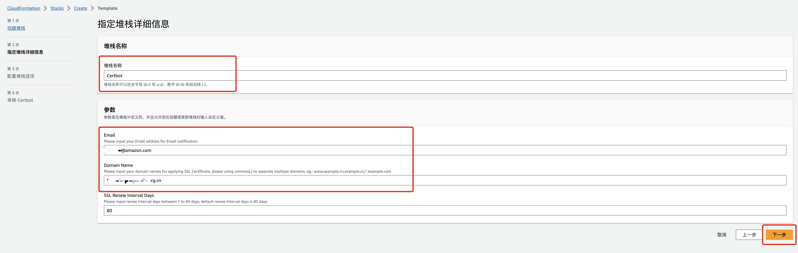

订阅成功后的提示如下。

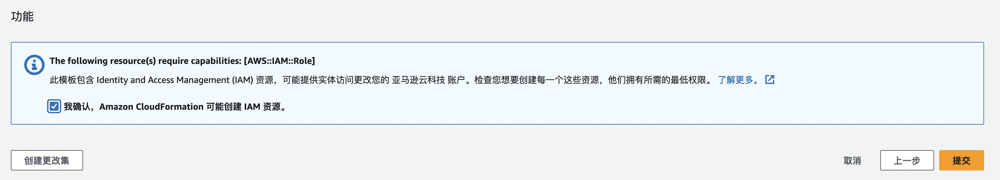

### 5. 查看堆栈部署进度

订阅完毕后，您可以返回堆栈，继续查看堆栈状态。当堆栈状态转变为绿色的 `CREATE_COMPLETE` 即为创建完毕。

您可以在堆栈"输出"标签页中查看解决方案为您提供的快速链接：

- **CloudfrontConsole：** 访问 Amazon CloudFront 控制台，快速绑定已经颁发的证书
- **ManagementWebURL：** 访问 SwaggerUI，查看或删除 IAM 中已有的 SSL 证书
- **S3BucketURL：** 访问 Amazon S3 控制台，下载颁发的 SSL 证书


### 6. 在 Amazon CloudFront 控制台中绑定 SSL 证书

堆栈部署完毕后，将自动为您的域名申请 SSL 证书。如果已经及时在邮件中订阅 SNS 主题，您会收到由 no-reply@sns.amazonaws.com 发送的邮件提醒，以提示您成功颁发 SSL 证书。证书名称由堆栈名称与 SSL 证书过期时间组成。例如：Certbot-2023-11-14-1540，名称后的数字代表证书过期时间，如图所示为 2023 年 11 月 14 日 15 点 40 分。

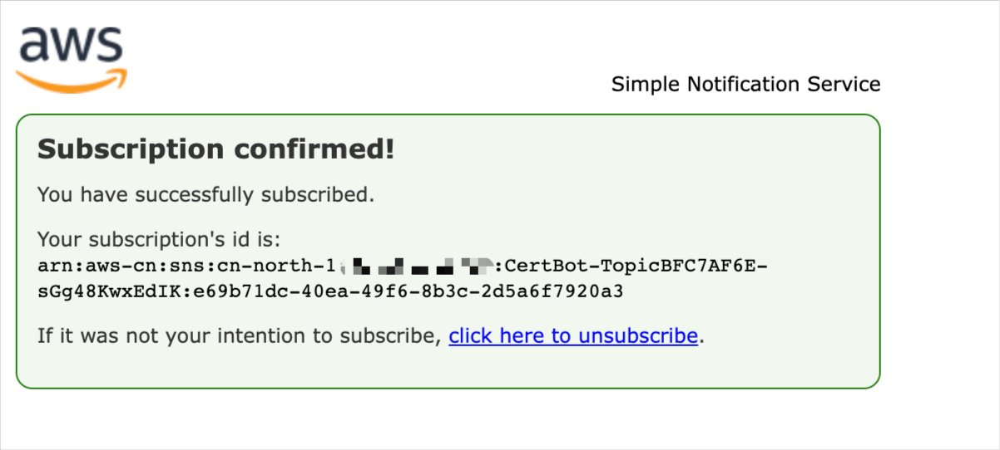

打开 CloudFront 控制台，创建或选择您已有的分配，找到编辑备用域名与 SSL 证书的选项入口。

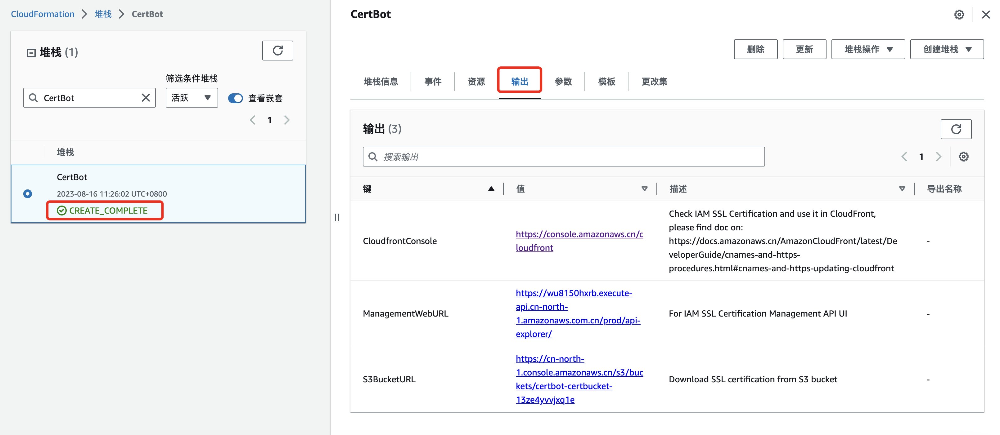

请在设置在自定义 SSL 证书的下拉菜单中选择对应的 SSL 证书，随后将更改进行保存。


部署完毕后，您可以使用浏览器访问由 Amazon CloudFront 加速的站点并使用 HTTPS 协议访问您的域名，同时查看由 Let's Encrypt 颁发的 SSL 证书信息，有效时长为 90 天。

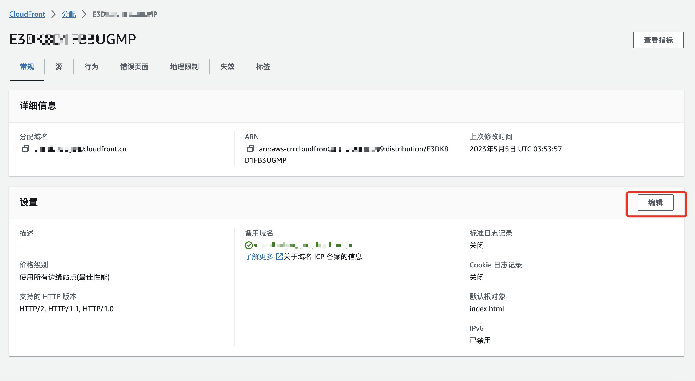

有关更多 China CloudFront SSL 插件的使用方式，您可以查看 [China CloudFront SSL 插件](https://www.amazonaws.cn/getting-started/tutorials/create-ssl-with-cloudfront/?nc1=h_ls)查找有关信息。

## 总结

通过本篇文章相信您已经了解了 Amazon CloudFront 的基本操作，并了解到如何将您部署在 EC2 上的网站访问流量转移到 CloudFront，从而实现访问加速和成本节省。此外您也了解到了通过 EC2 安全组中的 Amazon 托管式前缀列表来确保您的 EC2 仅接受来源于 CloudFront 流量，并通过 China CloudFront SSL 插件来申请免费 SSL 证书，利用 HTTPS 协议来保护您的站点。

## 参考文档

- [China CloudFront SSL 插件](https://www.amazonaws.cn/getting-started/tutorials/create-ssl-with-cloudfront/?nc1=h_ls)
- [Amazon CloudFront 介绍](https://docs.amazonaws.cn/AmazonCloudFront/latest/DeveloperGuide/Introduction.html)
- [Amazon CloudFront 中国区差异](https://docs.amazonaws.cn/aws/latest/userguide/cloudfront.html#feature-diff)
- [使用中国区 Amazon CloudFront 进行网络加速](https://www.amazonaws.cn/getting-started/use-cases/cloudfront-network-acceleration/?nc1=h_ls)


---

> **原文链接：** [Amazon CloudFront 部署小指南（八）- 使用中国区 CloudFront 及 CloudFront SSL 插件部署免费证书](https://aws.amazon.com/cn/blogs/china/divert-website-access-traffic-from-ec2-to-amazon-cloudfront/)
>
> **GitHub：** [aws-samples/China-CloudFront-SSL-Plugin](https://github.com/aws-samples/China-CloudFront-SSL-Plugin)
