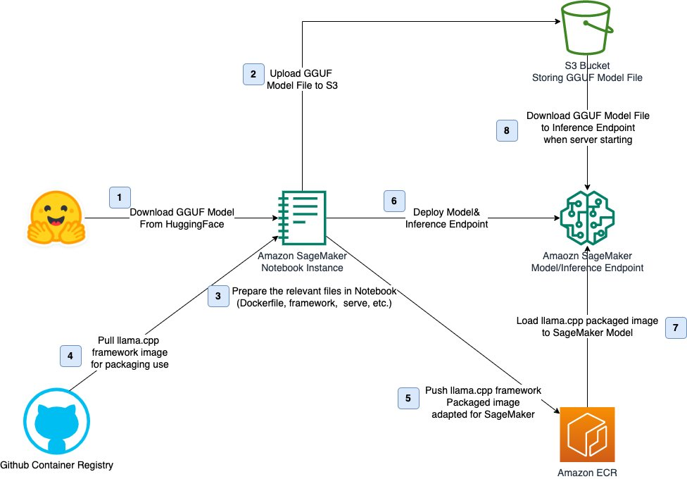
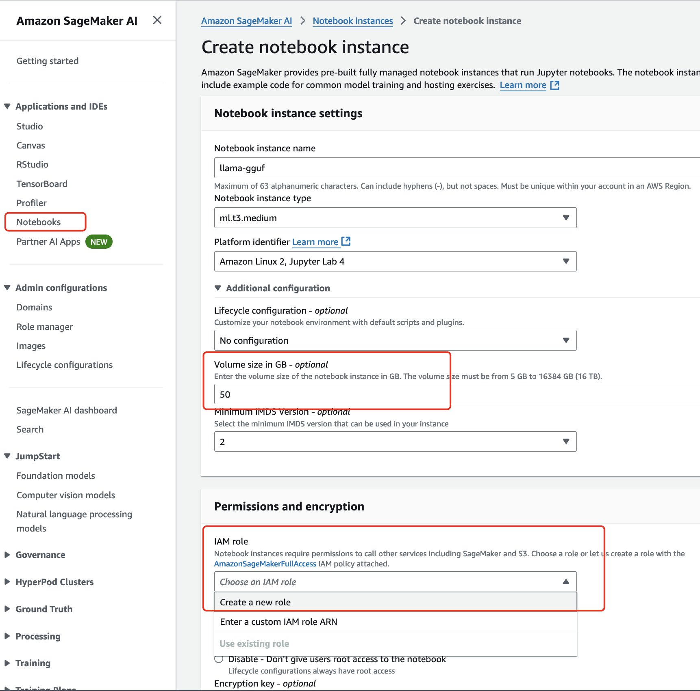
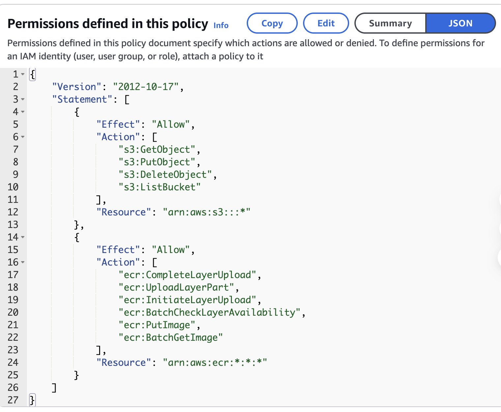
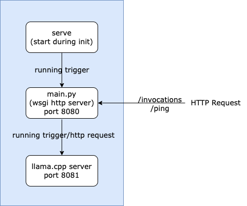
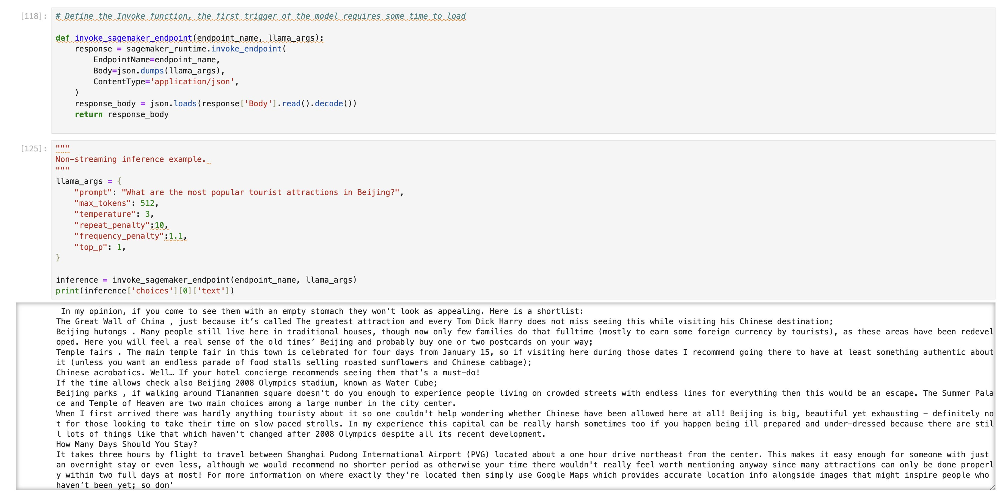

> 原文链接：[使用 SageMaker AI 运行 GGUF 格式的模型推理实践](https://aws.amazon.com/cn/blogs/china/practice-running-gguf-format-model-inference-using-sagemaker-ai/)
>
> GitHub 仓库：[aws-samples/deploy-gguf-model-to-sagemaker](https://github.com/aws-samples/deploy-gguf-model-to-sagemaker)

随着人工智能领域的快速发展，LLM 模型在自然语言处理、机器翻译和智能助手等多个领域展现出了强大的能力。这些模型的开发通常依赖于诸如 PyTorch 等框架，其预训练结果常以特定的二进制格式存储，如 PyTorch 常用的 .pt 文件。然而，随着模型规模的不断扩大，传统文件格式在存储、传输和加载方面面临诸多挑战。这些模型文件往往体积庞大，其结构和参数对推理效果和性能有显著影响，导致存储空间占用大、加载速度慢、跨平台兼容性差等问题。

为了应对这些挑战，[GGUF](https://github.com/ggerganov/ggml/blob/master/docs/gguf.md)（GPT-Generated Unified Format）应运而生。GGUF 是一种专为 LLM 模型设计的二进制文件格式，由开源项目 llama.cpp 的创始人 Georgi Gerganov 提出。它旨在提高大模型的存储和交换效率，通过多种技术实现了更高效的存储方式，包括优化的数据结构、紧凑的二进制编码及内存映射等。目前，GGUF 格式在各类大模型的部署和分享中得到广泛应用，特别是在开源社区如 Hugging Face 中受到热烈欢迎。

其核心特性使得开发者能够更高效地管理和使用 LLM 模型，同时降低资源消耗并提升性能。通过转换工具，原始模型预训练结果可以轻松转化为 GGUF 格式，从而实现更高效的使用体验。

在本文中，您将了解到如何使用 Amazon SageMaker AI 实时推理节点来部署 GGUF 文件格式的 LLM 模型。

## Amazon SageMaker AI 模型部署的选项

[Amazon SageMaker AI](https://aws.amazon.com/cn/sagemaker-ai/) 是一项完全托管的服务，它汇集了大量工具，可为任何使用场景提供高性能、低成本的机器学习（ML）。借助 SageMaker AI，您可以使用笔记本、调试器、分析器、管道、MLOps 等工具大规模构建、训练和部署机器学习模型。Amazon SageMaker AI 推理支持多种常见的机器学习框架（如 TensorFlow、PyTorch、ONNX 和 XGBoost）的内置算法和预构建的 Docker 镜像。此外，Amazon SageMaker AI 还提供专门的深度学习容器（DLC）、库和工具，用于模型并行和大型模型推理（LMI），以帮助提高基础模型的性能。

如果无法直接使用 SageMaker AI 预构建的 Docker 镜像，您可以构建自己的 Docker 容器（BYOC – Bring your own container）并在 SageMaker AI 中使用它进行推理。为了与 SageMaker AI 兼容，您的容器必须具备以下特征：

- 容器必须有一个在端口 8080 上监听的 Web 服务器。
- 容器必须接受对 /invocations 和 /ping 实时端点的 POST 请求。发送到这些端点的请求必须在 60 秒内返回，且最大大小为 6 MB。

要在 SageMaker AI 中部署和运行 GGUF 模型，需要构建自定义 Docker 容器。这种方法通过整合 llama.cpp 项目来实现 GGUF 模型的运行，从而在 SageMaker AI 平台上进行有效的部署和推理。

## llama.cpp 与 GGUF

[llama.cpp](https://github.com/ggerganov/llama.cpp) 是一个使用 C/C++ 实现的 LLM 推理项目，旨在以最小的设置和最佳性能在各种硬件上进行本地或云端 LLM 推理。它具备以下优势：

- 采用 C/C++ 实现，无需任何依赖
- 为 Apple silicon 提供一流支持，通过 ARM NEON、Accelerate 和 Metal 框架进行优化
- 支持 x86 架构的 AVX、AVX2、AVX512 和 AMX
- 提供多种量化选项（从 5-bit 到 8-bit），实现更快推理和更低内存使用
- 支持多种 GPU 后端，包括 NVIDIA（CUDA）、AMD（HIP）和摩尔线程 MTT（MUSA）
- 支持 CPU+GPU 混合推理，可以部分加速大于显存容量的模型

为了在 llama.cpp 中运行，模型必须以 GGUF 格式存储。您可以通过 llama.cpp 容器方式运行 GGUF 格式的模型，从而充分利用 llama.cpp 的功能。因此在 SageMaker 环境中运行 GGUF 模型时，需要将其与 llama.cpp 结合使用，以充分利用 llama.cpp 的高效推理能力和对多种硬件架构的支持。

## 使用 BYOC 方式在 SageMaker AI 中托管 GGUF 模型

以下将为您详细介绍如何利用 Amazon SageMaker AI 的功能，将 GGUF 与 llama.cpp 结合使用。本文将展示如何为 SageMaker AI 构建一个专门用于 GGUF 的 Docker 容器，并将其应用于模型推理。

通过采用[自带容器](https://docs.aws.amazon.com/sagemaker/latest/dg/adapt-inference-container.html)（Bring Your Own Container，BYOC）的方式，Amazon SageMaker AI 为您提供了极大的灵活性。无论您使用何种编程语言、运行环境、框架或依赖项，您都可以将几乎任何模型和代码集成到 Amazon SageMaker AI 生态系统中。

本文将通过 [Amazon SageMaker AI Notebook](https://aws.amazon.com/sagemaker-ai/notebooks/) 进行 GGUF 模型的运行框架构建与部署操作，方案架构图如下图所示。



主要步骤如下：

- 从 HuggingFace 中下载 GGUF 模型，并上传至 S3，本博客将采用 Llama 3 8B 的 GGUF 模型为例。
- 在 Notebook 中准备 BYOC 所需关键文件：Dockerfile、main.py、requirements.txt、serve、server.sh。
- 创建自定义 Docker 镜像，并将 Docker 镜像上传到 Amazon ECR。
- 在 Notebook 中创建 Amazon SageMaker Model 并部署至 Inference Endpoint。
- 推理端点运行阶段会从 S3 桶中下载 GGUF 模型至容器指定位置。
- 测试端点，使用 SageMaker SDK 请求调用端点进行推理。

### 1. 创建 Amazon SageMaker AI Notebook

您可以在亚马逊云科技的控制台创建 SageMaker AI Notebook 实例，选择合适的实例类型和存储空间。请注意，磁盘空间建议 30GB 以上，主要用于容器构建，模型转存等需要。

在选择或创建 IAM 角色时，请确保该角色具有向 Amazon ECR 推送镜像的权限。

若缺少对应权限，请复制如下权限添加至对应的内联策略中。





```json
{
  "Effect": "Allow",
  "Action": [
    "ecr:CompleteLayerUpload",
    "ecr:UploadLayerPart",
    "ecr:InitiateLayerUpload",
    "ecr:BatchCheckLayerAvailability",
    "ecr:PutImage",
    "ecr:BatchGetImage"
  ],
  "Resource": "arn:aws:ecr:*:*:*"
}
```

### 2. 构建 BYOC 代码

Notebook 中的完整代码您可以在 [aws-samples 对应仓库](https://github.com/aws-samples/deploy-gguf-model-to-sagemaker)查看，本文只做关键代码的说明。

为了使 GGUF 相关模型能在 SageMaker 中顺利运行，需要按照以下文件结构准备相关代码并构建容器镜像：

```
workspace
|-- Dockerfile
|-- main.py
|-- requirements.txt
|-- serve
|-- server.sh
```

其运行触发逻辑及 HTTP 请求如图所示。



#### 2.1 Dockerfile 文件

Dockerfile 文件定义了一个基于 llama.cpp CUDA 版本的容器环境，专为在 SageMaker 上运行 GGUF 模型而设计。

```dockerfile
FROM ghcr.io/ggerganov/llama.cpp:full-cuda

ENV PYTHONUNBUFFERED=1
ENV MODELPATH=/app/llm_model.bin
ENV PATH=$PATH:/app
ENV BUCKET=""
ENV BUCKET_KEY=""

WORKDIR /app

RUN apt-get update && apt-get install -y \
    unzip \
    libcurl4-openssl-dev \
    python3 \
    python3-pip \
    python3-dev \
    git \
    psmisc \
    pciutils

COPY requirements.txt ./requirements.txt
COPY main.py /app/
COPY serve /app/
COPY server.sh /app/

RUN chmod u+x serve
RUN chmod u+x server.sh
RUN pip3 install -r requirements.txt
RUN export PATH=/app:$PATH

ENTRYPOINT ["/bin/bash"]
EXPOSE 8080
```

在构建 Dockerfile 时，请特别留意以下关键环境变量：

- **MODELPATH**：用于指定模型启动时的名称
- **BUCKET** 和 **BUCKET_KEY**：定义存储模型文件的 Amazon S3 存储桶名称及对象名称

#### 2.2 main.py 文件

该文件实现了一个 HTTP API 服务器，专门用于与 llama.cpp 进行交互。为了使 GGUF 模型能够在 Amazon SageMaker 环境中进行模型推理部署，对原始代码进行了针对性的修改：

- 端口配置：main.py 默认端口为 8080，连接的 llama.cpp 端口为 8081
- 路由修改：/v1/completions 改为 /invocations，新增 /ping 健康检查
- 模型加载：新增 update_model 函数，支持从 S3 自动下载模型文件

```python
def update_model(bucket, key):
    try:
        s3 = boto3.client('s3')
        s3.download_file(bucket, key, os.environ.get('MODELPATH'))
        subprocess.run(["/app/server.sh", os.environ.get('MODELPATH')])
        return True
    except Exception as e:
        print(str(traceback.format_exc()))
        return False

@app.route('/ping', methods=['GET'])
def ping():
    return Response(status=200)

@app.route("/invocations", methods=['POST'])
def completion():
    ...
    if (is_present(body, "configure")):
        res = update_model(body["configure"]["bucket"], body["configure"]["key"])
        return Response(status=200) if (res) else Response(status=500)
    ...
```

#### 2.3 SageMaker 推理所需入口 serve 文件

SageMaker 推理节点在启动容器时会默认执行 `docker run image serve` 命令。

```bash
#!/bin/sh
echo "serve"
uvicorn 'main:asgi_app' --host 0.0.0.0 --port 8080 --workers 8
```

#### 2.4 llama.cpp 启动脚本文件 server.sh

server.sh 用于启动 llama.cpp 服务。您可以通过查看 [llama.cpp 相关文档](https://github.com/ggerganov/llama.cpp/blob/master/examples/server/README.md)查找运行时可以指定的参数。

```bash
#!/bin/sh
echo "server.sh"
echo "args: $1"
echo "GPU Layer: $GPU_LAYERS"

if lspci | grep -i nvidia &> /dev/null; then
    echo "NVIDIA GPU is available."
    NGL="$GPU_LAYERS"
    CPU_PER_SLOT=1
else
    echo "No NVIDIA GPU found."
    NGL=0
    CPU_PER_SLOT=4
fi

killall llama-server
/app/llama-server -m "$1" -c 2048 -t $(nproc --all) \
    --host 0.0.0.0 --port 8081 -cb \
    -np $(($(nproc --all) / $CPU_PER_SLOT)) -ngl $NGL &
```

### 3. 模型部署及测试

在模型部署阶段，您需要指定 ECR 镜像、实例类型以及相应的环境变量。

```python
container_uri = f"{ECR_REPOSITORY_URI}:{IMAGE_TAG}"
instance_type = "ml.g5.2xlarge"
endpoint_name = sagemaker.utils.name_from_base("llama-cpp-gguf-byoc")

model = sagemaker.Model(
    image_uri=container_uri,
    role=iam_role,
    name=endpoint_name,
    env={
        "MODELPATH": f"/app/{MODEL_NAME}",
        "BUCKET": S3_BUCKET_NAME,
        "BUCKET_KEY": MODEL_NAME,
        "GPU_LAYERS": "32",
    }
)

model.deploy(
    instance_type=instance_type,
    initial_instance_count=1,
    endpoint_name=endpoint_name,
)
```

在推理阶段，您可以通过传递相关参数来获取模型输出。标准调用方式：

```python
def invoke_sagemaker_endpoint(endpoint_name, llama_args):
    response = sagemaker_runtime.invoke_endpoint(
        EndpointName=endpoint_name,
        Body=json.dumps(llama_args),
        ContentType='application/json',
    )
    response_body = json.loads(response['Body'].read().decode())
    return response_body

llama_args = {
    "prompt": "What are the most popular tourist attractions in Beijing?",
    "max_tokens": 512,
    "temperature": 3,
    "repeat_penalty": 10,
    "frequency_penalty": 1.1,
    "top_p": 1,
}
inference = invoke_sagemaker_endpoint(endpoint_name, llama_args)
print(inference['choices'][0]['text'])
```

流式输出方式：

```python
def invoke_sagemaker_streaming_endpoint(endpoint_name, llama_args):
    response = sagemaker_runtime.invoke_endpoint_with_response_stream(
        EndpointName=endpoint_name,
        Body=json.dumps(llama_args),
        ContentType='application/json',
    )
    event_stream = response['Body']
    for line in event_stream:
        itm = line['PayloadPart']['Bytes'][6:]
        try:
            res = json.loads(itm, strict=False)
            print(res["choices"][0]["text"], end='')
        except:
            pass

llama_args = {
    "prompt": "What are the most popular tourist attractions in Beijing?",
    "max_tokens": 512,
    "temperature": 3,
    "repeat_penalty": 10,
    "frequency_penalty": 1.1,
    "top_p": 1,
    "stream": True
}
invoke_sagemaker_streaming_endpoint(endpoint_name, llama_args)
```

您可以将 S3 存储桶名称和对象名称传递给 SageMaker AI 推理实例，从而实现在运行时动态替换模型文件：

```python
payload = {
    "configure": {
        "bucket": S3_BUCKET_NAME,
        "key": MODEL_NAME
    }
}
response = sagemaker_runtime.invoke_endpoint(
    EndpointName=endpoint_name,
    ContentType='application/json',
    Body=json.dumps(payload)
)
print(f"response: {response}")
```

部署后推理结果如图所示。



完成测试后，如果您不再需要运行的推理终端节点，请删除所创建的 Endpoint 资源，从而避免不必要的费用支出。

## 总结

本文通过 Amazon SageMaker AI Notebook，展示了如何使用自带容器（BYOC）方式在 Amazon SageMaker AI 推理终端节点部署 GGUF 格式的模型。成功部署后，您可以将此模型与其他亚马逊云科技的服务无缝集成，并嵌入到您的应用程序中，从而构建功能丰富的 AI 应用。

## 参考文档

1. [GGUF Specification](https://github.com/ggerganov/ggml/blob/master/docs/gguf.md)
2. [llama.cpp](https://github.com/ggerganov/llama.cpp)
3. [Amazon SageMaker](https://aws.amazon.com/cn/sagemaker/)
4. [Adapting Your Own Inference Container](https://docs.aws.amazon.com/sagemaker/latest/dg/adapt-inference-container.html)
5. [SageMaker BYOC Examples](https://sagemaker-examples.readthedocs.io/en/latest/advanced_functionality/scikit_bring_your_own/scikit_bring_your_own.html)
6. [llama.cpp API Example](https://github.com/ggerganov/llama.cpp/blob/gguf-python/examples/server/api_like_OAI.py)
7. [GenAI LLM CPU SageMaker](https://github.com/aws-samples/genai-llm-cpu-sagemaker/tree/main/docker)
8. [Community AWS Article](https://community.aws/content/2eazHYzSfcY9flCGKsuGjpwqq1B)
