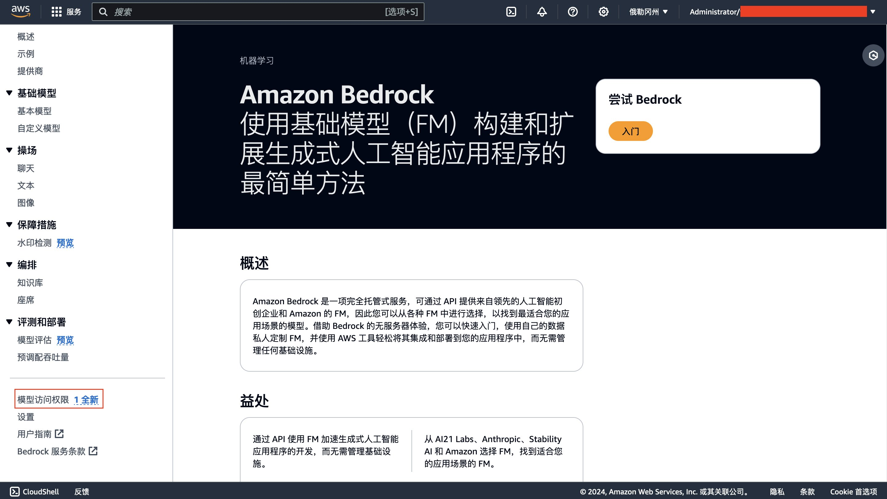
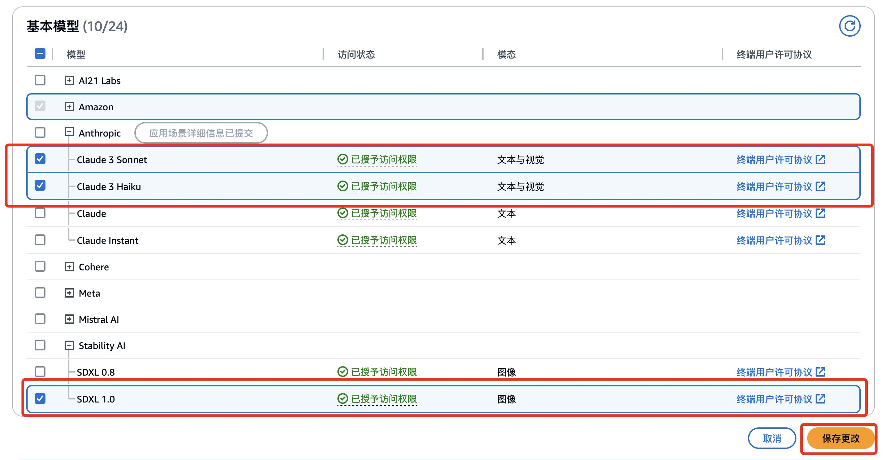
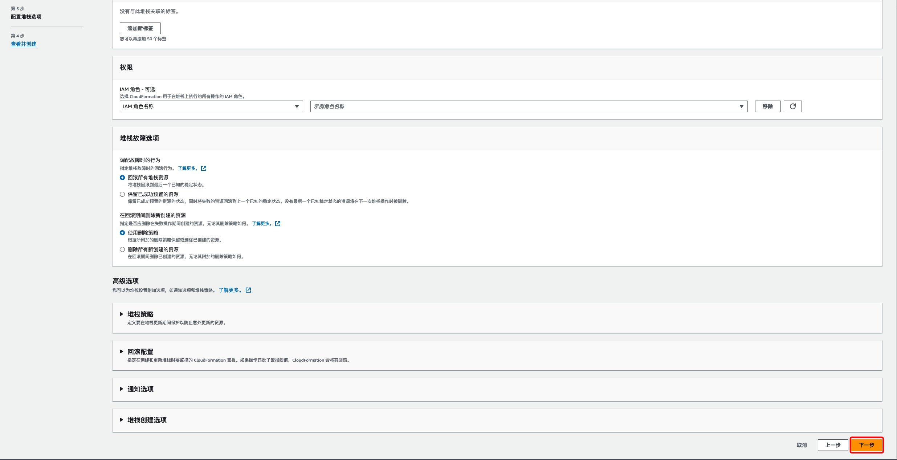
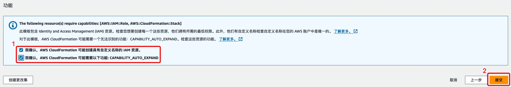
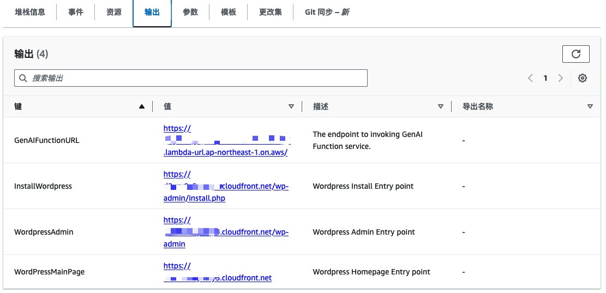
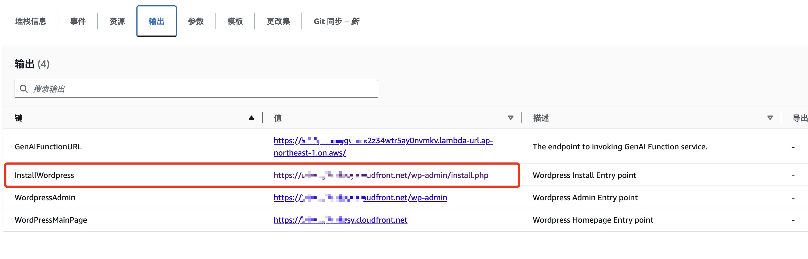
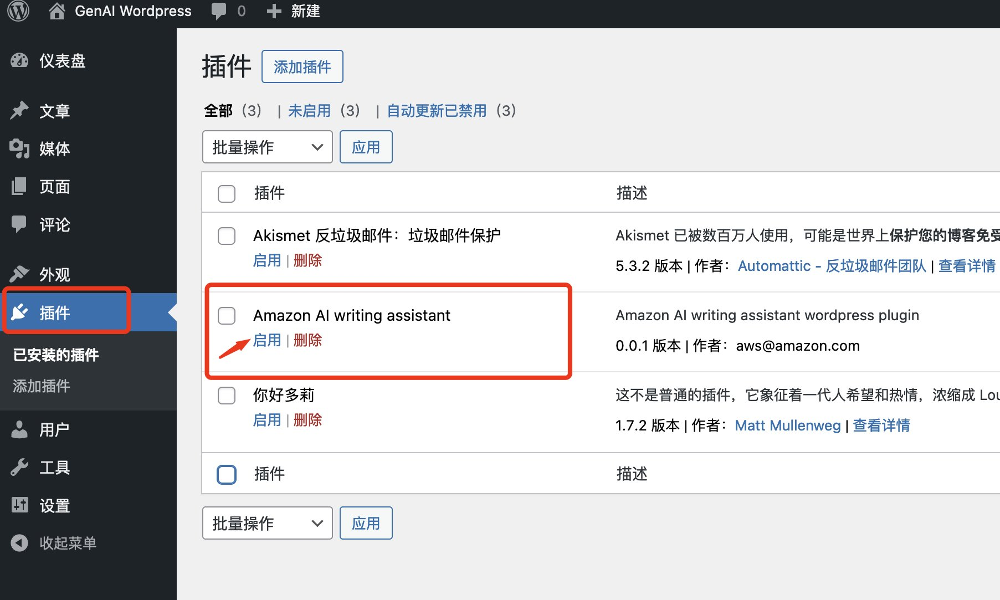
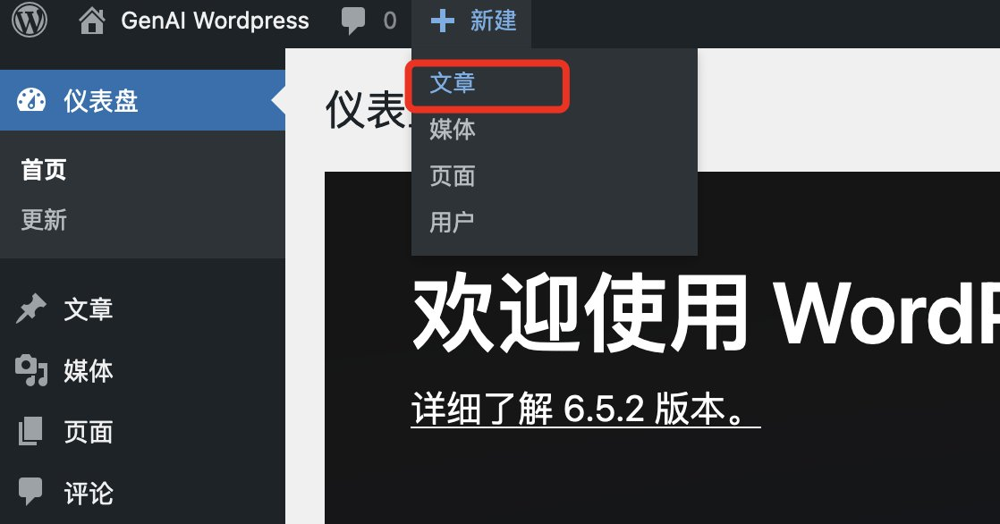
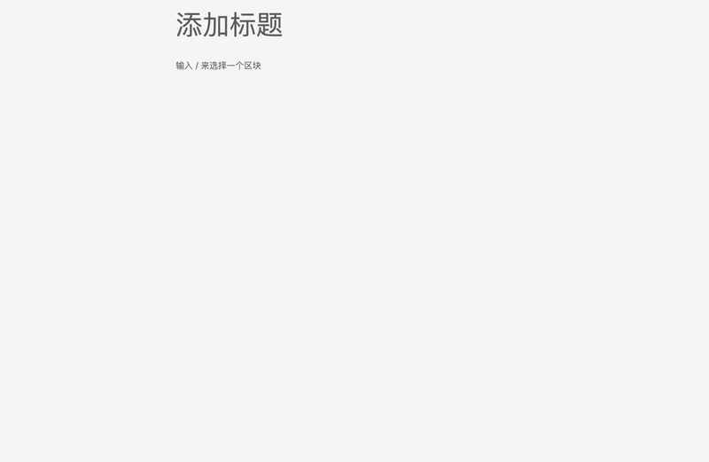
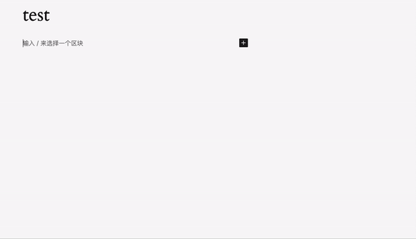

> Authors: Li Fangyi, Su Zhe | AWS Team | 2024-04-29

Generative AI (GenAI) has risen rapidly since 2022, sweeping the globe and demonstrating enormous potential across multiple domains — text-to-image, text-to-text, image-to-image, and more. Models like Stable Diffusion and DALL-E can generate realistic images from natural-language descriptions, opening new possibilities for creative design and visual arts. Meanwhile, large language models such as Claude and GPT enable natural, fluent conversational interactions, empowering content creation and Q&A applications.

WordPress is a widely used open-source content management system (CMS) ideal for creating and managing all types of websites — blogs, corporate sites, personal pages, and online stores. First released in 2003, it was designed to give users an easy-to-use platform for publishing content, even without a technical background.

Now, leveraging the powerful AI capabilities of AWS, you can experience an intelligent AI writing assistant directly inside WordPress to accelerate your content creation. The newly launched WordPress GenAI Plus solution seamlessly integrates Claude 3 (via Amazon Bedrock) and Stable Diffusion into the WordPress editor. Simply provide a prompt or topic direction, and the AI will automatically generate article content and images. You can iterate as many times as needed until you achieve the ideal result.

The main features provided by WordPress GenAI Plus writing assistant include:

- **Text Generation**: Generate articles based on user prompts
- **Image Generation**: Generate images based on user prompts
- **Translation**: Currently supports Chinese, English, French, Japanese, and Korean as target languages; source language is unrestricted
- **Grammar Check**: Provides grammar correction suggestions for selected English paragraphs (English only)

This solution supports one-click deployment via an Amazon CloudFormation template. By deploying the stack, users get the complete infrastructure — WordPress site, database, CDN, and AI capabilities — greatly simplifying setup and usage.

## Architecture Overview

The WordPress GenAI Plus solution can be deployed in any AWS global region. It offers both a two-tier architecture (separating web and database layers) and a traditional LNMP (Linux, Nginx, MySQL, PHP) all-in-one architecture. The two-tier architecture is shown below:

Architecture highlights: Two-tier (web + data), WordPress on public subnet, RDS on private subnet, multi-AZ option, CloudFront CDN, Lambda + Bedrock integration for GenAI capabilities. EC2, RDS, and Lambda can be deployed in any region; Bedrock is available in us-east-1 or us-west-2.

## Deployment Process

### Model Access Preparation

Before getting started, you need to request model access permissions in Amazon Bedrock.

- Select the Bedrock service in the AWS global console

- Select the model deployment region (us-east-1 or us-west-2) in the top-right corner

- In the left sidebar, select "Model access"

- Click the "Manage model access" button

- Check the boxes for SDXL1.0, Claude 3 Sonnet, and Claude 3 Haiku, then click "Save changes"

- Wait for permission to be granted (status changes to "Access granted")

### Create Key Pair

A key pair allows you to securely connect to your Amazon EC2 instance via SSH. Before deployment, make sure you have created a key pair.

If you haven't created one yet, [click here to create a key pair](https://console.aws.amazon.com/ec2/home?#CreateKeyPair:).

- Confirm the deployment region, enter a key pair name, click "Create key pair" and save it securely.

### Create CloudFormation Stack

Click the link above to enter the stack deployment page.

[Click to deploy](https://console.aws.amazon.com/cloudformation/home?#stacks/create/template?templateURL=https://aws-cn-getting-started.s3.us-west-2.amazonaws.com/wordpress-plus/WordpressTwoLayer.template.json)

Confirm the deployment region in the top-right corner (must match your key pair region), then specify the following parameters:

- Custom stack name
- EC2 instance type
- EC2 disk size
- EC2 key pair
- Database username
- Database password (min 8 chars, no /, quotes, or @)
- Database instance type
- Database storage size
- Multi-AZ deployment option
- Bedrock deployment region

Click Next.

- On step 3 "Configure stack options", click Next

- On step 4, check the IAM acknowledgments and CAPABILITY_AUTO_EXPAND, then click Submit

- Wait about 10 minutes for the stack status to become CREATE_COMPLETE

- Check the Outputs tab for GenAI Function URL, WordPress install URL, admin URL, and site URL

## Start Using WordPress AI Capabilities

### Initialize WordPress

After deployment, find the InstallWordPress field in the CloudFormation stack outputs and open the URL to configure WordPress.

In the one-click deployment, database information is pre-configured. You only need to set up your site title, username, and password, then click "Install WordPress" and log into the admin panel.

### Enable the GenAI Plugin

In the WordPress admin panel, click "Plugins", find "Amazon AI writing assistant" and click Activate.

The Lambda URL and Region are pre-configured. Verify and click Save.

### Experience GenAI Capabilities

In the WordPress admin, click "New → Post".

In the editor body, type `/ask` to trigger the Ask AI plugin. Click it to start using the AI features.

You can enter text-to-text or text-to-image prompts in Chinese or English in the popup input box.

See the demo below:

The GenAI plugin also supports translation and grammar checking:

**Translation**: Enter text in any language, click the pen icon in the floating toolbar → Translate Text. Target language is set in the plugin configuration page. Supported: ZH_CN, EN_US, FR, JA, KO.

**Grammar Check**: For text you want to correct, click the pen icon in the floating toolbar → Correct Text.

## Alternative Architecture

You can configure your own domain name in Amazon CloudFront, use Certificate Manager to request a free public certificate for HTTPS, and update the site address in the WordPress admin panel.

This solution also supports a traditional LNMP all-in-one WordPress architecture:

Deploy the LNMP architecture: [Click to deploy](https://console.aws.amazon.com/cloudformation/home?#stacks/create/template?templateURL=https://aws-cn-getting-started.s3.us-west-2.amazonaws.com/wordpress-plus/WordpressInOne.template.json)

## Summary

Through this tutorial, you can deploy WordPress GenAI Plus on AWS with one click, integrating the power of generative AI into the WordPress editor for a brand-new AI-powered content creation experience.

Related Resources:

- [AWS Generative AI](https://aws.amazon.com/cn/generative-ai/)

---

Original article: [WordPress GenAI Plus: Accelerate Your Website Content Creation with Generative AI](https://aws.amazon.com/cn/blogs/china/wordpress-genai-plus-accelerate-your-website-content-creation-with-generative-ai/)

