> 原文链接：[WordPress GenAI Plus：利用生成式 AI 加速您的网站内容创作](https://aws.amazon.com/cn/blogs/china/wordpress-genai-plus-accelerate-your-website-content-creation-with-generative-ai/)
> 作者：李方怡、苏喆 | AWS Team | 2024-04-29

生成式人工智能（Generative AI，GenAI）自 2022 年以来迅速兴起并风靡全球，在多个领域中展现出巨大的潜力和影响力。例如文生图、文生文、图生图等等多个技术领域，都已经或正在被 GenAI 所改变和重塑。以文生图技术为例，Stable Diffusion、DALL-E 等 AI 模型能够根据语言描述生成逼真的图像，为创意设计、视觉艺术等领域带来全新体验。与此同时，文生文技术也获得了长足进步，以 Claude、GPT 等为代表的大语言模型能够与人类进行自然流畅的对话交互，为内容创作、问答服务等应用场景提供了强大助力。

Generative AI (GenAI) has risen rapidly since 2022, sweeping the globe and demonstrating enormous potential across multiple domains — text-to-image, text-to-text, image-to-image, and more. Models like Stable Diffusion and DALL-E can generate realistic images from natural-language descriptions, opening new possibilities for creative design and visual arts. Meanwhile, large language models such as Claude and GPT enable natural, fluent conversational interactions, empowering content creation and Q&A applications.

WordPress 是一个广泛使用的开源内容管理系统（CMS），非常适合创建和管理各种类型的网站，包括博客、企业网站、个人网站和在线商店。它最初于 2003 年发布，旨在为用户提供一个易于使用的平台，通过这个平台，即使是没有技术背景的用户也能轻松地发布内容。

WordPress is a widely used open-source content management system (CMS) ideal for creating and managing all types of websites — blogs, corporate sites, personal pages, and online stores. First released in 2003, it was designed to give users an easy-to-use platform for publishing content, even without a technical background.

现在，我们可以借助亚马逊云科技强大的 AI 能力，在 WordPress 中一键式地体验智能 AI 写手的神奇力量，加速您的网站内容创作。亚马逊云科技新推出的 WordPress GenAI Plus 解决方案，将 Amazon Bedrock 中的 Claude3 与 Stable Diffusion 的能力无缝整合进 WordPress 编辑器之中。用户只需根据需求提供简单的引导词或主题方向，AI 就会自动为你生成文章内容与图片。您可以根据需要多次迭代修改，最终得到理想的写作结果。

Now, leveraging the powerful AI capabilities of AWS, you can experience an intelligent AI writing assistant directly inside WordPress to accelerate your content creation. The newly launched WordPress GenAI Plus solution seamlessly integrates Claude 3 (via Amazon Bedrock) and Stable Diffusion into the WordPress editor. Simply provide a prompt or topic direction, and the AI will automatically generate article content and images. You can iterate as many times as needed until you achieve the ideal result.

WordPress GenAI Plus 写作助手提供的主要功能包括：

The main features provided by WordPress GenAI Plus writing assistant include:

- **生文**：根据用户输入的提示词生成文章 / **Text Generation**: Generate articles based on user prompts
- **生图**：根据用户输入的提示词生成图片 / **Image Generation**: Generate images based on user prompts
- **翻译**：目前支持中文、英文、法语、日文、韩文五种目标语言，源语言不限 / **Translation**: Currently supports Chinese, English, French, Japanese, and Korean as target languages; source language is unrestricted
- **语法校对**：针对选中的英文段落，给出语法上的修改建议，目前只支持英文 / **Grammar Check**: Provides grammar correction suggestions for selected English paragraphs (English only)

此方案支持一键式部署，提供 Amazon CloudFormation 模版，用户可通过部署堆栈，直接获得 WordPress 站点、数据库、CDN 以及 AI 能力等全套基础设施，简化了部署和使用的复杂度。

This solution supports one-click deployment via an Amazon CloudFormation template. By deploying the stack, users get the complete infrastructure — WordPress site, database, CDN, and AI capabilities — greatly simplifying setup and usage.

## 架构总览 / Architecture Overview

WordPress GenAI Plus 解决方案可以部署在亚马逊云海外区的任何区域。本解决方案提供 Web 服务器与数据库分层的架构及传统 LNMP（Linux、Nginx、MySQL、PHP）多合一架构解决方案。两层分层架构图如图所示：

The WordPress GenAI Plus solution can be deployed in any AWS global region. It offers both a two-tier architecture (separating web and database layers) and a traditional LNMP (Linux, Nginx, MySQL, PHP) all-in-one architecture. The two-tier architecture is shown below:

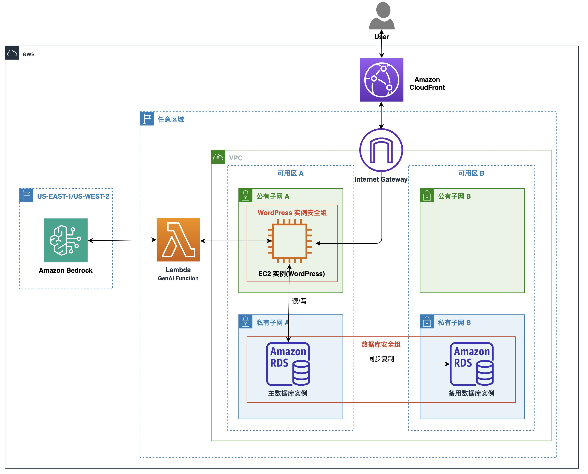

- 本架构为两层架构，为 Web 应用层与数据层。
- WordPress 网站部署在可以与互联网通信的公有子网中。
- 对于安全性要求较高的 Amazon RDS 数据库，部署在与互联网隔离的私有子网中。
- 您可以在部署过程中选择数据库的多可用区部署，以提高您的数据可用性。
- 网站分发由 Amazon CloudFront（CDN）处理，为客户提供更快的网络性能并降低流量费用。
- Amazon EC2 中的 WordPress GenAI 插件与 Lambda 通信，获取 AI 能力。
- Lambda（GenAI Function）与 Amazon Bedrock 集成，为 WordPress 编辑器提供 AI 写作和图像生成功能。

*Architecture highlights: Two-tier (web + data), WordPress on public subnet, RDS on private subnet, multi-AZ option, CloudFront CDN, Lambda + Bedrock integration for GenAI capabilities. EC2, RDS, and Lambda can be deployed in any region; Bedrock is available in us-east-1 or us-west-2.*

## 部署过程 / Deployment Process

### 模型权限准备 / Model Access Preparation

在正式开始之前，需要先申请 Bedrock 的模型访问权限。

Before getting started, you need to request model access permissions in Amazon Bedrock.

- 在亚马逊云科技海外控制台选择 Bedrock 服务 / Select the Bedrock service in the AWS global console

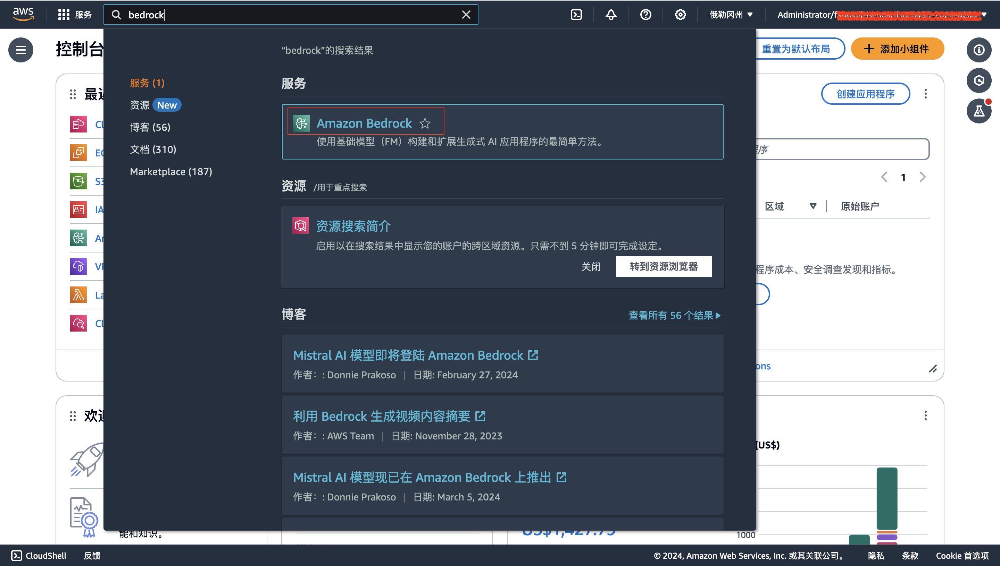

- 在控制台右上角选择模型部署区域：弗吉尼亚北部或俄勒冈州 / Select the model deployment region (us-east-1 or us-west-2) in the top-right corner

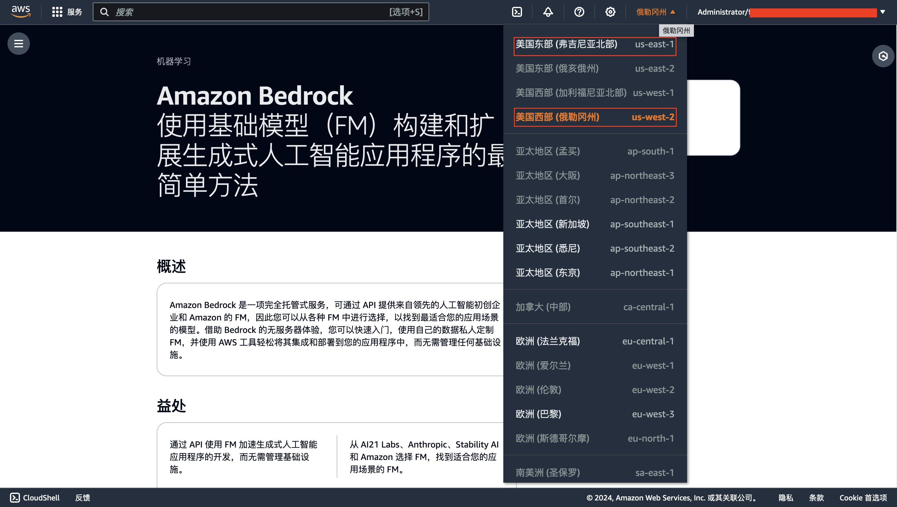

- 下滑至左边栏选择"模型访问权限" / In the left sidebar, select "Model access"

- 在右边窗口点击"管理模型访问权限"按钮 / Click the "Manage model access" button

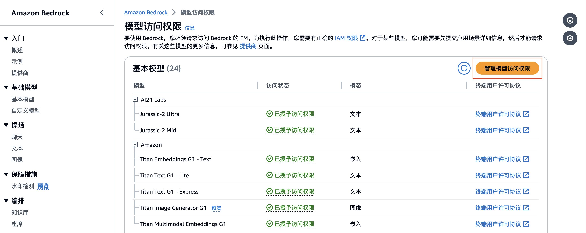

- 勾选 SDXL1.0、Claude 3 Sonnet 和 Claude 3 Haiku 三个模型的访问权限，点击"保存更改"提交申请 / Check the boxes for SDXL1.0, Claude 3 Sonnet, and Claude 3 Haiku, then click "Save changes"

- 等待权限分配完成，状态变为"已授予访问权限" / Wait for permission to be granted (status changes to "Access granted")

### 创建密钥对 / Create Key Pair

密钥对可以让您通过 SSH 协议安全地连接至 Amazon EC2 实例。在开始部署之前，请确保您已经创建过密钥对。

A key pair allows you to securely connect to your Amazon EC2 instance via SSH. Before deployment, make sure you have created a key pair.

若您之前没有创建过密钥对，请点击[此链接](https://console.aws.amazon.com/ec2/home?#CreateKeyPair:)创建。

If you haven't created one yet, [click here to create a key pair](https://console.aws.amazon.com/ec2/home?#CreateKeyPair:).

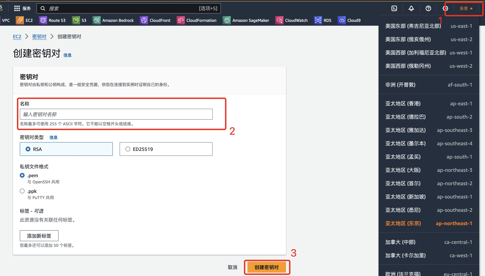

- 确认部署区域，输入密钥对名称，点击"创建密钥对"按钮并保存。
- Confirm the deployment region, enter a key pair name, click "Create key pair" and save it securely.

### 创建 CloudFormation 堆栈 / Create CloudFormation Stack

点击以下链接进入堆栈部署页面：[点击部署](https://console.aws.amazon.com/cloudformation/home?#stacks/create/template?templateURL=https://aws-cn-getting-started.s3.us-west-2.amazonaws.com/wordpress-plus/WordpressTwoLayer.template.json)

Click the link above to enter the stack deployment page.

在右上角确认部署区域（需与密钥对区域一致），指定以下参数：

Confirm the deployment region in the top-right corner (must match your key pair region), then specify the following parameters:

- 自定义堆栈名称 / Custom stack name
- EC2 实例类型 / EC2 instance type
- EC2 磁盘大小 / EC2 disk size
- EC2 密钥对 / EC2 key pair
- 数据库用户名称 / Database username
- 数据库密码（至少 8 位，不含 /、引号和 @）/ Database password (min 8 chars, no /, quotes, or @)
- 数据库实例类型 / Database instance type
- 数据库存储大小 / Database storage size
- 是否多可用区部署 / Multi-AZ deployment option
- Bedrock 部署区域 / Bedrock deployment region

点击下一步。/ Click Next.

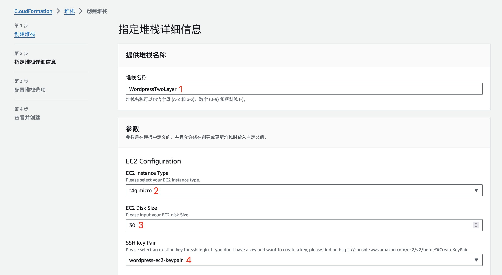

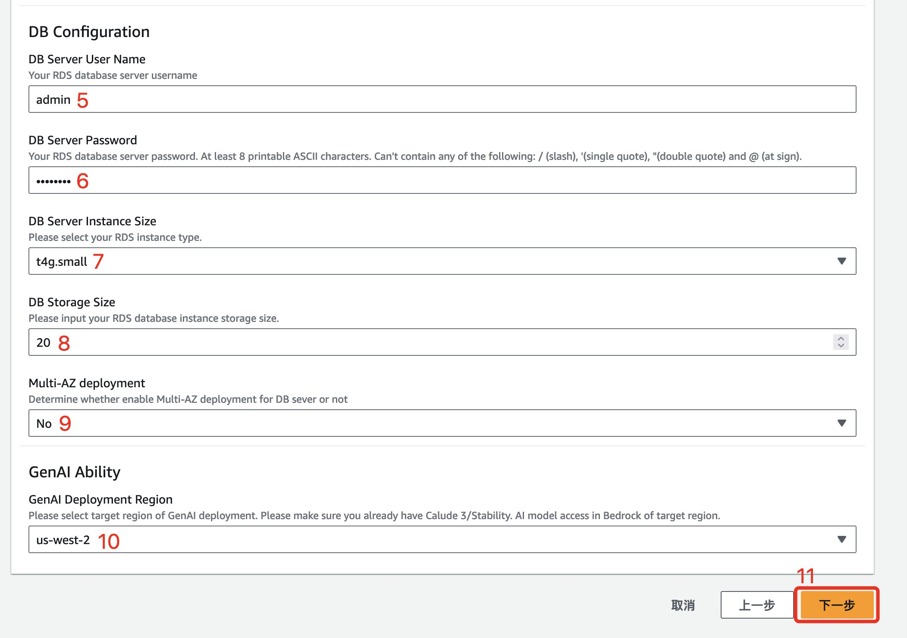

- 在第三步"配置堆栈选项"页面点击下一步 / On step 3 "Configure stack options", click Next

- 在第四步底部，勾选 IAM 资源确认和 CAPABILITY_AUTO_EXPAND，然后点击提交 / On step 4, check the IAM acknowledgments and CAPABILITY_AUTO_EXPAND, then click Submit

- 等待约 10 分钟，堆栈状态变为 CREATE_COMPLETE / Wait about 10 minutes for the stack status to become CREATE_COMPLETE

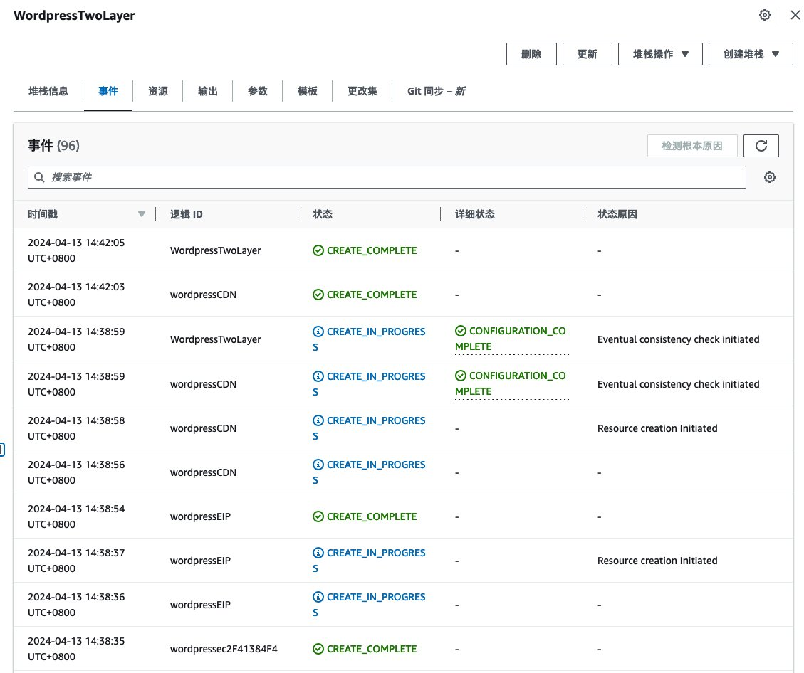

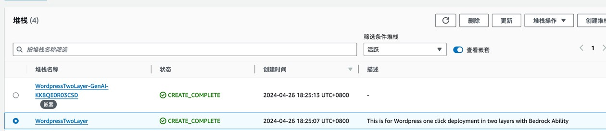

- 在输出页面查看 GenAI Function URL、WordPress 安装页面 URL、管理页面 URL 及网站访问 URL / Check the Outputs tab for GenAI Function URL, WordPress install URL, admin URL, and site URL

## 开始使用 WordPress 的 AI 能力 / Start Using WordPress AI Capabilities

### 初始化 WordPress / Initialize WordPress

WordPress 部署完成后，在 CloudFormation 堆栈输出中查找 InstallWordPress 字段，打开对应网址进行配置。

After deployment, find the InstallWordPress field in the CloudFormation stack outputs and open the URL to configure WordPress.

在一键式部署中，数据库信息已自动配置，您只需配置站点信息、用户名和密码，然后点击"安装 WordPress"并登录管理界面。

In the one-click deployment, database information is pre-configured. You only need to set up your site title, username, and password, then click "Install WordPress" and log into the admin panel.

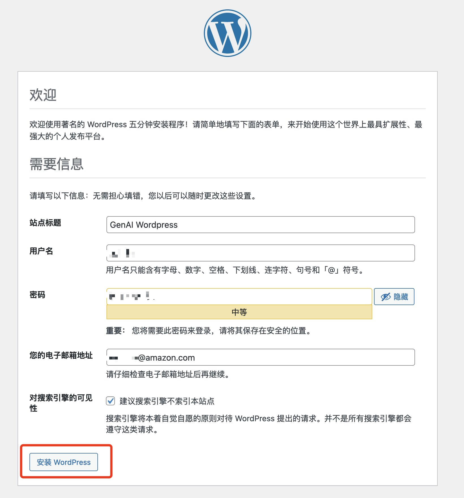

### 启用 GenAI 插件 / Enable the GenAI Plugin

在 WordPress 后台管理界面中，点击"插件"选项，找到"Amazon AI writing assistant"并点击启用。

In the WordPress admin panel, click "Plugins", find "Amazon AI writing assistant" and click Activate.

在配置界面中，Lambda URL 与 Region 已预置。检查确认后点击 Save。

The Lambda URL and Region are pre-configured. Verify and click Save.

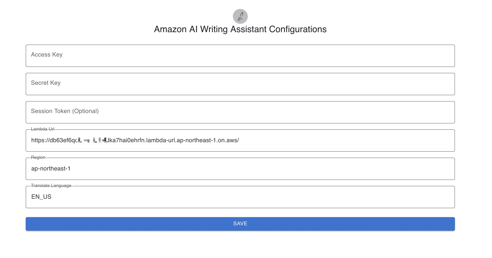

### 体验 GenAI 能力 / Experience GenAI Capabilities

在 WordPress 管理站点中，点击"新建→文章"。

In the WordPress admin, click "New → Post".

在编辑界面的正文部分输入 `/ask` 会弹出 Ask AI 插件，点击插件进行功能体验。

In the editor body, type `/ask` to trigger the Ask AI plugin. Click it to start using the AI features.

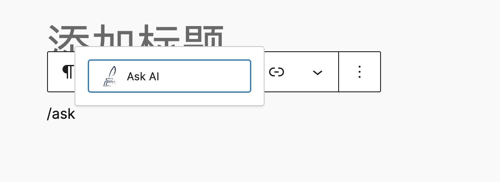

您可以在弹出的输入框中，使用中文或英文输入文生文/文生图的指令。

You can enter text-to-text or text-to-image prompts in Chinese or English in the popup input box.

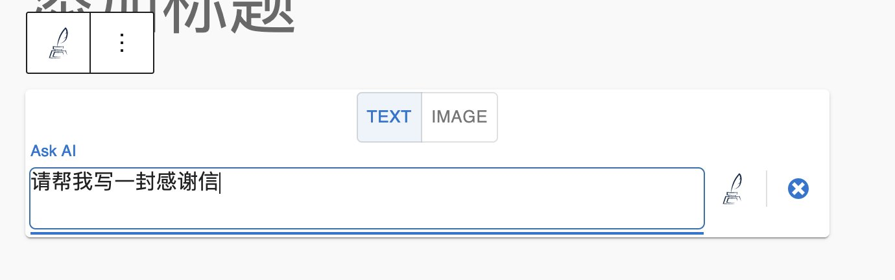

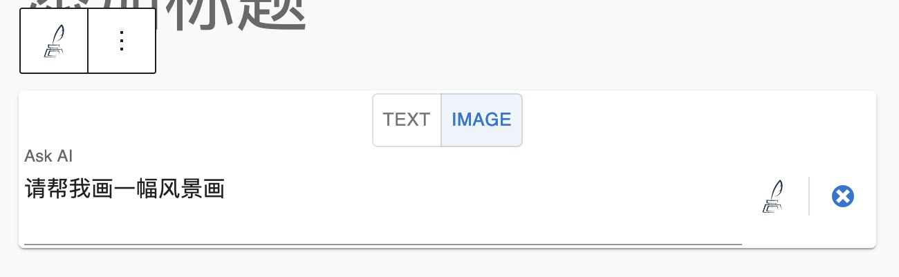

具体操作请看下方演示：

See the demo below:

此外 GenAI 插件还支持翻译与语法校对功能：

The GenAI plugin also supports translation and grammar checking:

**翻译功能 / Translation**: 输入任何语言的文字，点击浮动工具栏中的画笔标志 → Translate Text。目标语言在配置页面中指定，支持中文（ZH_CN）、英文（EN_US）、法语（FR）、日文（JA）、韩文（KO）。

Enter text in any language, click the pen icon in the floating toolbar → Translate Text. Target language is set in the plugin configuration page. Supported: ZH_CN, EN_US, FR, JA, KO.

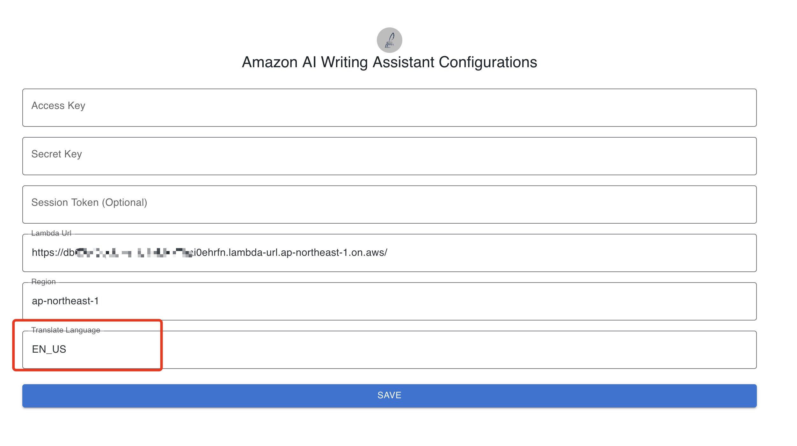

**语法校对功能 / Grammar Check**: 对于想要修改的文字，点击浮动工具栏中的画笔标志 → Correct Text。

For text you want to correct, click the pen icon in the floating toolbar → Correct Text.

## 其他架构参考 / Alternative Architecture

您可以在 Amazon CloudFront 中配置您自己的站点域名，并使用 Certificate Manager 申请免费的公有证书以满足 HTTPS 访问需求，最后在 WordPress 管理员界面中修改站点地址与名称。

You can configure your own domain name in Amazon CloudFront, use Certificate Manager to request a free public certificate for HTTPS, and update the site address in the WordPress admin panel.

本方案还支持传统 LNMP WordPress 多合一架构：

This solution also supports a traditional LNMP all-in-one WordPress architecture:

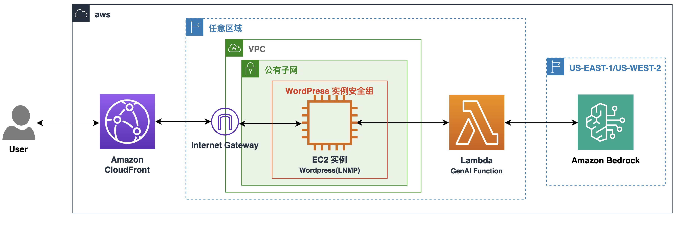

部署 LNMP 架构的 WordPress GenAI Plus：[点击部署](https://console.aws.amazon.com/cloudformation/home?#stacks/create/template?templateURL=https://aws-cn-getting-started.s3.us-west-2.amazonaws.com/wordpress-plus/WordpressInOne.template.json)

Deploy the LNMP architecture: [Click to deploy](https://console.aws.amazon.com/cloudformation/home?#stacks/create/template?templateURL=https://aws-cn-getting-started.s3.us-west-2.amazonaws.com/wordpress-plus/WordpressInOne.template.json)

## 总结 / Summary

通过本文的教程，您可以通过一键式部署在亚马逊云中使用 WordPress GenAI Plus，并将生成式人工智能的强大能力融入 WordPress 编辑器，为您的内容创作提供全新的 AI 体验。

Through this tutorial, you can deploy WordPress GenAI Plus on AWS with one click, integrating the power of generative AI into the WordPress editor for a brand-new AI-powered content creation experience.

相关资源 / Related Resources:
- [亚马逊云科技 AIGC](https://aws.amazon.com/cn/campaigns/aigc)
- [AWS Generative AI](https://aws.amazon.com/cn/generative-ai/)

*本篇作者 / Authors: **李方怡** — 亚马逊云科技解决方案架构师；**苏喆** — 亚马逊云科技解决方案架构师*
